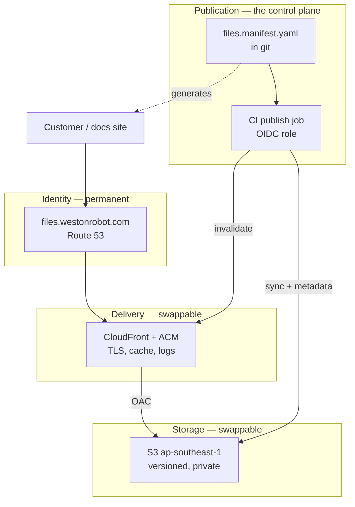

# File Hosting — Reference Design

How the downloadable-document store should be built and operated. [`../adr/0001-host-downloadable-documents-on-s3.md`](../adr/0001-host-downloadable-documents-on-s3.md) decides *what* and *why*; this document covers *how*, and the operational practice around it.

Scope: public customer-facing files — product manuals, SDK and protocol specs, training decks, software archives, firmware, video. Roughly 39 documents today, growing per product and per release.

**Right-sizing is part of the design.** Every control below earns its place at this scale or is marked as deferred. A store of 39 documents does not need the topology of a package registry, and copying one in produces a system nobody maintains. Where a practice is standard but not yet worth it here, it is listed under §12 with the trigger that would change the answer.

## 0. Four principles

**P1 — The URL is the contract; everything behind it is an implementation detail.** A URL handed to a customer outlives the storage, the vendor, the account and probably the product. It is the only part of this system that cannot be changed unilaterally later.

**P2 — Publishing is a reviewed, reproducible operation, not a console upload.** Anything a person can do by hand in a web console has no review, no audit trail, no rollback, and no answer to "what is live right now?".

**P3 — Prefer failures that are structurally impossible over failures that are detected.** A link that is generated from the same data that drives the upload cannot be broken. A link that is hand-written and checked by CI can be broken for as long as it takes someone to look.

**P4 — Breakage must be observable.** Issue #31's real cost was not that 53 links broke; it was that they broke silently and were found weeks later by a manual audit.

## 1. The layer model

Four layers, each replaceable without touching the ones above it. The point of the separation is P1: the identity layer is permanent, everything below it is negotiable.



The dashed relationship worth noticing is `MAN → C`: the manifest that drives the upload also generates the links on the docs site. That is P3, and §3 is about it.

## 2. Topology

Two buckets, not four. Separate a bucket from another bucket only when they differ in **blast radius or lifecycle policy**, never merely in content type — prefixes handle content type, and every extra bucket is another policy, another log destination and another thing to get wrong.

| Bucket | Holds | Access | Why separate |
| --- | --- | --- | --- |
| `wr-files-prod` | Everything customers download | Private; readable only by the CloudFront OAC principal | The served content |
| `wr-files-logs` | CloudFront + S3 access logs | Private; write from the log delivery principal | Logs must never live in the bucket they describe — a policy error that exposes content would expose the audit trail with it, and log writes pollute the content bucket's own access log |

Within `wr-files-prod`, prefixes carry the structure: `/robot/...`, `/solution/...`, `/video/...`. Masters and other private material do **not** belong here (ADR 0001 scope); when that need is addressed it gets its own bucket, because its lifecycle policy and access model are entirely different.

## 3. Publication: the manifest is the source of truth

This is the part that separates a professional setup from a working one, and it is the highest-value item in this document.

**The problem it solves.** Today the set of published documents exists in three unrelated places: the files themselves, the links hand-written across eight doc pages, and somebody's memory. Nothing reconciles them. That is precisely how 53 links came to be dead with nobody noticing.

**The shape.** One git-tracked file declares every published document:

```yaml
# content/files.manifest.yaml
- key: robot/manipulator/wr65/wr65-user-manual-en-v2.3.pdf
  title: WR65 User Manual
  product: wr65
  kind: manual
  lang: en
  version: "2.3"
  content_type: application/pdf
  sha256: "…"
  source: internal/wr65/manual-v2.3.pdf
```

**Three things follow from it, and they are the payoff:**

1. **CI publishes it.** On merge to `main`, a job syncs exactly the declared set to S3, applies `Content-Type` and `Cache-Control` from the manifest, and issues a CloudFront invalidation for changed keys only. Nobody touches the console. "What is live?" is answered by `git show`.
2. **The docs site generates its links from it.** A Docusaurus component reads the manifest and renders the download tables that are currently hand-written. A link cannot point at a document that is not published, because both come from the same record. This is P3 — the class of bug from issue #31 stops being *detected* and starts being *impossible*.
3. **Review becomes meaningful.** Adding a customer-facing document is a pull request with a diff, an approver and a date, rather than a drag-and-drop nobody saw.

**Is this over-engineering for 39 files?** No, and the reason is specific rather than aspirational: the failure has already happened once and cost a full 160-link audit to find. The manifest is perhaps a hundred lines of YAML and a publish job. Item 2 is the part that could be deferred if the schedule demands it — but it is also the part that carries most of the value, so defer it last.

## 4. Identity and paths

The path convention is ADR 0001 D4. Two operational rules make it hold over time:

**Published paths are immutable.** Never rename, never delete, never repurpose. A new revision is a new key; the old key keeps resolving. This is not tidiness — a customer's bookmark, a printed QR code on a robot, and a support email from 2024 all depend on it.

**Where "the current manual" needs a stable address**, `latest/` is a separate short-TTL key that redirects or duplicates, and the versioned key remains the canonical one. Never make the unversioned path the only path.

**Language is a path element, not a suffix on the title** — `…-en-v2.3.pdf`, `…-zh-v2.3.pdf`. The docs site serves existing customers including zh-Hans readers, and a language variant that is discoverable only by reading a table is not discoverable.

## 5. Integrity and authenticity

The corpus contains software archives and firmware. That is executable code shipped to robots in the field, and it changes the standard this system is held to.

**Minimum, now:** every archive and firmware image gets a published SHA-256, in the manifest and in a sidecar `.sha256` next to the object, with the docs page showing it. TLS protects the transfer; the checksum protects against a corrupted upload, a truncated download and a substituted object at rest. Every serious vendor publishes these; their absence is conspicuous.

**Next, for firmware and SDKs:** detached GPG signatures. There is a consistency argument close to hand — `deb.westonrobot.net` already relies on GPG, and the same key management can cover both. The reason this matters more than it looks: apt verifies signatures automatically, but a human downloading a `.zip` from a web page verifies nothing unless the page gives them something to verify against and a reason to bother.

**Tamper evidence:** bucket versioning (§6) means an overwritten object is recoverable and the overwrite is visible, rather than the previous bytes simply ceasing to exist.

## 6. Durability, versioning and recovery

S3's durability guarantee covers hardware loss. It does not cover the failure that actually happens, which is a person or a script deleting or overwriting the wrong thing.

- **Versioning ON.** The single highest-value control here, and close to free at this volume. It turns "someone overwrote the manual" from an incident into a console click.
- **Deletes denied outside the publish role.** A bucket policy that denies `s3:DeleteObject` and `s3:DeleteObjectVersion` to everything except the CI role. Public documents should essentially never be deleted (§10).
- **Lifecycle for noncurrent versions**, so versioning does not accumulate cost without bound — expire noncurrent versions after a generous window rather than keeping every revision of every PDF forever.
- **Account-level Block Public Access ON.** With OAC (D3) nothing needs public ACLs, so this costs nothing and removes the most common way an S3 bucket becomes an incident.

Cross-region replication is deferred (§12).

## 7. Access control and least privilege

**No long-lived AWS keys in CI.** GitHub Actions authenticates to AWS via OIDC and assumes a publish role scoped to this bucket and these actions. Static access keys in repository secrets are the single most common finding in a setup like this: they do not rotate, they do not expire, they are copied into other places, and they survive the departure of whoever created them.

The roles worth having are three:

| Role | Can | Assumed by |
| --- | --- | --- |
| Publish | `PutObject`, `DeleteObject` on `wr-files-prod/*`, CloudFront invalidation | CI, via OIDC, only from `main` |
| Read | `GetObject`, `ListBucket` | Humans, for debugging |
| Admin | Bucket and distribution configuration | A named person, rarely, ideally through IaC |

**Infrastructure as code.** The bucket, distribution, certificate, OAC and policies should be a Terraform or CDK definition in a repository, not a sequence of console clicks. This matters less for getting it running and a great deal for the second environment, the recovery, and the review of a policy change two years from now.

## 8. Observability — making breakage visible

P4. The design goal is that the next time something breaks, a dashboard says so before a customer does.

**What moving to our own domain buys us, beyond the fix.** When the links lived on `tangrobot.sharepoint.com`, a broken link produced a DNS failure on infrastructure we did not own and could not see. Once every link is on `files.westonrobot.com`, a broken link produces a **404 in our own CloudFront logs**. The failure becomes an observable event on a system we operate. That is arguably a larger win than the fix itself.

Worth watching, in rough order of value:

1. **404 rate, and the top missing keys.** A spike means a link went wrong, and the key names say exactly which. This is the direct answer to issue #31's real defect.
2. **Cache hit ratio.** A low ratio on a static corpus means `Cache-Control` is wrong and egress is being paid for needlessly.
3. **Egress volume**, once video is in the mix, with a billing alarm.
4. **4xx/5xx from the origin**, which indicates an OAC or policy problem rather than a link problem.

CloudFront standard logs to `wr-files-logs`, queried with Athena when a question comes up. A CloudWatch alarm on 404 rate is the piece that has to exist from day one; the query tooling can wait until there is a question.

## 9. Cost

Not a deciding factor at this volume, which is itself worth recording so nobody optimises it prematurely. The levers, in order of effect:

- **`Cache-Control`.** The dominant lever on egress. Long TTLs on immutable versioned keys mean the origin is read approximately once per object per edge.
- **Storage class.** Standard for served content. Archive tiers apply to masters, which are out of scope here.
- **A billing alarm**, so video growth is noticed as a number rather than as an invoice.

**Measurement to take, not estimated here:** total corpus size once the 39 documents are exported. Storage cost is negligible at any plausible figure; egress depends on traffic nobody has measured yet, and inventing a number would only make it look decided.

## 10. Content lifecycle and retention

**Robotics changes the retention question.** A UGV sold in 2021 is still in service, and its operator still needs its manual and its firmware. The instinct to delete documentation for discontinued products is wrong here: the product is discontinued, the fleet is not.

- **Never delete a manual or firmware image for hardware that could still be in the field.** Supersede it.
- **Mark superseded documents rather than removing them** — the docs page stops linking the old revision, the object stays reachable for anyone holding the URL.
- **Retention is effectively indefinite** for manuals and firmware; storage is cheap and the alternative is a customer with an unserviceable robot.
- **A document leaving the docs site is not a document leaving the bucket.** Two separate decisions, and conflating them is how bookmarks break.

## 11. Adoption in phases

Ordered so each phase is independently useful and nothing is blocked on the phase after it.

**Phase 0 — Unblock.** Export the 39 documents from the renamed M365 tenant. Everything waits on this; WR65 and WRL63 first, since those products currently have no reachable documentation at all.

**Phase 1 — Serve it correctly.** Bucket, CloudFront, ACM, OAC, Block Public Access, versioning, OIDC publish role. Upload under D4 paths, rewrite the 48 SharePoint occurrences and the 4 Google Drive links. At the end of this phase the defect is fixed.

**Phase 2 — Make it reproducible.** The manifest, the CI publish job, IaC for the infrastructure. At the end of this phase nobody touches the console.

**Phase 3 — Make it structural.** Generate the docs-site download tables from the manifest. At the end of this phase the broken-link class is gone rather than monitored.

**Phase 4 — Harden.** Checksums, then signatures for firmware and SDKs. 404 alarm and cost alarm. Noncurrent-version lifecycle.

Phases 1 and 4's alarm are the ones that matter most per unit of effort. Phase 3 is the one that pays off longest.

## 12. Deliberately not doing this yet

Listed with the trigger that would change the answer, so the decision is revisitable rather than forgotten.

| Practice | Why not now | Trigger to revisit |
| --- | --- | --- |
| Cross-region replication | S3 durability within a region already exceeds the risk this addresses; versioning covers the realistic failure | A contractual availability commitment, or a second region for compliance |
| A staging bucket and environment | 39 mostly-static documents; a PR diff on the manifest is sufficient review | Publishing becoming frequent enough that a bad publish is likely |
| Signed URLs / access control | ADR 0001 scope is public content only (decided 2026-08-31) | Any licence-gated SDK or customer-specific deliverable |
| Object Lock / WORM | No regulatory retention requirement identified | A compliance or safety-certification requirement on firmware provenance |
| A mainland-China mirror | Deferred by decision | Chinese customer download experience becoming a support burden |
| Separate archive bucket for masters | Out of ADR 0001 scope | Taken up as its own piece of work; the need is already recorded in `.gitignore` |
