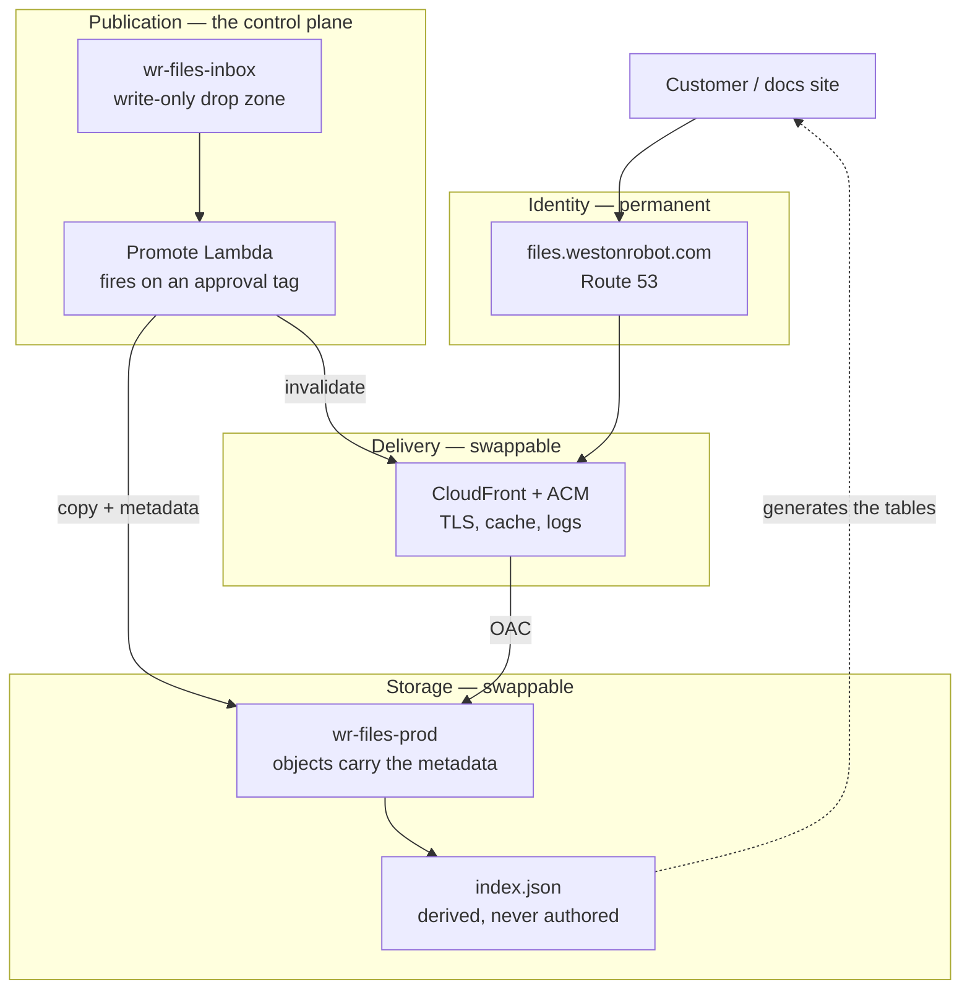

# File Hosting — Reference Design

How the downloadable-document store should be built and operated. [`../adr/0001-host-downloadable-documents-on-s3.md`](../adr/0001-host-downloadable-documents-on-s3.md) decides *what* and *why*; this document covers *how*, and the operational practice around it.

Scope: public customer-facing files — product manuals, SDK and protocol specs, training decks, software archives, firmware, video. Roughly 39 documents today, growing per product and per release.

**Right-sizing is part of the design.** Every control below earns its place at this scale or is marked as deferred. A store of 39 documents does not need the topology of a package registry, and copying one in produces a system nobody maintains. Where a practice is standard but not yet worth it here, it is listed under §12 with the trigger that would change the answer.

## 0. Four principles

**P1 — The URL is the contract; everything behind it is an implementation detail.** A URL handed to a customer outlives the storage, the vendor, the account and probably the product. It is the only part of this system that cannot be changed unilaterally later.

**P2 — Publishing is reviewed and attributable; uploading need not be.** They are different operations and deserve different privileges. The principal that adds a file and the principal that serves it must not be the same one — but making the first hard in order to control the second only guarantees it gets worked around.

**P3 — Prefer failures that are structurally impossible over failures that are detected.** A page that declares what it wants — every published WR65 manual — cannot hold a broken link, because it holds no link at all. A page that hard-codes a URL and leans on a CI check can be broken for as long as it takes someone to look.

**P4 — Breakage must be observable.** Issue #31's real cost was not that 53 links broke; it was that they broke silently and were found weeks later by a manual audit.

## 1. The layer model

Four layers, each replaceable without touching the ones above it. The point of the separation is P1: the identity layer is permanent, everything below it is negotiable.



The dashed relationship worth noticing is `IDX → C`: the store generates the site's download tables, so a page carries a query rather than a URL. That is P3, and §3 is about it. Note also what is absent — git appears nowhere on this diagram, because it holds the code that renders the store and never the store's inventory.

## 2. Topology

Three buckets. Separate a bucket from another bucket only when they differ in **blast radius or lifecycle policy**, never merely in content type — prefixes handle content type, and every extra bucket is another policy, another log destination and another thing to get wrong. Each of the three below differs on the stated criterion; a fourth, split by content type, would not.

| Bucket | Holds | Access | Why separate |
| --- | --- | --- | --- |
| `wr-files-prod` | Everything customers download | Private; readable only by the CloudFront OAC principal | The served content |
| `wr-files-logs` | CloudFront + S3 access logs | Private; write from the log delivery principal | Logs must never live in the bucket they describe — a policy error that exposes content would expose the audit trail with it, and log writes pollute the content bucket's own access log |
| `wr-files-inbox` | Files waiting to be published | **Write-only** for people; read and delete for the promote Lambda | A drop zone whose whole purpose is to be writable by humans, which is the one thing the served bucket must never be. Nothing here is reachable by a customer, so a bad upload is junk in a staging area rather than an incident |

Within `wr-files-prod`, prefixes carry the structure: `/robot/...`, `/solution/...`, `/video/...`. Masters and other private material do **not** belong here (ADR 0001 scope); when that need is addressed it gets its own bucket, because its lifecycle policy and access model are entirely different.

## 3. Publication: the store is the source of truth

**The problem it solves.** The set of published documents currently exists in three unrelated places: the files themselves, the links hand-written across eight doc pages, and somebody's memory. Nothing reconciles them, which is precisely how 53 links came to be dead with nobody noticing.

**A rejected answer, recorded because it is the tempting one.** An earlier draft of this document made a git-tracked manifest the source of truth. That is wrong, and the reason is worth keeping: it makes the documentation repository the gate for every document. Every manual a technician produces becomes a pull request; the repository accumulates a growing record of items it does not and must not hold; and a person who will never write code has to learn a code workflow to publish a PDF. **Git holds the code that renders the store. It does not hold the store's inventory.**

**The source of truth is the bucket.** A document's metadata lives on the object itself, set at the moment it is promoted:

```
s3://wr-files-prod/robot/manipulator/wr65/wr65-user-manual-en-v2.3.pdf
  Content-Type:  application/pdf
  Cache-Control: public, max-age=31536000, immutable
  x-amz-meta-title:    WR65 User Manual
  x-amz-meta-product:  wr65
  x-amz-meta-kind:     manual
  x-amz-meta-lang:     en
  x-amz-meta-version:  2.3
  x-amz-meta-sha256:   9f2b1c…
```

A Lambda derives `index.json` from the prefix whenever it changes. The index is a *derived artifact* — never authored, never committed, reproducible at any time by re-listing the bucket.

**The docs site declares intent, not URLs.** This is the piece that keeps P3 intact without git holding anything:

```jsx
<Downloads product="wr65" kind="manual" />
```

The component resolves that query against the index at build time. **A page cannot hold a link to a document that is not published, because the page holds no links** — it holds a question, and the store answers it. An unsatisfied query renders an empty table rather than a dead link, and since "this page asks for WR65 manuals and the index has none" is checkable, the build fails on it instead of shipping it.

### The flow, with no git in the upload path

| | Step | Who | Entire grant |
| --- | --- | --- | --- |
| 1 | Upload to the inbox | Technician or engineer | `PutObject` on `wr-files-inbox/*` |
| 2 | Approve | A small named group | `PutObjectTagging` on `wr-files-inbox/*` |
| 3 | Copy to the served bucket, set metadata, invalidate | Lambda | Read inbox, write prod, invalidate |
| 4 | Regenerate `index.json` | Lambda | Write the index object |
| 5 | Rebuild the docs site | CI, on `repository_dispatch` | Read the index |

**No human writes to the served bucket at any point.** An approver's entire privilege is the ability to put a tag on an object sitting in the inbox; the copy is performed by a Lambda. The separation between "can approve" and "can serve" is therefore enforced by IAM rather than by anyone remembering it, and it survives someone being in a hurry.

**Audit and rollback, without git.** CloudTrail records who tagged which object and when — stronger attribution than a merge commit, because it cannot be rewritten. S3 versioning covers rollback. "What is live?" is answered by reading the index, which is generated from the only thing that can be authoritative about what is live: the bucket.

**What git still holds:** the site, the `<Downloads>` component, the infrastructure definition. Code, never inventory.

**Is a Lambda and an index over-engineering for 39 files?** The index generator is a few dozen lines and the promote function not much more, against a failure that has already happened once and cost a 160-link audit to find. The part that could be deferred is the `<Downloads>` component — pages could carry `files.westonrobot.com` URLs by hand at first. But that is the piece carrying most of the value, so defer it last.

### Authoring locally, publishing deliberately

A document is usually received or written by the same person editing the page that will link it, and that person needs to see the page work before anyone else does — the table rendered, the link live, the right revision attached. Sending them to a console to upload first and back to the page to paste a URL gets that backwards, and a link pasted by hand is a link typed wrong eventually.

So the engineer's path starts in the working tree:

1. **Drop the file into the `_upload/` directory beside the page.** These directories are gitignored, exactly as `**/video/raw/` already is, so the bytes never enter history. The leading underscore also keeps Docusaurus from treating the directory as routable content.

   The name is deliberate. It is not `_publish/`, because dropping a file there does not publish it — it stages it for the upload step, and approval still stands between that and a customer. Naming the directory after the verb it actually performs keeps the distinction in §3 visible at the point where someone is most likely to forget it.
2. **Reference it locally and build.** `npm start` and a local build show the real page with the real document attached — which is the point, and the thing no console-first flow can offer.
3. **Run the publish script when the page is right.** It parses the naming convention, computes the digest, derives the D4 key, uploads to the inbox and — for a caller who also holds the approve grant — tags it, so it is live in seconds. Then it rewrites the page's local reference to the published one.
4. **Rebuild and review again.** The second review is against exactly what a customer will get.

**The gitignore is the enforcement, and this is the load-bearing part.** CI has no local files, because they are not in the repository. A page committed before its document was uploaded therefore cannot resolve, and the build fails. The author saw a working page; CI sees the truth; the discrepancy surfaces in a pipeline rather than in a support ticket. It is the same mechanism as the video budget check (ADR 0001 D8) — a guarantee that comes from git and the filesystem disagreeing in a controlled, deliberate way.

`npm run check:downloads` runs the same resolution locally for anyone who wants the answer before pushing rather than after.

**What step 3 rewrites changes between phases**, and the earlier form is worth shipping first:

- **Phase 2.** The script substitutes the published URL directly into the page. Simple, and it makes the second review concrete — you are looking at the actual link. The URL is generated from the D4 convention rather than typed, and D4 paths are immutable, so it does not rot the way a hand-pasted one would.
- **Phase 3.** The page carries `<Downloads product="wr65" kind="manual" />` instead, and the resolver prefers a matching local file in development and the published index everywhere else. No URL appears in the page at all, and a superseded revision stops requiring an edit to every page that mentions it.

**Why a script here and a console for technicians.** Engineers already have the repository open, the file in hand and the metadata in its filename; a script closes the loop without a context switch and is deterministic where a console is not — content type, digest, key derivation and path convention all come out of one code path rather than out of somebody's care on the day. The two routes land in the same inbox and pass the same approval. One pipeline, two front doors, chosen by which one is already open.

**A skill is a wrapper, not the implementation.** If this is exposed as a Claude Code skill alongside `vendor-interface-summary`, the skill calls the script and the script stays runnable on its own. CI needs it, a technician on a laptop may need it, and neither has the skill installed.

### Uploading is not publishing

The two verbs have different audiences, different frequencies and different privileges, and conflating them is how a design becomes one nobody can use.

| | Upload | Publish |
| --- | --- | --- |
| What it is | Getting bytes into AWS | Giving a document a customer-facing URL |
| Who | Any technician or engineer with the file | A Lambda, on an approval tag |
| How often | Whenever a document is produced | Whenever an approver says so |
| Reviewed | No | Yes |
| Access needed | Write to the inbox bucket, nothing else | Held by no human at all |

**The inbox is write-only, and that is the whole security argument.** The upload grant is `s3:PutObject` on `wr-files-inbox/*` and nothing else — no `GetObject`, no `ListBucket`, no `DeleteObject`, no access to the served bucket, no other AWS service. A technician cannot read what anyone else uploaded, cannot enumerate the bucket, cannot delete or alter anything, and cannot make anything public. The worst outcome from a lost laptop or a leaked credential is junk accumulating in a staging area no customer can reach, cleared by a 90-day expiry lifecycle rule.

That is a genuinely small grant. "Can add a file to one bucket" is not high access, and it is the least privilege that still allows self-service.

**Objects are named by content hash.** An upload lands at `inbox/<sha256>`, not at a human-chosen path. Three things fall out of that:

- **Overwrites become impossible without a deny rule.** Different content is a different key by construction, so `PutObject` alone cannot destroy an earlier upload — which is what makes it safe to grant `PutObject` without `DeleteObject` and stop there.
- **The digest is the integrity value and the address at once.** What an approver tagged is what the Lambda copies and what a customer verifies, with no step where the three can drift apart.
- **Nothing about the item enters git.** Which is the point.

**How the technician actually uploads.** Three options; the first is the recommendation.

1. **AWS IAM Identity Center with an S3 console bookmark.** One permission set granting the upload role above, MFA on the account, and a bookmarked URL that opens directly on the inbox bucket. The technician signs in and drags the file onto the page. Identity Center itself carries no charge, there is nothing to build or run, and the grant is auditable in CloudTrail per person. The console is not beautiful, but its upload page is drag-and-drop and needs no explanation.
2. **A presigned upload page.** The technician holds no AWS identity at all; a small endpoint mints a presigned POST, which can additionally cap content length and constrain content type. The catch is that the endpoint still has to know who the technician is, so this moves the identity problem rather than removing it — worth it only where there is already an internal login to hook into.
3. **SFTP through AWS Transfer Family.** Field staff know WinSCP and FileZilla, which is a real advantage. Rejected on cost: the endpoint bills per hour whether or not anyone uploads, which is heavily disproportionate to a handful of files a month. *Rate to confirm before dismissing it permanently.*

**Name the file so the metadata can be inferred**: `<product>__<kind>__<lang>__v<version>.<ext>`, for example `wr65__manual__en__v2.3.pdf`. Renaming before dropping the file is the only convention a technician has to learn, and it is what lets the approve step present a ready-made record rather than a form to fill in. A file that does not parse is held in the inbox and reported, never guessed at.

## 4. Identity and paths

The path convention is ADR 0001 D4. Two operational rules make it hold over time:

**Published paths are immutable.** Never rename, never delete, never repurpose. A new revision is a new key; the old key keeps resolving. This is not tidiness — a customer's bookmark, a printed QR code on a robot, and a support email from 2024 all depend on it.

**Where "the current manual" needs a stable address**, `latest/` is a separate short-TTL key that redirects or duplicates, and the versioned key remains the canonical one. Never make the unversioned path the only path.

**Language is a path element, not a suffix on the title** — `…-en-v2.3.pdf`, `…-zh-v2.3.pdf`. The docs site serves existing customers including zh-Hans readers, and a language variant that is discoverable only by reading a table is not discoverable.

## 5. Integrity and authenticity

The corpus contains software archives and firmware. That is executable code shipped to robots in the field, and it changes the standard this system is held to.

**Minimum, now:** every archive and firmware image gets a published SHA-256, carried in the object's own metadata and in a sidecar `.sha256` beside it, with the docs page showing it. It is the same digest that addressed the object in the inbox (§3), so what an approver tagged is what a customer verifies. TLS protects the transfer; the checksum protects against a corrupted upload, a truncated download and a substituted object at rest. Every serious vendor publishes these; their absence is conspicuous.

**Next, for firmware and SDKs:** detached GPG signatures. There is a consistency argument close to hand — `deb.westonrobot.net` already relies on GPG, and the same key management can cover both. The reason this matters more than it looks: apt verifies signatures automatically, but a human downloading a `.zip` from a web page verifies nothing unless the page gives them something to verify against and a reason to bother.

**Tamper evidence:** bucket versioning (§6) means an overwritten object is recoverable and the overwrite is visible, rather than the previous bytes simply ceasing to exist.

## 6. Durability, versioning and recovery

S3's durability guarantee covers hardware loss. It does not cover the failure that actually happens, which is a person or a script deleting or overwriting the wrong thing.

- **Versioning ON.** The single highest-value control here, and close to free at this volume. It turns "someone overwrote the manual" from an incident into a console click.
- **Deletes denied outside the promote role.** A bucket policy that denies `s3:DeleteObject` and `s3:DeleteObjectVersion` to everything except the promote Lambda's execution role. Public documents should essentially never be deleted (§10).
- **Lifecycle for noncurrent versions**, so versioning does not accumulate cost without bound — expire noncurrent versions after a generous window rather than keeping every revision of every PDF forever.
- **Account-level Block Public Access ON.** With OAC (D3) nothing needs public ACLs, so this costs nothing and removes the most common way an S3 bucket becomes an incident.

Cross-region replication is deferred (§12).

## 7. Access control and least privilege

**CI holds no AWS credentials at all.** `index.json` is public content served through CloudFront like everything else, so the site build fetches it over HTTPS exactly as any other consumer would. There is no publish step in CI and therefore no role for it to assume — which disposes of the most common finding in a setup like this: static access keys in repository secrets that do not rotate, do not expire, get copied elsewhere, and outlive whoever created them.

One consequence to be aware of: a public index makes the full inventory enumerable. That is acceptable only because the store holds public content by decision, and it needs revisiting the moment anything gated appears (§12).

**No human writes to the served bucket.** This is what makes a broad upload grant safe: the people who add files cannot serve them, and the principal that serves them is a Lambda rather than anybody's login. The roles worth having are five:

| Role | Can | Assumed by |
| --- | --- | --- |
| Upload | `PutObject` on `wr-files-inbox/*` — and nothing else | Technicians and engineers, via Identity Center with MFA |
| Approve | `PutObjectTagging` on `wr-files-inbox/*` — and nothing else | A small named group |
| Promote | Read the inbox, write `wr-files-prod/*`, CloudFront invalidation | The promote Lambda's execution role. No human, no CI |
| Read | `GetObject`, `ListBucket` | Humans, for debugging |
| Admin | Bucket and distribution configuration | A named person, rarely, ideally through IaC |

**Infrastructure as code.** The bucket, distribution, certificate, OAC and policies should be a Terraform or CDK definition in a repository, not a sequence of console clicks. This matters less for getting it running and a great deal for the second environment, the recovery, and the review of a policy change two years from now.

## 8. Observability — making breakage visible

P4. The design goal is that the next time something breaks, a dashboard says so before a customer does.

**What moving to our own domain buys us, beyond the fix.** When the links lived on `tangrobot.sharepoint.com`, a broken link produced a DNS failure on infrastructure we did not own and could not see. Once every link is on `files.westonrobot.com`, a broken link produces a **404 in our own CloudFront logs**. The failure becomes an observable event on a system we operate. That is arguably a larger win than the fix itself.

Worth watching, in rough order of value:

1. **404 rate, and the top missing keys.** A spike means a link went wrong, and the key names say exactly which. This is the direct answer to issue #31's real defect.
2. **Cache hit ratio.** A low ratio on a static corpus means `Cache-Control` is wrong and egress is being paid for needlessly.
3. **Egress volume**, once video is in the mix, with a billing alarm.
4. **4xx/5xx from the origin**, which indicates an OAC or policy problem rather than a link problem.

CloudFront standard logs to `wr-files-logs`, queried with Athena when a question comes up. A CloudWatch alarm on 404 rate is the piece that has to exist from day one; the query tooling can wait until there is a question.

## 9. Cost

Not a deciding factor at this volume, which is itself worth recording so nobody optimises it prematurely. The levers, in order of effect:

- **`Cache-Control`.** The dominant lever on egress. Long TTLs on immutable versioned keys mean the origin is read approximately once per object per edge.
- **Storage class.** Standard for served content. Archive tiers apply to masters, which are out of scope here.
- **A billing alarm**, so video growth is noticed as a number rather than as an invoice.

**Measurement to take, not estimated here:** total corpus size once the 39 documents are exported. Storage cost is negligible at any plausible figure; egress depends on traffic nobody has measured yet, and inventing a number would only make it look decided.

## 10. Content lifecycle and retention

**Robotics changes the retention question.** A UGV sold in 2021 is still in service, and its operator still needs its manual and its firmware. The instinct to delete documentation for discontinued products is wrong here: the product is discontinued, the fleet is not.

- **Never delete a manual or firmware image for hardware that could still be in the field.** Supersede it.
- **Mark superseded documents rather than removing them** — the docs page stops linking the old revision, the object stays reachable for anyone holding the URL.
- **Retention is effectively indefinite** for manuals and firmware; storage is cheap and the alternative is a customer with an unserviceable robot.
- **A document leaving the docs site is not a document leaving the bucket.** Two separate decisions, and conflating them is how bookmarks break.

## 11. Adoption in phases

Ordered so each phase is independently useful and nothing is blocked on the phase after it.

**Phase 0 — Unblock.** Export the 39 documents from the renamed M365 tenant. Everything waits on this; WR65 and WRL63 first, since those products currently have no reachable documentation at all.

**Phase 1 — Serve it correctly.** Bucket, CloudFront, ACM, OAC, Block Public Access, versioning. An admin bulk-loads the 39 exported documents under D4 paths with their metadata, and the 48 SharePoint occurrences and 4 Google Drive links are rewritten. This is a one-time migration, so it does not wait on the self-service machinery. At the end of this phase the defect is fixed.

**Phase 2 — Make it self-service.** The inbox bucket, the upload and approve roles, the promote Lambda, the index generator, and IaC for all of it — plus the publish script and the gitignored `_upload/` convention, which is how an engineer gets a document up without leaving the repository. At the end of this phase a technician can publish without an engineer, an engineer can publish without a console, and no human can write to the served bucket.

**Phase 3 — Make it structural.** The `<Downloads>` component with its local-file fallback, and the S3 event that rebuilds the site when the index changes. The publish script stops substituting URLs and the pages that carry them are converted. At the end of this phase pages carry queries instead of URLs, and the broken-link class is gone rather than monitored.

**Phase 4 — Harden.** Checksums, then signatures for firmware and SDKs. 404 alarm and cost alarm. Noncurrent-version lifecycle.

Phases 1 and 4's alarm are the ones that matter most per unit of effort. Phase 3 is the one that pays off longest.

## 12. Deliberately not doing this yet

Listed with the trigger that would change the answer, so the decision is revisitable rather than forgotten.

| Practice | Why not now | Trigger to revisit |
| --- | --- | --- |
| Cross-region replication | S3 durability within a region already exceeds the risk this addresses; versioning covers the realistic failure | A contractual availability commitment, or a second region for compliance |
| A staging *environment* — a second distribution serving unpublished content for preview | 39 mostly-static documents; the approve step in §3 is the review. Distinct from `wr-files-inbox`, which is a write-only drop zone rather than a preview of the served site | Publishing becoming frequent enough that a bad publish is likely |
| Signed URLs / access control | ADR 0001 scope is public content only (decided 2026-08-31) | Any licence-gated SDK or customer-specific deliverable |
| Object Lock / WORM | No regulatory retention requirement identified | A compliance or safety-certification requirement on firmware provenance |
| A mainland-China mirror | Deferred by decision | Chinese customer download experience becoming a support burden |
| Separate archive bucket for masters | Out of ADR 0001 scope | Taken up as its own piece of work; the need is already recorded in `.gitignore` |
