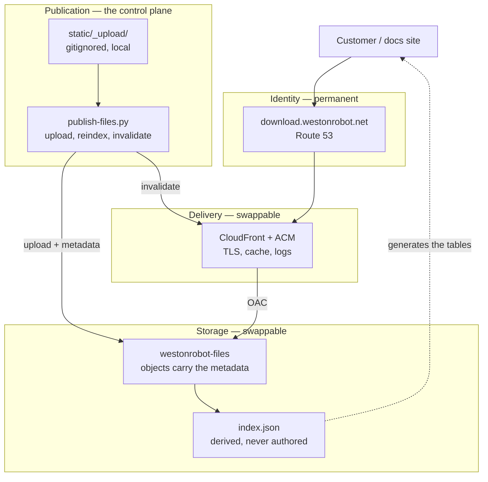

# File Hosting — Reference Design

How the downloadable-document store should be built and operated. [`../adr/0001-host-downloadable-documents-on-s3.md`](../adr/0001-host-downloadable-documents-on-s3.md) decides *what* and *why*; this document covers *how*, and the operational practice around it.

Scope: public customer-facing files — product manuals, SDK and protocol specs, training decks, software archives, firmware, video. Roughly 39 documents today, growing per product and per release.

**Right-sizing is part of the design.** Every control below earns its place at this scale or is marked as deferred. A store of 39 documents does not need the topology of a package registry, and copying one in produces a system nobody maintains. Where a practice is standard but not yet worth it here, it is listed under §12 with the trigger that would change the answer.

## 0. Four principles

**P1 — The URL is the contract; everything behind it is an implementation detail.** A URL handed to a customer outlives the storage, the vendor, the account and probably the product. It is the only part of this system that cannot be changed unilaterally later.

**P2 — Publishing is reviewed and attributable; uploading need not be.** They are different operations and deserve different privileges. The principal that adds a file and the principal that serves it must not be the same one — but making the first hard in order to control the second only guarantees it gets worked around.

**P3 — Prefer failures that are structurally impossible over failures that are detected.** A page that declares what it wants — every published WR65 manual — cannot hold a broken link, because it holds no link at all. A page that hard-codes a URL and leans on a CI check can be broken for as long as it takes someone to look.

**P4 — Breakage must be observable.** Issue #31's real cost was not that 53 links broke; it was that they broke silently and were found weeks later by a manual audit.

## 1. The layer model

Four layers, each replaceable without touching the ones above it. The point of the separation is P1: the identity layer is permanent, everything below it is negotiable.



The dashed relationship worth noticing is `IDX → C`: the store generates the site's download tables, so a page carries a query rather than a URL. That is P3, and §3 is about it. Note also what is absent — git appears nowhere on this diagram, because it holds the code that renders the store and never the store's inventory.

## 2. Topology

One bucket, `westonrobot-files`, holding one kind of thing: public documents. Prefixes carry the structure — `/robot/…`, `/solution/…` — and `index.json` sits at the root.

It got here by subtraction, and the subtractions are worth keeping because each one names a job that stopped existing. A logs bucket went when access logging moved to Phase 4 (§8). An inbox went with the approval step (ADR 0001 D9): its purpose was to be writable by people while the served bucket was not, and with publishing direct there is nothing to stage.

**What still earns the bucket boundary is CloudFront.** It is the origin, so everything in the bucket is reachable at `download.westonrobot.net`. That is exactly right for a store of published documents and exactly wrong for anything else, which is why nothing else goes in it. If a private prefix is ever needed — video masters are the open candidate — it gets its own bucket rather than a deny rule, because an allowlist that has to stay correct is a weaker thing than an origin that cannot reach.

**Naming follows one rule: customer-facing surfaces say `download`, internal ones say `files`.** The hostname is `download.westonrobot.net` because it names what a customer *does* there — `files` describes the storage, and the hostname exists for the person clicking a link in a manual. The bucket is `westonrobot-files` because it names what it *holds*. The same split runs through the code: `<Downloads>` and `npm run check:downloads` are customer-facing, while `wrfiles.py`, `npm run publish:files` and `WR_FILES_BASE_URL` are internal. It looks like an inconsistency until you know the rule, which is why the rule is written here rather than left to be inferred.

## 3. Publication: the store is the source of truth

**The problem it solves.** The set of published documents currently exists in three unrelated places: the files themselves, the links hand-written across eight doc pages, and somebody's memory. Nothing reconciles them, which is precisely how 53 links came to be dead with nobody noticing.

**A rejected answer, recorded because it is the tempting one.** An earlier draft of this document made a git-tracked manifest the source of truth. That is wrong, and the reason is worth keeping: it makes the documentation repository the gate for every document. Every manual a technician produces becomes a pull request; the repository accumulates a growing record of items it does not and must not hold; and a person who will never write code has to learn a code workflow to publish a PDF. **Git holds the code that renders the store. It does not hold the store's inventory.**

**The source of truth is the bucket.** A document's metadata lives on the object itself, set at the moment it is published:

```
s3://westonrobot-files/robot/wr65/wr65-user-manual-en-v2.3.pdf
  Content-Type:  application/pdf
  Cache-Control: public, max-age=31536000, immutable
  x-amz-meta-title:    WR65 User Manual
  x-amz-meta-product:  wr65
  x-amz-meta-kind:     manual
  x-amz-meta-lang:     en
  x-amz-meta-version:  2.3
  x-amz-meta-sha256:   9f2b1c…
```

The publish script regenerates `index.json` from the bucket on every run. The index is a *derived artifact* — never authored, never committed, reproducible at any time by re-listing the bucket.

**The docs site declares intent, not URLs.** This is the piece that keeps P3 intact without git holding anything:

```jsx
<Downloads product="wr65" kind="manual" />
```

The component resolves that query against the index at build time. **A page cannot hold a link to a document that is not published, because the page holds no links** — it holds a question, and the store answers it. An unsatisfied query renders an empty table rather than a dead link, and since "this page asks for WR65 manuals and the index has none" is checkable, the build fails on it instead of shipping it.

### The flow

| | Step | Who | Grant |
| --- | --- | --- | --- |
| 1 | Stage the file under `static/_upload/`, at its published path | Anyone editing the page | none — local |
| 2 | `publish-files.py --publish` uploads it with content type, cache headers, metadata and a `.sha256` sidecar | The publisher | `DocsDownloadPublish` |
| 3 | The same run regenerates `index.json` from the bucket and invalidates the CDN | " | " |
| 4 | It rewrites the page's local link to the published URL | " | none — local |
| 5 | Rebuild the docs site | CI, on `repository_dispatch` or the next push | none — the index is public |

**The publish grant carries no `DeleteObject`.** Published paths are permanent (D4) and a manual for hardware still in the field outlives any reason to tidy it away (§10), so the worst a publisher can do is overwrite an existing key — which versioning makes recoverable. Removing an object is an admin act, done deliberately by someone who knows why.

**Reconciliation runs in the safe direction.** Every run lists the bucket and reports objects with nothing staged locally. That is the normal state for anything published — the local copy is meant to be cleaned up — so it is a report rather than an error, and nothing is ever deleted automatically. Its value is drift: an object uploaded by hand, or a half-finished publish, shows up here.

### Authoring locally, publishing deliberately

A document is usually received or written by the same person editing the page that will link it, and that person needs to see the page work before anyone else does — the table rendered, the link live, the right revision attached. Sending them to a console to upload first and back to the page to paste a URL gets that backwards, and a link pasted by hand is a link typed wrong eventually.

So the engineer's path starts in the working tree:

1. **Drop the file into `static/_upload/`, at the path it will occupy in the store.** It has to be under `static/` for Docusaurus to serve it during a local build — which is the whole point of step 2 — and that also makes substitution a prefix swap: `/_upload/robot/wr65/x.pdf` locally, `https://download.westonrobot.net/robot/wr65/x.pdf` once published. `static/_upload/robot/wr65/wr65-user-manual-en-v2.3.pdf` publishes to exactly that path — the script derives the key by stripping the `_upload/` root, so the local tree is a preview of the bucket and a misfiled document is visible by eye before it is uploaded rather than after. The directory is gitignored, exactly as `**/video/raw/` already is, so the bytes never enter history, and the leading underscore keeps Docusaurus from treating it as routable content.

   **There is no `pending/` or `done/` subdirectory, deliberately.** The script compares each local digest against the published index, so it already knows what is outstanding and re-running it is a no-op for anything published. State directories would have to be kept in step by hand, and the one thing a gitignored tree cannot offer is a guarantee that anyone did.

   The name is deliberate. It is not `_publish/`, because dropping a file there does not publish it — a file sits there through however many local builds it takes to get the page right, and only `publish-files.py --publish` sends it anywhere. The directory holds things queued for upload, and is named for that.
2. **Reference it locally and build.** `npm start` shows the real page with the real document attached — the thing no console-first flow can offer. A `<Downloads>` query resolves against staged files too, and marks them `staged` so a local build is never mistaken for a published one.
3. **Run the publish script when the page is right.** It derives the D4 key from the local path, computes the digest, uploads with the right content type and cache headers, writes the checksum sidecar, regenerates the index, invalidates the CDN, and rewrites the page's local reference to the published one. One command, and the document is live.
4. **Rebuild and review again.** The second review is against exactly what a customer will get.

**The gitignore is the enforcement, and this is the load-bearing part.** CI has no local files, because they are not in the repository. A page committed before its document was uploaded therefore cannot resolve, and the build fails. The author saw a working page; CI sees the truth; the discrepancy surfaces in a pipeline rather than in a support ticket. It is the same mechanism as the video budget check (ADR 0001 D8) — a guarantee that comes from git and the filesystem disagreeing in a controlled, deliberate way.

`npm run check:downloads` runs the same resolution locally for anyone who wants the answer before pushing rather than after. It checks two things: that no page references `static/_upload/`, and — whenever the index is reachable — that every `<Downloads>` query matches something. An unreachable index skips the second check rather than failing it, because before the store exists there is nothing to check against and a gate that fails for that reason gets switched off.

**What step 3 rewrites changes between phases**, and the earlier form is worth shipping first:

- **Phase 2.** The script substitutes the published URL directly into the page. Simple, and it makes the second review concrete — you are looking at the actual link. The URL is generated from the D4 convention rather than typed, and D4 paths are immutable, so it does not rot the way a hand-pasted one would.
- **Phase 3.** The page carries `<Downloads product="wr65" kind="manual" />` instead, and the resolver prefers a matching local file in development and the published index everywhere else. No URL appears in the page at all, and a superseded revision stops requiring an edit to every page that mentions it.

**Why a script and not a console.** Content type, cache headers, the digest, the key and the index all come out of one code path rather than out of somebody's care on the day. A file dropped into the bucket by hand is at the wrong key with no cache headers and invisible to `index.json` — not obviously broken, which is worse. The script is the publishing interface, and there is no second one.

**A skill is a wrapper, not the implementation.** If this is exposed as a Claude Code skill alongside `vendor-interface-summary`, the skill calls the script and the script stays runnable on its own. CI needs it, a technician on a laptop may need it, and neither has the skill installed.

## 4. Identity and paths

The path convention is ADR 0001 D4: `/<section>/<product>/<document>-<lang>-v<version>.<ext>`. Everything belonging to one robot shares one prefix, so `download.westonrobot.net/robot/wr65/` is the whole of the WR65's downloadable documentation and someone holding any one of its URLs can guess the others.

**The prefix names the product, not the navigation.** The page for the WR65 lives at `/robot/manipulator/wr65`; its files live at `/robot/wr65/`. Dropping the category is deliberate — see the amendment note on D4. Sections and product identities are stable; the taxonomy between them is the layer that gets reorganised, and a permanent URL must not inherit that.

Three operational rules make the convention hold over time:

**Published paths are immutable.** Never rename, never delete, never repurpose. A new revision is a new key; the old key keeps resolving. This is not tidiness — a customer's bookmark, a printed QR code on a robot, and a support email from 2024 all depend on it.

**Where "the current manual" needs a stable address**, `latest/` is a separate short-TTL key that redirects or duplicates, and the versioned key remains the canonical one. Never make the unversioned path the only path.

**The local tree is a literal preview of the store.** `static/_upload/robot/wr65/wr65-user-manual-en-v2.3.pdf` publishes to exactly that path; the script derives the key by stripping the `_upload/` root. A misfiled document is visible by eye before it is uploaded rather than after.

**Language is a path element, not a suffix on the title** — `…-en-v2.3.pdf`, `…-zh-v2.3.pdf`. The docs site serves existing customers including zh-Hans readers, and a language variant that is discoverable only by reading a table is not discoverable.

## 5. Integrity and authenticity

The corpus contains software archives and firmware. That is executable code shipped to robots in the field, and it changes the standard this system is held to.

**Minimum, now:** every archive and firmware image gets a published SHA-256, carried in the object's own metadata and in a sidecar `.sha256` beside it, with the docs page showing it. It is computed from the bytes on disk at publish time and stored on the object, so what was uploaded is what a customer verifies. TLS protects the transfer; the checksum protects against a corrupted upload, a truncated download and a substituted object at rest. Every serious vendor publishes these; their absence is conspicuous.

**Next, for firmware and SDKs:** detached GPG signatures. There is a consistency argument close to hand — `deb.westonrobot.net` already relies on GPG, and the same key management can cover both. The reason this matters more than it looks: apt verifies signatures automatically, but a human downloading a `.zip` from a web page verifies nothing unless the page gives them something to verify against and a reason to bother.

**Tamper evidence:** bucket versioning (§6) means an overwritten object is recoverable and the overwrite is visible, rather than the previous bytes simply ceasing to exist.

## 6. Durability, versioning and recovery

S3's durability guarantee covers hardware loss. It does not cover the failure that actually happens, which is a person or a script deleting or overwriting the wrong thing.

- **Versioning ON.** The single highest-value control here, and close to free at this volume. It turns "someone overwrote the manual" from an incident into a console click.
- **The publish grant has no `DeleteObject`.** The worst a publisher can do is overwrite a key, which versioning makes recoverable. Removing an object needs admin credentials — friction that is the point, since public documents should essentially never be deleted (§10).
- **Lifecycle for noncurrent versions**, so versioning does not accumulate cost without bound — expire noncurrent versions after a generous window rather than keeping every revision of every PDF forever.
- **Account-level Block Public Access ON.** With OAC (D3) nothing needs public ACLs, so this costs nothing and removes the most common way an S3 bucket becomes an incident.

Cross-region replication is deferred (§12).

## 7. Access control and least privilege

**CI holds no AWS credentials at all.** `index.json` is public content served through CloudFront like everything else, so the site build fetches it over HTTPS exactly as any other consumer would. There is no publish step in CI and therefore no role for it to assume — which disposes of the most common finding in a setup like this: static access keys in repository secrets that do not rotate, do not expire, get copied elsewhere, and outlive whoever created them.

One consequence to be aware of: a public index makes the full inventory enumerable. That is acceptable only because the store holds public content by decision, and it needs revisiting the moment anything gated appears (§12).

**Publishing is direct, so the publish grant does put files in front of customers** (ADR 0001 D9). Two roles, not five:

| Role | Can | Held by |
| --- | --- | --- |
| Publish | `PutObject`, `GetObject`, `ListBucket` on `westonrobot-files`, and CloudFront invalidation. **No `DeleteObject`** | Whoever publishes documents |
| Read | `GetObject`, `ListBucket` | Humans, for debugging |

Bucket and distribution configuration is an admin act, done through the stack rather than through a standing role.

**The no-delete property belongs to the grant, not to the person.** Verified against the deployed policy with `iam simulate-principal-policy`: a publisher whose only relevant membership is this group gets `implicitDeny` on `s3:DeleteObject`, while a publisher who is also in `Administrators` gets `allowed`. That is the intended shape — removing a published document *should* require admin credentials (§10) — but it means the guarantee constrains the role rather than the human, and anyone holding admin is outside it. Worth knowing before assuming the store is protected from everyone who can publish to it.

**CI holds no AWS credentials at all.** `index.json` is public content served through CloudFront like everything else, so the site build fetches it over HTTPS exactly as any other consumer would. There is no publish step in CI and therefore no role for it to assume — which disposes of the most common finding in a setup like this: static access keys in repository secrets that do not rotate, do not expire, get copied elsewhere, and outlive whoever created them.

One consequence to be aware of: a public index makes the full inventory enumerable. That is acceptable only because the store holds public content by decision, and it needs revisiting the moment anything gated appears (§12).

**Infrastructure as code, for one narrow reason.** The security model of this store *is* its IAM and bucket policies — the OAC condition on `AWS:SourceArn`, the deny-delete, all four public-access blocks, five deliberately narrow grants. Those interlock, and their failure mode is silent: an over-broad grant does not error, it quietly works. Console editing over three years by three people is how that rots, so the policies have to exist as reviewable text that matches reality.

That requirement is met by CloudFormation (`infra/`), chosen over Terraform on dependency grounds: the AWS CLI is already installed and authenticated, there is no second binary, and **AWS holds the state** rather than a file someone has to host, secure and not corrupt. For a team whose first piece of infrastructure-as-code this is, the tool that adds no new operational concern beats the better language. Terraform earns its state file at the second account or the third environment; neither exists yet.

## 8. Observability — making breakage visible

P4. The design goal is that the next time something breaks, a dashboard says so before a customer does.

**What moving to our own domain buys us, beyond the fix.** When the links lived on `tangrobot.sharepoint.com`, a broken link produced a DNS failure on infrastructure we did not own and could not see. Once every link is on `download.westonrobot.net`, a broken link produces a **404 in our own CloudFront logs**. The failure becomes an observable event on a system we operate. That is arguably a larger win than the fix itself.

**Access logging is not on at launch.** Merging the logs bucket into the private one made it inexpressible in a single stack (§2), so it is switched on with the alarm work rather than before it. That costs less than it sounds: CloudFront publishes `4xxErrorRate` to CloudWatch as a metric with no logging configured, so the alarm below — the one that answers how 53 dead links went unnoticed — can exist without them. What logs add is *which* keys are missing, which is the second question rather than the first.

Worth watching, in rough order of value:

1. **404 rate, and the top missing keys.** A spike means a link went wrong, and the key names say exactly which. This is the direct answer to issue #31's real defect.
2. **Cache hit ratio.** A low ratio on a static corpus means `Cache-Control` is wrong and egress is being paid for needlessly.
3. **Egress volume**, once video is in the mix, with a billing alarm.
4. **4xx/5xx from the origin**, which indicates an OAC or policy problem rather than a link problem.

A CloudWatch alarm on 404 rate is the piece that has to exist from day one. Access logs, and a destination for them, arrive with it — the query tooling can wait until there is a question worth running against them.

## 9. Cost

**Effectively zero at this volume, and that is now measured rather than assumed.** Rates below were read from the AWS Pricing API on 2026-08-31 (`aws pricing get-products --service-code AmazonCloudFront`), not recalled; they are list prices, so any negotiated agreement only moves them down.

| Line | Rate | At 39 documents |
| --- | --- | --- |
| CloudFront egress, first 1 TB/month | **$0.00** — perpetual, not a trial | $0.00 |
| CloudFront egress beyond that, Asia Pacific | $0.12/GB (0–10 TB), $0.085/GB in Europe and the US | — |
| CloudFront HTTPS requests, first 10M/month | $0.00, then $1.20 per million in Asia Pacific | $0.00 |
| S3 Standard, ap-southeast-1 | $0.025/GB-Mo | a few cents |
| ACM certificate | free when used with CloudFront | $0.00 |
| Route 53 hosted zone | `westonrobot.net` already exists | $0.00 |

Exceeding the free tier needs more than 1 TB of egress a month — on the order of fifty thousand downloads of a 20 MB manual. The first terabyte past it costs about $120. That is a volume worth celebrating rather than optimising against.

The levers, in order of effect, for whenever it does matter:

- **`Cache-Control`.** The dominant lever on egress. Long TTLs on immutable versioned keys mean the origin is read approximately once per object per edge.
- **Storage class.** Standard for served content. Archive tiers apply to masters, which are out of scope here.
- **A billing alarm**, so video growth is noticed as a number rather than as an invoice. $20/month is a reasonable threshold — comfortably above zero, far below anything that would be a surprise.

**Still a measurement to take:** total corpus size once the 39 documents are exported. Storage is a rounding error at any plausible figure, but the number is worth knowing before the first bulk load rather than after.

## 10. Content lifecycle and retention

**Robotics changes the retention question.** A UGV sold in 2021 is still in service, and its operator still needs its manual and its firmware. The instinct to delete documentation for discontinued products is wrong here: the product is discontinued, the fleet is not.

- **Never delete a manual or firmware image for hardware that could still be in the field.** Supersede it.
- **Mark superseded documents rather than removing them** — the docs page stops linking the old revision, the object stays reachable for anyone holding the URL.
- **Retention is effectively indefinite** for manuals and firmware; storage is cheap and the alternative is a customer with an unserviceable robot.
- **A document leaving the docs site is not a document leaving the bucket.** Two separate decisions, and conflating them is how bookmarks break.

`publish-files.py --retire <key>` implements the second bullet: it writes a `retired` date into the object's metadata, so the index still reports the document and `<Downloads>` stops listing it while the URL goes on resolving. Metadata rather than a tag because `head_object` already returns it, so the index build reads it for free and setting it needs only `PutObject`, which a publisher already has. The index deliberately keeps reporting retired objects — it is derived from the bucket, and filtering there would make it a curated second source of truth that can disagree with the first.

## 11. Adoption in phases

Ordered so each phase is independently useful and nothing is blocked on the phase after it.

**Phase 0 — Unblock. Still blocked.** Export the 39 documents from the renamed M365 tenant. Everything downstream waits on this; WR65 and WRL63 first, since those products have no reachable documentation at all.

**Phase 1 — Serve it correctly. Infrastructure done 2026-09-01.** Bucket, CloudFront, ACM, OAC, Block Public Access, versioning — deployed and verified; `infra/README.md` records what exists. The bulk load and the link rewrite wait on Phase 0.

**Phase 2 — Make it repeatable. Done.** The publish script and the gitignored `_upload/` convention, plus — added once the need appeared — `--list` to see what is published and `--retire` to withdraw a document without breaking its URL.

**Phase 3 — Make it structural. Done, except the rebuild trigger.** The `<Downloads>` component resolves from the live index, and pages carry queries rather than URLs. What remains is the trigger that rebuilds the site when the index changes: it needs a GitHub token in AWS, which is a decision of its own.

**Phase 4 — Harden. Not started.** Checksums are already written at publish, so what remains is signatures for firmware and SDKs, the 404 alarm with the access logging it wants, and the cost alarm.

Of what remains, the Phase 4 alarm is the highest value per unit of effort — it is the answer to how 53 dead links went unnoticed for weeks, and CloudFront publishes `4xxErrorRate` to CloudWatch whether or not access logging is on.

## 12. Deliberately not doing this yet

Listed with the trigger that would change the answer, so the decision is revisitable rather than forgotten.

| Practice | Why not now | Trigger to revisit |
| --- | --- | --- |
| Cross-region replication | S3 durability within a region already exceeds the risk this addresses; versioning covers the realistic failure | A contractual availability commitment, or a second region for compliance |
| A staging *environment* — a second distribution serving unpublished content for preview | 39 mostly-static documents; review happens on the page, before publishing. Nothing unpublished exists to preview: a document is either staged on someone's laptop or live | Publishing becoming frequent enough that a bad publish is likely |
| Signed URLs / access control | ADR 0001 scope is public content only (decided 2026-08-31) | Any licence-gated SDK or customer-specific deliverable |
| Object Lock / WORM | No regulatory retention requirement identified | A compliance or safety-certification requirement on firmware provenance |
| A mainland-China mirror | Deferred by decision | Chinese customer download experience becoming a support burden |
| Separate archive bucket for masters | Out of ADR 0001 scope | Taken up as its own piece of work; the need is already recorded in `.gitignore` |
