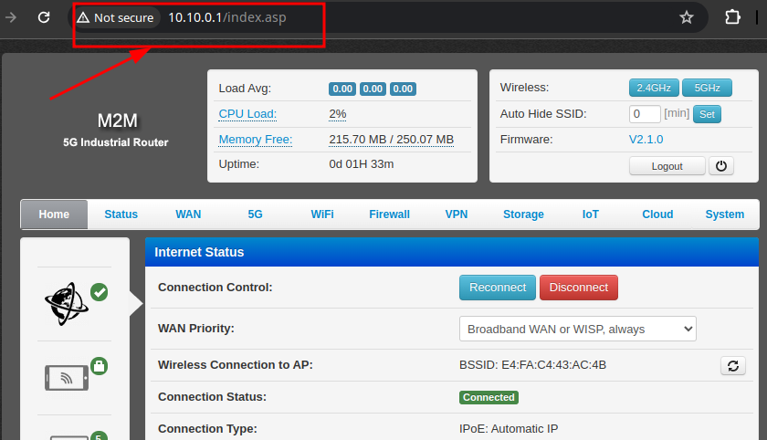
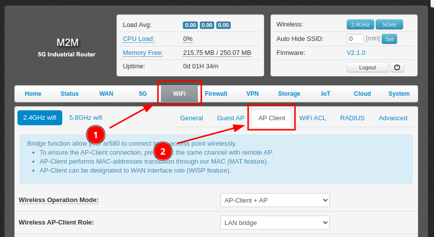
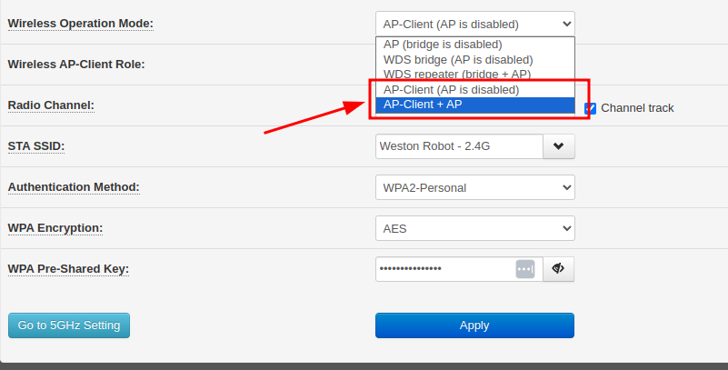
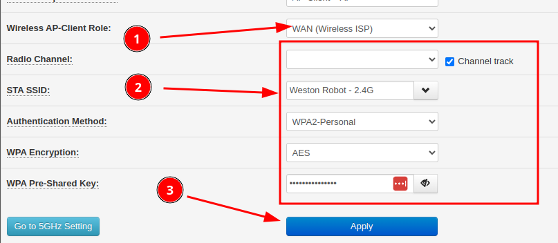
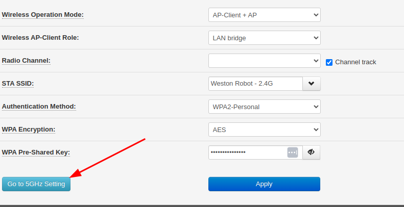
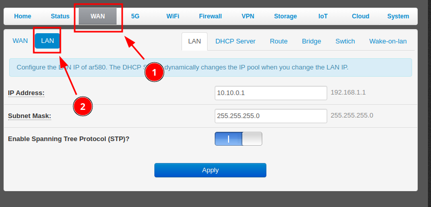
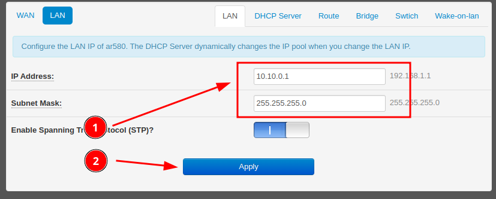

import ROUTER_5G_IMG from '../img/westonrobot/5g_router/industrial_5g_wifi_router.jpg';

# Industrial 5G Router

## 1. Key Specifications

* **Cellular**
    * **5G Standard**: 3GPP R16, Sub-6 GHz
    * **5G NR NSA**: n1, n2, n3, n5, n7, n8, n12, n13, n14, n18, n20, n25, n26, n28, n29, n30, n38, n40, n41, n48, n66, n70, n71, n75, n76, n77, n78, n79
    * **5G NR SA**: n1, n2, n3, n5, n7, n8, n12, n13, n14, n18, n20, n25, n26, n28, n29, n30, n38, n40, n41, n48, n66, n70, n71, n75, n76, n77, n78, n79
    * **LTE-FDD**: B1, B2, B3, B4, B5, B7, B8, B12, B13, B14, B17, B18, B19, B20, B25, B26, B28, B29, B30, B32, B66, B71
    * **LTE-TDD**: B34, B38, B39, B40, B41, B42, B43, B48
    * Refer to "RM520N-GL" datasheet for more technical details
* **Wifi:** 2.4G/5G
* **Network Ports**
    * 1x Gigabit WAN/LAN port
    * 3x Gigabit LAN ports
* **2x SIM card slots**: supports network switching between SIM cards
* **Hardware watchdog**
* **Operating temperature**: -40°C to 75°C
* **Power supply**: 5-40V (DC2.1/2-pin Phoenix connector)

## 2. Common Configurations

### Using the Industrial 5G/Wifi Router as an Access Point (AP) Client

The router can be configured to connect to an existing Wifi network as an AP client, after which it can provide internet access (assuming the existing network already has internet) to devices connected to its LAN ports.

To configure the router as an AP client, follow these steps:

1. Connect to the router's web interface by entering the router's IP address in a web browser. The default IP address is usually "10.10.0.1".

   

2. Click into the AP client configuration page.

   

3. Change "Wireless Operation Mode" to "AP-Client + AP" or "AP-Client (AP is disabled)"

   **Note**: The difference between the 2 modes is whether the router will also broadcast its own Wifi network. If you want the router to broadcast its own Wifi network, choose "AP-Client + AP".

   

4. Switch Role to "WAN (Wireless ISP)", configure the Wifi network settings of the **existing network** to connect and click "Apply"

   

5. After applying the settings, the router will attempt to connect to the existing Wifi network. You can check the connection status on the "Status" page.

#### For 5Ghz network

The router supports both 5Ghz and 2.4Ghz networks, you can configure the router to connect to a 5Ghz network by clicking the "Go to 5Ghz Setting" button and repeat the steps above.

### Changing the Router's LAN IP Address

The router's LAN IP address range can be changed to fit your network configuration.

To change the LAN IP address, follow these steps:

1. Connect to the router's web interface by entering the router's IP address in a web browser. The default IP address is usually "10.10.0.1".

   

2. Click into the "LAN" configuration tab.
  
   

3. Adjust the LAN settings as needed and click "Apply".
    
   **Note**: DHCP server settings should be adjusted automatically to suit the new LAN settings.

   
