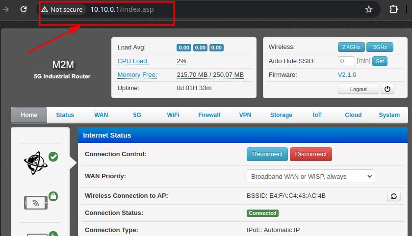
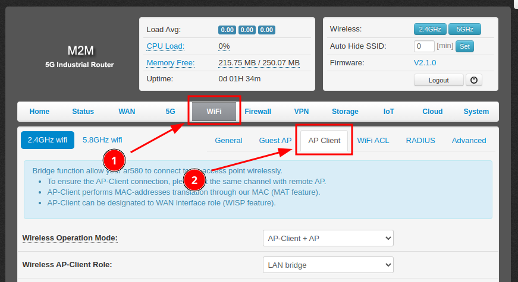
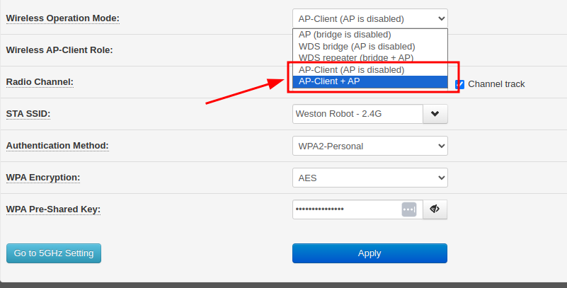
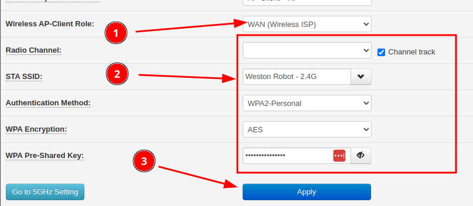
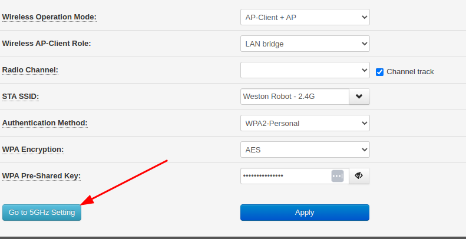
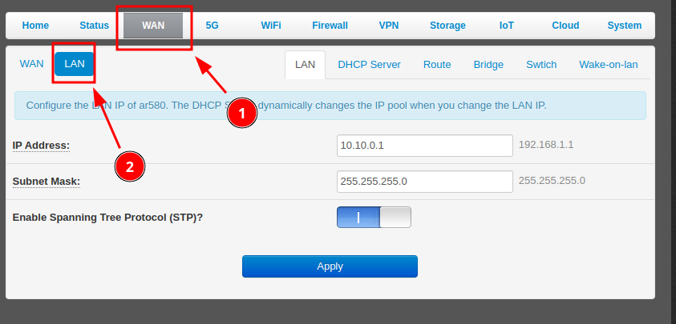
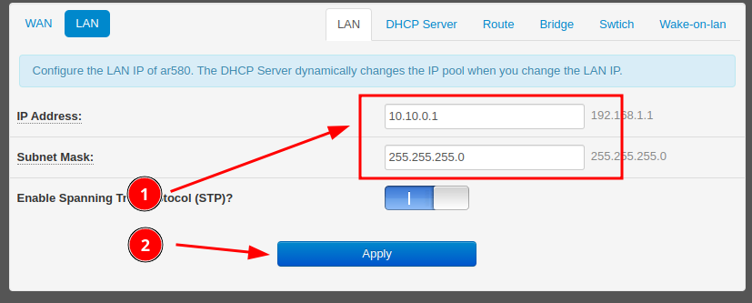

# Industrial 5G / WiFi router

<Split ratio="wide-narrow">

An industrial cellular router for robots that have to work away from a fixed network — outdoor deployments, multi-site inspection, or anywhere you need to reach a robot that is not on your own WiFi.

It carries 5G and LTE over a **Quectel RM520N-GL** module, has two SIM slots so it can fall back between carriers, and provides both WiFi and four Gigabit Ethernet ports for the devices on the robot.

It can also run as a **WiFi client**, joining an existing network and sharing that connection to everything on its LAN ports — which is often what you actually want on a bench or in a lab.

<Figure
  src={require('../img/westonrobot/5g_router/industrial_5g_wifi_router.jpg').default}
  alt="Industrial 5G and WiFi router"
  size="hero"
  framed />

</Split>

## Getting started

1. **Mount it** somewhere the antennas are not enclosed in metal.
2. **Power it** — 5–40 V, through either the DC 2.1 barrel jack or the 2-pin Phoenix connector. The wide range means it can usually run straight from the platform's battery rail without a regulated supply.
3. **Insert a SIM** if you are using cellular. There are two slots, and the router can switch between them.
4. **Connect a machine to a LAN port** and open the web interface at `http://10.10.0.1` — see [Logins and IP addresses](#logins-and-ip-addresses).

From there, the two things most people need are in [Common configurations](#common-configurations).

## Key information

### Related resources

| Resource | What it is | Where |
| --- | --- | --- |
| Cellular module datasheet | Supported 5G NR and LTE bands, in full | [Quectel RM520N series](https://www.quectel.com/product/5g-rm520n-series/) |

### Logins and IP addresses

| | |
| --- | --- |
| **Web interface** | `http://10.10.0.1` |

Everything in [Common configurations](#common-configurations) is done through that web interface. If the router has already been deployed, its address may have been changed — see [Changing the LAN IP address](#changing-the-lan-ip-address).

### Electrical interfaces

| Interface | Count | Notes |
| --- | --- | --- |
| Ethernet | 1 × Gigabit WAN/LAN, 3 × Gigabit LAN | |
| SIM | 2 slots | Supports switching between them |
| WiFi | 2.4 GHz and 5 GHz | Configured separately — see the AP-client procedure |
| Power input | DC 2.1 barrel or 2-pin Phoenix | 5–40 V |

### Specifications

The 5G NR and LTE band support comes from the **Quectel RM520N-GL** module. The full band list is long and belongs with the module rather than here — see the [Quectel RM520N series datasheet](https://www.quectel.com/product/5g-rm520n-series/).

| | |
| --- | --- |
| Cellular | 5G Sub-6 GHz, 3GPP Release 16. NR standalone and non-standalone, with LTE-FDD and LTE-TDD fallback |
| Module | Quectel RM520N-GL |
| Operating temperature | −40 °C to 75 °C |
| Watchdog | Hardware |

Check your carrier's bands against the module datasheet before committing to a region.

## Common configurations

### Using the router as a WiFi (AP) client

This makes the router join an existing WiFi network and share that connection to devices on its LAN ports — useful when the robot needs internet access but you do not want to move it onto cellular.

1. Open the web interface at `http://10.10.0.1`.

   

2. Go to the AP client configuration page.

   

3. Set **Wireless Operation Mode** to either `AP-Client + AP` or `AP-Client (AP is disabled)`.

   The difference is whether the router keeps broadcasting its own WiFi network as well. Choose `AP-Client + AP` if you still want to connect to the robot over its own SSID.

   

4. Set **Role** to `WAN (Wireless ISP)`, enter the credentials of the **existing** network you are joining, and click **Apply**.

   

5. Check the connection on the **Status** page.

#### Joining a 5 GHz network

The steps are the same, but start by clicking **Go to 5Ghz Setting** — the 2.4 GHz and 5 GHz radios are configured separately.

### Changing the LAN IP address

Change this when `10.10.0.x` collides with an existing network — which it will if you have two of these, or if the robot has to sit on a customer's subnet.

1. Open the web interface at `http://10.10.0.1`.

2. Go to the **LAN** configuration tab.

   

3. Adjust the LAN settings and click **Apply**. The DHCP server range adjusts automatically to match.

   

:::caution You will lose the connection when you apply this

Changing the LAN address changes the address you are currently connected on. Reconnect
at the new address afterwards, and record it — there is no label on the unit saying
what it was changed to.

:::

## Troubleshooting & FAQ

### The web interface does not respond at 10.10.0.1

Either the address has been changed on this unit, or your machine is not on its subnet. Check that you have an address from its DHCP server before assuming the router is faulty.

### It has joined a WiFi network but devices have no internet

Confirm the network it joined actually has internet, and that **Role** is set to `WAN (Wireless ISP)` — in the other roles the router will associate but not route.

For fault and alarm codes, see [Fault codes](/support/fault-codes). General questions are answered on the [Support FAQ](/support/faq).

## Support

Collect the serial number, firmware version and the configuration you are using before raising a ticket — [Before you contact us](/support/before-you-contact-us) lists what helps.

- [Support centre](/support/intro) — all support resources
- [Identify your product](/support/identify-your-product) — where to find the serial number
- [Warranty and RMA](/support/warranty-and-rma) — repairs, replacements and returns
