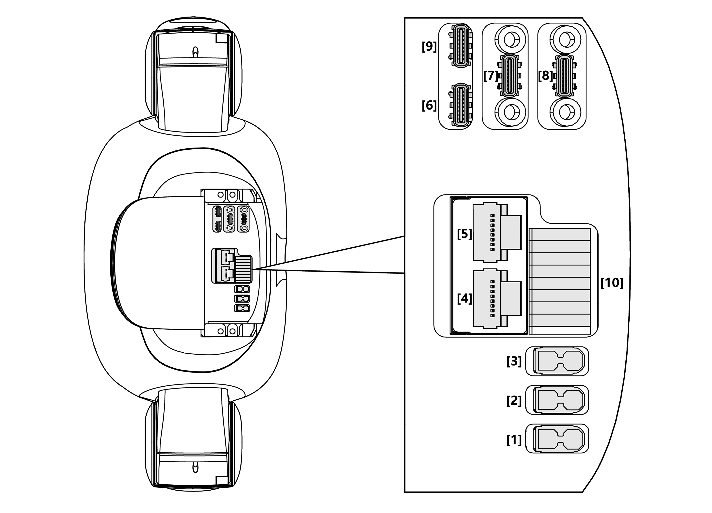
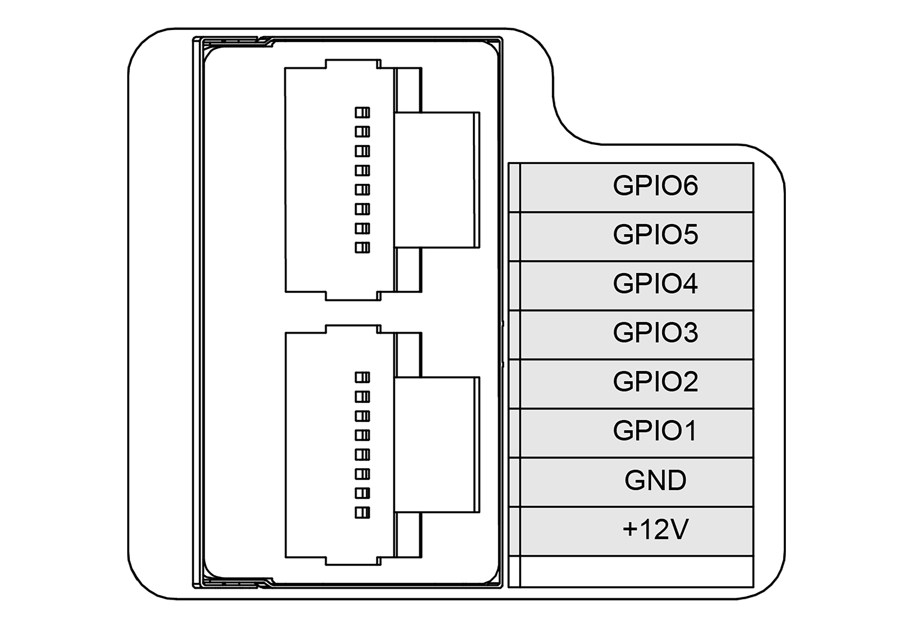

# G1

## 1. Overview

The G1 is a humanoid robot that stands 130 cm tall and weighs 35 kg. It comes equipped with a LIVOX MID-360 LiDAR and an Intel RealSense D435i depth camera.

## 2. Specifications

### 2.2 Electrical Interfaces

> **Note**: There are many ways to operate NVIDIA GPIO, refer to this [link](https://docs.nvidia.com/jetson/archives/r35.2.1/DeveloperGuide/text/HR/JetsonModuleAdaptationAndBringUp/JetsonOrinNxSeries.html#identifying-the-gpio-number) for the definition.

### 2.3 On-board Computer

G1 Edu has 2 onboard computers:

- Operation & Control computing unit (Not accessible to public)
    - IP: 192.168.123.161
     
- User development computing unit
    - IP: 192.168.123.164
    - Username: unitree
    - Password: 123

## 3. Resources

### Basic Guides

* G1 Manual: [Unitree](https://support.unitree.com/home/en/G1_developer)
* Training Slides: [G1 Basic Training](https://tangrobot.sharepoint.com/:b:/s/Public-Outgoing/EYW7e2v3tL1DtCeW-HGdQo8BlBn-CkYQve05OhJDlS7xcA?e=5kJQpt)

### Development

* SDK Support: [unitree_sdk2](https://github.com/unitreerobotics/unitree_sdk2)
* ROS2 Support: [unitree_ros2](https://github.com/unitreerobotics/unitree_ros2)
