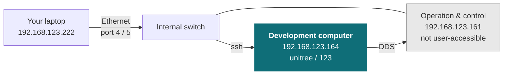

# G1

<Split ratio="wide-narrow">

The G1 is Unitree's full-size bipedal humanoid, supplied as a development platform. Unitree's own locomotion stack handles balance and walking; you write your application against it over the robot's internal network.

Unitree's own documentation: [product page](https://www.unitree.com/g1) · [developer documentation](https://support.unitree.com/home/en/G1_developer)

<Figure
  src={require('../img/unitree/G1_robot.png').default}
  alt="Unitree G1 humanoid robot in a running stance"
  size="hero" />

</Split>

## Getting started

Read [Operational Safety](/tutorial/operational-safety) before powering the robot for the first time. The G1 is a legged robot that can fall, and the guidance there on supporting it during early testing prevents the most common damage.

The first-run sequence is covered end to end in the **[G1 Development Guide](/tutorial/unitree/g1_dev_guide)**, the most detailed guide on this site. In outline:

1. **Understand the hardware** — joint layout, peripherals and electrical connectivity.
2. **Connect to the robot** — wire into its internal network and reach the development computer.
3. **Set up the software** — the SDK and the ROS 2 packages, and how Unitree's software is structured.
4. **Run an example** — a first motion program, to confirm the whole chain works.

If you only need the robot on the internet rather than a development setup, the [Internet Connection Guide](/tutorial/unitree/g1_internet_guide) is the shorter path.

## Key information

A quick reference for what you reach for most often. Unitree documents all of this in more depth — collected here so you can scan it with the robot in front of you, rather than searching for it. Values below are as configured on the units we supply.

### Logins and IP addresses

| Computer | Address | Credentials | What it is |
| --- | --- | --- | --- |
| **Development** | `192.168.123.164` | `unitree` / `123` | Where your code runs |
| Operation & control | `192.168.123.161` | — | Unitree's locomotion stack. Not user-accessible |

You reach the development computer over SSH and talk to the control computer from there over DDS — you do not log into the control computer directly.

Development requires a **wired** connection. The development computer can join a WiFi network for *internet access* — to fetch packages, for example — but not for development itself. The [Internet Connection Guide](/tutorial/unitree/g1_internet_guide) covers both methods, including sharing your host machine's connection.

The units we supply carry a **LIVOX MID-360** LiDAR, reached over Ethernet on the internal network, and an **Intel RealSense D435i** depth camera on USB on the development computer.

G1 ships in variants, and which one you have determines what is fitted — so confirm the model designation as well as the serial number. Both are in the battery compartment and in the mobile app under `Device → Robot Settings`; see [Identify your product](/support/identify-your-product) for every platform.

### Network layout

Both computers sit on the robot's internal `192.168.123.x` network. **Your code goes on the development computer.**

```mermaid
flowchart LR
    L["Your laptop<br/>192.168.123.222"] -->|Ethernet<br/>port 4 / 5| SW["Internal switch"]
    SW -->|ssh| DEV["<b>Development computer</b><br/>192.168.123.164<br/>unitree / 123"]
    SW --- CTL["Operation &amp; control<br/>192.168.123.161<br/>not user-accessible"]
    DEV -->|DDS| CTL
    style DEV fill:#0f6e78,stroke:#0f6e78,color:#fff
    style CTL fill:#e8e8e8,stroke:#999,color:#333
```

The [G1 Development Guide](/tutorial/unitree/g1_dev_guide) has fuller diagrams of the internal wiring and of the two SDK approaches.

### Electrical interfaces

Use these when mounting a payload or wiring anything to the robot. The first image shows where each interface sits on the body; the second gives the GPIO connector pinout. Click either to enlarge.

<FigureGrid columns={2}>
  <Figure
    src={require('../img/unitree/G1_electrical_interfaces.jpg').default}
    alt="G1 electrical interface locations"
    framed
    caption="Interface locations on the body." />
  <Figure
    src={require('../img/unitree/G1_electrical_interfaces_gpio.jpg').default}
    alt="G1 GPIO connector pinout"
    framed
    caption="GPIO connector pinout." />
</FigureGrid>

> **Note**: There are many ways to operate NVIDIA GPIO, refer to this [link](https://docs.nvidia.com/jetson/archives/r35.2.1/DeveloperGuide/text/HR/JetsonModuleAdaptationAndBringUp/JetsonOrinNxSeries.html#identifying-the-gpio-number) for the definition.

## Guides for this product

| Guide | What it covers | Reach for it when |
| --- | --- | --- |
| [G1 Development Guide](/tutorial/unitree/g1_dev_guide) | Hardware layout, network setup, SDK and software architecture, first motion example | Setting the robot up, or starting to write code against it |
| [G1 Diagnostics Guide](/tutorial/unitree/g1_diag_guide) | Reading diagnostic data and alarm information through the mobile app | Something is wrong and you need to know what |
| [G1 Internet Connection Guide](/tutorial/unitree/g1_internet_guide) | Joining the development PC to WiFi, or sharing your host's connection | The robot needs internet access, e.g. to install packages |

**[All G1 guides](/tutorial/tags/g1)** — generated from the `g1` tag, so anything published later appears there without this page being edited.

## Troubleshooting & FAQ

### Can the robot stand on its own?

From a lying position, the G1 can stand on its own. However, this mode is not recommended: it may damage the joints through excessive use, and the robot may fall on smooth floors. Have the robot stand from a seated or hanging position instead.

### Does the robot support wireless development?

No. The internal development PC can connect to WiFi for internet access — see the [Internet Connection Guide](/tutorial/unitree/g1_internet_guide) — but development itself requires a wired connection to the robot's internal network.

### Questions that apply across our platforms

These are answered once on the [Support FAQ](/support/faq) rather than repeated per model:

- [Is the robot waterproof?](/support/faq#is-the-robot-waterproof) — no, and what the ratings mean across platforms
- [How often do I need to lubricate the joints?](/support/faq#how-often-do-i-need-to-lubricate-the-joints) — and what to do about stiffness or play
- [The robot has fallen over and does not respond to the controller](/support/faq#the-robot-has-fallen-over-and-does-not-respond-to-the-controller) — the recovery sequence

For fault and alarm codes, see [Fault codes](/support/fault-codes).

## Downloads and software

| Resource | What it is | Where |
| --- | --- | --- |
| Training slides | Weston Robot's G1 basic training deck | [G1 Basic Training](https://tangrobot.sharepoint.com/:b:/s/Public-Outgoing/EYW7e2v3tL1DtCeW-HGdQo8BlBn-CkYQve05OhJDlS7xcA?e=5kJQpt) |
| URDF / CAD | Robot model for simulation and mechanical design | [Unitree developer downloads](https://support.unitree.com/home/en/G1_developer/get_sdk) |
| C++ SDK | Primary development interface | [unitree_sdk2](https://github.com/unitreerobotics/unitree_sdk2) |
| Python SDK | Python bindings for the same interface | [unitree_sdk2_python](https://github.com/unitreerobotics/unitree_sdk2_python) |
| ROS 2 package | ROS 2 integration | [unitree_ros2](https://github.com/unitreerobotics/unitree_ros2) |

Installing Weston Robot packages on the robot or your host? Add our package repository first: [Weston Robot Apt Source](/tutorial/installation/apt_source).

Vendor manuals, videos and the mobile app are on the official pages linked at the top of this page.

## Support

Collect the serial number, firmware version and logs before raising a ticket — [Before you contact us](/support/before-you-contact-us) lists exactly what helps and includes the commands to gather it. Tickets that arrive complete are usually answered in one reply rather than several.

- [Support centre](/support/intro) — all support resources
- [Fault codes](/support/fault-codes) — what an error or alarm code means
- [Warranty and RMA](/support/warranty-and-rma) — repairs, replacements and returns
