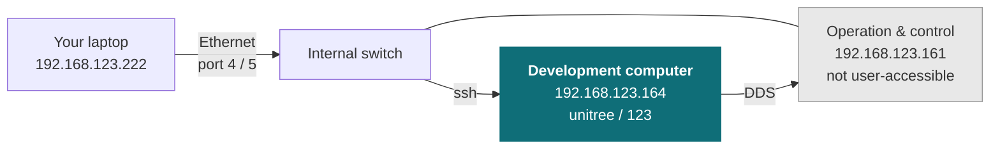

# G1

<Split ratio="wide-narrow">

<div>

The G1 is Unitree's full-size bipedal humanoid, supplied as a development platform. Unitree's own locomotion stack handles balance and walking; you write your application against it over the robot's internal network, wired for anything touching low-level control.

This page does not repeat or replace Unitree's documentation. It highlights the information you reach for most often, and supplements it with what we have learned from supplying and supporting these units — configuration, verified values, and our own guides. Unitree's own documentation:

* [Official product page](https://www.unitree.com/g1)
* [Official documentation](https://support.unitree.com/home/en/G1_developer)

</div>

<Figure
  src={require('../img/unitree/G1_robot.png').default}
  alt="Unitree G1 humanoid robot in a running stance"
  size="hero" />

</Split>

## Getting started

Read [Operational Safety](/tutorial/operational-safety) before powering the robot for the first time. The G1 is a legged robot that can fall, and the guidance there on supporting it during early testing prevents the most common damage.

The first-run sequence is covered end to end in the **[G1 Development Guide](/tutorial/unitree/g1_dev_guide)**, the most detailed guide on this site. In outline:

1. **Understand the hardware** — joint layout, peripherals and electrical connectivity.
2. **Connect to the robot** — wire into its internal network and reach the development computer.
3. **Set up the software** — the SDK and the ROS 2 packages, and how Unitree's software is structured.
4. **Run an example** — a first motion program, to confirm the whole chain works.

If you only need the robot on the internet rather than a development setup, the [Internet Connection Guide](/tutorial/unitree/g1_internet_guide) is the shorter path.

## Key information

A quick reference for the things you reach for most often, collected so you can find them with the robot in front of you. Values are as configured on the units we supply.

### Related resources

Files and repositories you clone or download to work with the robot.

| Resource | What it is | Where |
| --- | --- | --- |
| Training slides | Weston Robot's G1 basic training deck | [G1 Basic Training](https://drive.google.com/file/d/1bxRCtmtrvQ1vH279HSRvdj0IkLV-axV7/view?usp=drive_link) |
| URDF / CAD | Robot model for simulation and mechanical design | [Unitree developer downloads](https://support.unitree.com/home/en/G1_developer/get_sdk) |
| C++ SDK | Primary development interface | [unitree_sdk2](https://github.com/unitreerobotics/unitree_sdk2) |
| Python SDK | Python bindings for the same interface | [unitree_sdk2_python](https://github.com/unitreerobotics/unitree_sdk2_python) |
| ROS 2 package | ROS 2 integration | [unitree_ros2](https://github.com/unitreerobotics/unitree_ros2) |

Installing Weston Robot packages on the robot or your host? Add our package repository first: [Weston Robot Apt Source](/tutorial/installation/apt_source).

Vendor manuals, videos and the mobile app are on the official pages linked at the top of this page.

### Power on / off

- **Power on**: short press, then long press (~2 s) the power button until the LEDs light and you hear a chime. Allow about a minute for the robot to finish booting.
- **Power off**: short press, then long press the power button until the LEDs on the battery fade.

### Logins and IP addresses

| Computer | Address | Credentials | What it is |
| --- | --- | --- | --- |
| **Development** | `192.168.123.164` | `unitree` / `123` | Where your code runs |
| Operation & control | `192.168.123.161` | — | Unitree's locomotion stack. Not user-accessible |

You reach the development computer over SSH and talk to the control computer from there over DDS — you do not log into the control computer directly.

Use a **wired** connection for anything touching low-level control — WiFi dropouts can stall a control loop and drop the robot. WiFi is fine for high-level work and for internet access; the [Internet Connection Guide](/tutorial/unitree/g1_internet_guide) covers both methods, including sharing your host machine's connection.

The units we supply carry a **LIVOX MID-360** LiDAR, reached over Ethernet on the internal network, and an **Intel RealSense D435i** depth camera on USB on the development computer.

G1 ships in variants, and which one you have determines what is fitted — so confirm the model designation as well as the serial number. Both are in the battery compartment, and in the mobile app under `Device → Robot Settings`.

### Network layout

Both computers sit on the robot's internal `192.168.123.x` network. **Your code goes on the development computer.**


```mermaid
flowchart LR
    L["Your laptop<br/>192.168.123.222"] -->|Ethernet<br/>port 4 / 5| SW["Internal switch"]
    SW -->|ssh| DEV["<b>Development computer</b><br/>192.168.123.164<br/>unitree / 123"]
    SW --- CTL["Operation &amp; control<br/>192.168.123.161<br/>not user-accessible"]
    DEV -->|DDS| CTL
    style DEV fill:#0f6e78,stroke:#0f6e78,color:#fff
    style CTL fill:#e8e8e8,stroke:#999,color:#333
```

Set your host machine to a static IP on the same subnet (e.g. `192.168.123.200/24`), then:

```bash
ping 192.168.123.161   # operation & control — replies once the robot has booted
ping 192.168.123.164   # development computer

ssh unitree@192.168.123.164   # password: 123
```

The [G1 Development Guide](/tutorial/unitree/g1_dev_guide) has fuller diagrams of the internal wiring and of the two SDK approaches.

### Electrical interfaces

Use these when mounting a payload or wiring anything to the robot. The first image shows where each interface sits on the body; the second gives the GPIO connector pinout. Click either to enlarge.

<FigureGrid columns={2}>
  <Figure
    src={require('../img/unitree/G1_electrical_interfaces.jpg').default}
    alt="G1 electrical interface locations"
    framed
    caption="Interface locations on the body." />
  <Figure
    src={require('../img/unitree/G1_electrical_interfaces_gpio.jpg').default}
    alt="G1 GPIO connector pinout"
    framed
    caption="GPIO connector pinout." />
</FigureGrid>

> **Note**: There are many ways to operate NVIDIA GPIO, refer to this [link](https://docs.nvidia.com/jetson/archives/r35.2.1/DeveloperGuide/text/HR/JetsonModuleAdaptationAndBringUp/JetsonOrinNxSeries.html#identifying-the-gpio-number) for the definition.

### Emergency stop

This is what [Operational Safety](/tutorial/operational-safety#if-something-goes-wrong) means by "hit the emergency stop" on the G1.

| If… | Do this | Result |
| --- | --- | --- |
| Normal operation | Press and hold **L2 + B** | Damping — joints go limp |
| Robot is dancing | Double-click **Start** | Routine stops |
| Remote has a dedicated E-Stop button (latest gen.) | Press **E-Stop** once | Zero torque — joints go fully slack |
| Remote unresponsive | Short press, then long press the **power button** | Forces a shutdown |

> Before forcing a shutdown: make sure the robot is on the hanger rack, seated, or lying down — a standing G1 collapses the instant power is cut.

### Safety notes

- **Keep at least 1.5 m back** during SDK operation, and clear any hanging cables from the workspace — the Ethernet cable used for the SDK connection is a common trip and snag hazard once the arms start moving.
- **Standing up from a lying position** needs a second person spotting the robot through the transition. It can fall on smooth floors, and repeated unassisted stand-ups stress the joints.

## Guides for this product

| Guide | What it covers | Reach for it when |
| --- | --- | --- |
| [G1 Development Guide](/tutorial/unitree/g1_dev_guide) | Hardware layout, network setup, SDK and software architecture, first motion example | Setting the robot up, or starting to write code against it |
| [G1 Diagnostics Guide](/tutorial/unitree/g1_diag_guide) | Reading diagnostic data and alarm information through the mobile app | Something is wrong and you need to know what |
| [G1 Internet Connection Guide](/tutorial/unitree/g1_internet_guide) | Joining the development PC to WiFi, or sharing your host's connection | The robot needs internet access, e.g. to install packages |

**[All G1 guides](/tutorial/tags/g1)** — generated from the `g1` tag, so anything published later appears there without this page being edited.

## Troubleshooting & FAQ

### Can I develop over WiFi instead of a wired connection?

Technically yes, and it is fine for high-level work. **Not for low-level control** — a WiFi latency spike or dropout can stall the control loop, and the G1 can lose balance and fall as a result. Use a cable for anything joint-level or balance-related.

See [the full answer](/tutorial/operational-safety#while-you-are-developing) and the [Internet Connection Guide](/tutorial/unitree/g1_internet_guide).

### Questions that apply across our platforms

These are answered in the guides rather than repeated on every product page:

- [Is the robot waterproof?](/tutorial/operational-safety#where-you-can-operate) — no, and what the ratings mean across platforms
- [How often do I need to lubricate the joints?](/tutorial/robot-maintenance#quadrupeds-and-humanoids) — and what to do about stiffness or play
- [The robot has fallen over and does not respond to the controller](/tutorial/operational-safety#if-something-goes-wrong) — the recovery sequence

## Support

Collect the serial number, firmware version and logs before raising a ticket — [Before you contact us](/support/before-you-contact-us) lists exactly what helps and includes the commands to gather it. Tickets that arrive complete are usually answered in one reply rather than several.

[Submit a support request](https://forms.office.com/r/qELKzYF33W).
