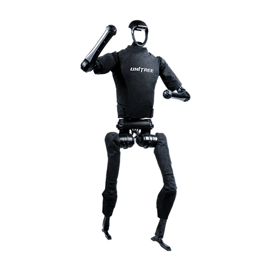
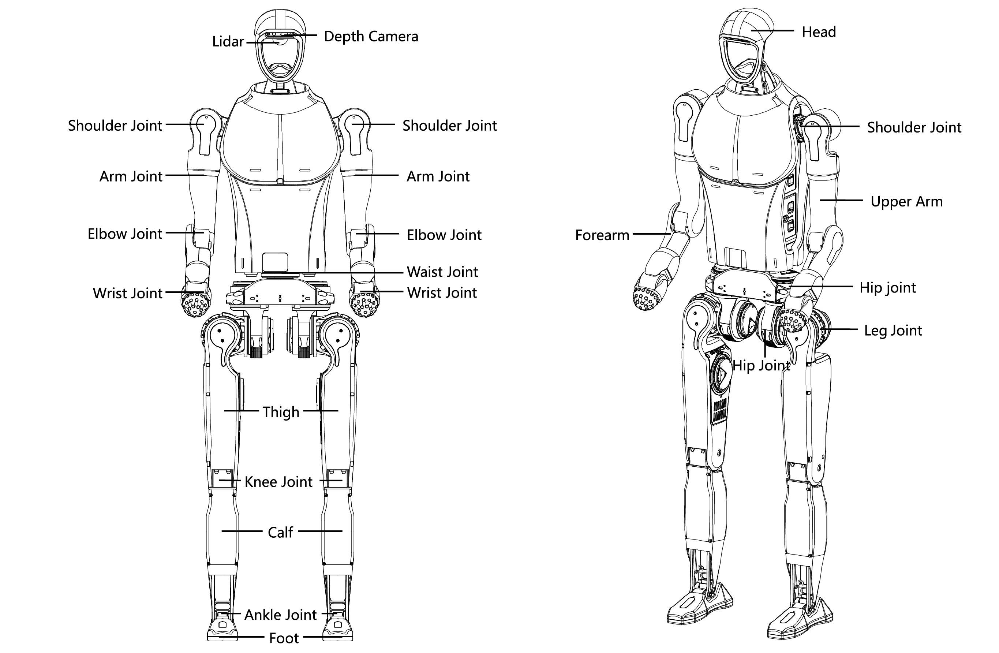
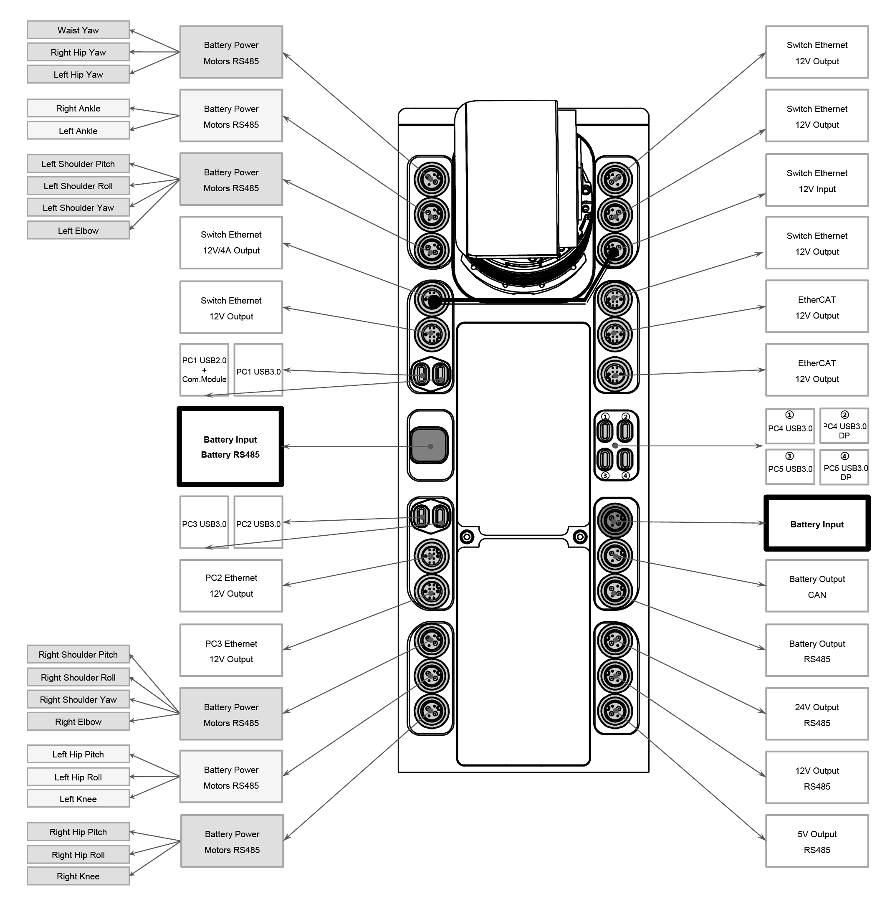

# H1-2

## 1. Overview

The H1 is Unitree's first general-purpose humanoid robot. It stands 180 cmm tall and weighs 72 kg. It comes equipped with a LIVOX MID-360 LiDAR and an Intel RealSense D435i depth camera.

## 2. Specifications

H1-2 has been upgraded based on the H1 model, boasting enhanced motion capability and degrees of freedom. Each arm of the H1-2 possesses 7 degrees of freedom, each leg has 6, and the waist features 1 degree of freedom. A total of 27 degrees of freedom across the entire machine. Comprised of 27 joint motors, this configuration enables the robot to achieve precise motion control and posture manipulation.

### 2.1 Electrical Interfaces

The H1-2 robot is equipped with electrical interfaces on its right side, which are used to connect various body joint motors, sensor peripherals, Ethernet ports, etc. This design allows for convenient debugging, issue troubleshooting, and secondary development.

### 2.2 On-board Computer

H1-2 comes with 2 on-board computers, additional computing unit can be optionally configured:

- Motion control computing unit (Not accessible to public)
    - IP: 192.168.123.161

- User development computing unit
    - IP: 192.168.123.164
    - Username: unitree
    - Password: Unitree0408

## 3. Resources

### Basic Guides

* H1-2 Manual: [Unitree](https://support.unitree.com/home/en/H1_developer/About_H1-2)

### Development

* SDK Support: [unitree_sdk2](https://github.com/unitreerobotics/unitree_sdk2)
* ROS2 Support: [unitree_ros2](https://github.com/unitreerobotics/unitree_ros2)
