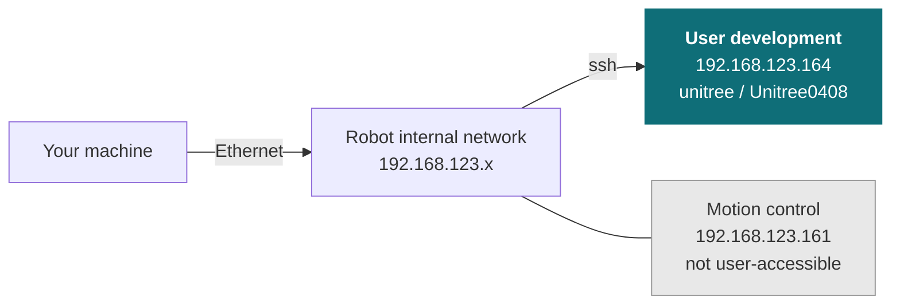

# H1-2

<Split ratio="wide-narrow">

The H1-2 is Unitree's full-size general-purpose humanoid, an upgrade of the original H1 with greater range of motion. It is supplied as a development platform: Unitree's own control stack handles locomotion, and you write your application against it over the robot's internal network, wired for anything touching low-level control.

This page does not repeat or replace Unitree's documentation. It highlights the information you reach for most often, and supplements it with what we have learned from supplying and supporting these units — configuration, verified values, and our own guides.

Unitree's own documentation:

* [Official product page](https://www.unitree.com/h1)
* [Official documentation](https://support.unitree.com/home/en/H1_developer/About_H1-2)

<Figure
  src={require('../img/unitree/H1-2_robot.png').default}
  alt="Unitree H1-2 humanoid robot"
  size="hero" />

</Split>

## Getting started

Read [Operational Safety](/tutorial/operational-safety) before powering the robot for the first time. The H1-2 is a full-size legged robot: it can fall, and at 180 cm it can do real damage to itself and its surroundings when it does.

The bring-up sequence is:

1. **Power on** and let Unitree's control stack come up.
2. **Connect your machine** to the robot's internal network over Ethernet.
3. **SSH to the development computer** at `192.168.123.164` — see [Logins and IP addresses](#logins-and-ip-addresses).
4. **Install the SDK** and run one of Unitree's examples to confirm the chain works.

Unitree's [official documentation](https://support.unitree.com/home/en/H1_developer/About_H1-2) covers each step in detail. We do not yet publish an H1-2 bring-up guide of our own; the [Guides](/tutorial/intro) section holds what we have for other platforms, and the [G1 Development Guide](/tutorial/unitree/g1_dev_guide) covers the same `unitree_sdk2` interface if you want a worked example.

## Key information

A quick reference for the things you reach for most often, collected so you can find them with the robot in front of you. Values are as configured on the units we supply.

### Related resources

Files and repositories you clone or download to work with the robot.

| Resource | What it is | Where |
| --- | --- | --- |
| C++ SDK | Primary development interface | [unitree_sdk2](https://github.com/unitreerobotics/unitree_sdk2) |
| ROS 2 package | ROS 2 integration | [unitree_ros2](https://github.com/unitreerobotics/unitree_ros2) |

Installing Weston Robot packages on the robot or your host? Add our package repository first: [Weston Robot Apt Source](/tutorial/installation/apt_source).

Vendor manuals, CAD models and product information are on the official pages linked at the top of this page.

### Logins and IP addresses

| Computer | Address | Credentials | What it is |
| --- | --- | --- | --- |
| **User development** | `192.168.123.164` | `unitree` / `Unitree0408` | Where your code runs |
| Motion control | `192.168.123.161` | — | Unitree's control stack. Not user-accessible |

:::note Different password from the G1

The H1-2 development computer uses `Unitree0408`, not the `123` used on the [G1](/robot/humanoid/g1). If you have worked on a G1 first, this is the step that catches people out.

:::

An additional computing unit can be configured on request. If your unit has one, its address will have been supplied with the robot.

Use a **wired** connection for anything touching low-level control — WiFi dropouts can stall a control loop and drop the robot. WiFi is reasonable for high-level work and for internet access.

### Network layout

Both computers sit on the robot's internal `192.168.123.x` network. **Your code goes on the development computer.**

```mermaid
flowchart LR
    L["Your machine"] -->|Ethernet| NET["Robot internal network<br/>192.168.123.x"]
    NET -->|ssh| DEV["<b>User development</b><br/>192.168.123.164<br/>unitree / Unitree0408"]
    NET --- CTL["Motion control<br/>192.168.123.161<br/>not user-accessible"]
    style DEV fill:#0f6e78,stroke:#0f6e78,color:#fff
    style CTL fill:#e8e8e8,stroke:#999,color:#333
```

### Electrical interfaces

The interfaces are on the robot's **right side**, and carry the body joint motors, sensor peripherals and Ethernet. They are what you use for debugging, fault-finding and mounting your own hardware. Click either image to enlarge.

<FigureGrid columns={2}>
  <Figure
    src={require('../img/unitree/H1-2_overview.png').default}
    alt="H1-2 labelled overview showing the robot's main components"
    framed
    caption="Labelled overview of the robot." />
  <Figure
    src={require('../img/unitree/H1-2_electrical_interfaces.png').default}
    alt="H1-2 electrical interface locations on the right side of the robot"
    framed
    caption="Electrical interfaces, right side." />
</FigureGrid>

## Troubleshooting & FAQ

### Can I develop over WiFi instead of a wired connection?

Technically yes, and it is fine for high-level work. **Not for low-level control** — a WiFi latency spike or dropout can stall the control loop, and a legged robot the size of the H1-2 can lose balance and fall as a result. Use a cable for anything joint-level or balance-related.

See [the full answer](/tutorial/operational-safety#while-you-are-developing).

## Support

Collect the serial number, firmware version and logs before raising a ticket — [Before you contact us](/support/before-you-contact-us) lists what helps and includes the commands to gather it.

[Submit a support request](https://forms.office.com/r/qELKzYF33W).
