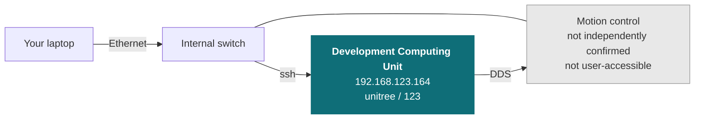

# R1

<Split ratio="wide-narrow">

<div>

Unitree's R1 humanoid, supplied as a development platform. Unitree's control stack handles balance and locomotion; you write your application against it over the robot's internal network, wired for anything touching low-level control.

This page does not repeat or replace Unitree's documentation. It highlights the information you reach for most often, and supplements it with what we have learned from supplying and supporting these units — configuration, verified values, and our own guides.

Unitree's own documentation:

* [Official product page](https://www.unitree.com/R1)
* [Official documentation](https://support.unitree.com/home/en/R1_developer)

</div>

<Figure
  src={require('../img/unitree/R1_robot.png').default}
  alt="Unitree R1 humanoid robot"
  size="hero" />

</Split>

:::caution Two things on this page are still unconfirmed

The serial number location isn't confirmed yet, and the control computer's IP
address below is inferred from other Unitree platforms, not independently
confirmed for R1 — both marked **TODO** / flagged inline.

:::

## Getting started

Read [Operational Safety](/tutorial/operational-safety) before powering the robot for the first time. The R1 is a bipedal robot that can fall, and the guidance there on supporting it during early testing prevents the most common damage.

Bring-up in outline:

1. **Power on** and pair the controller or the mobile app. Stand up / lie down is triggered by a physical button on the robot — the action runs **~3 s after** the voice prompt finishes, expect the delay, it's not a hang.
2. **Connect your machine** to the robot's internal network over Ethernet — see [Network layout](#network-layout).
3. **SSH to the Development Computing Unit** (R1-EDU only — see [Variants](#variants)) — see [Logins and IP addresses](#logins-and-ip-addresses).
4. **Install the SDK** and run one of Unitree's examples to confirm the chain works.

## Variants

Official names are **R1 Air**, **R1 Basic**, and **R1-EDU**. They share two 6-DOF legs and differ in the waist, arm, and head joints — and critically, only **R1-EDU** supports secondary development (your own code). R1 Air and R1 Basic ship locked, with no `unitree_sdk2` / ROS 2 access.

| Variant | Total DOF | Waist | Head | Head camera | Secondary development |
| --- | --- | --- | --- | --- | --- |
| R1 Air | 20 | — | — | Monocular | ❌ |
| R1 Basic | 26 | 2 | 2 | Binocular depth | ❌ |
| R1-EDU | 26 | 2 | 2 | Binocular depth | ✅ |

R1-EDU optionally adds two **Dex3-1** dexterous hands (7 DOF each), counted separately from the 26.

## Key information

A quick reference for the things you reach for most often, collected so you can find them with the robot in front of you. Values are as configured on the units we supply.

### Related resources

Files and repositories you clone or download to work with the robot.

| Resource | What it is | Where |
| --- | --- | --- |
| Developer documentation | Unitree's R1 documentation | [R1 developer](https://support.unitree.com/home/en/R1_developer) |
| C++ SDK | Primary development interface (same repo as Go2/B2/A2/G1) | [unitree_sdk2](https://github.com/unitreerobotics/unitree_sdk2) |
| Python SDK | Python bindings for the same interface | [unitree_sdk2_python](https://github.com/unitreerobotics/unitree_sdk2_python) |
| ROS 2 package | ROS 2 integration | [unitree_ros2](https://github.com/unitreerobotics/unitree_ros2) |
| URDF / CAD | Robot model — not in `unitree_model` or `unitree_mujoco` | [unitree_ros — r1_description](https://github.com/unitreerobotics/unitree_ros/tree/master/robots/r1_description) ([R1 Air variant](https://github.com/unitreerobotics/unitree_ros/tree/master/robots/r1_air_description)) |

Installing Weston Robot packages on the robot or your host? Add our package repository first: [Weston Robot Apt Source](/tutorial/installation/apt_source).

Vendor manuals, videos and the mobile app are on the official pages linked at the top of this page.

### Specifications

| Item | R1 Air | R1 Basic / R1-EDU |
| --- | --- | --- |
| Dimensions, standing | 1230 × 357 × 190 mm | Same |
| Dimensions, folded | 690 × 450 × 300 mm | Same |
| Weight (with battery) | ~27 kg | ~29 kg |
| Total DOF | 20 | 26 |
| Arm span | 0.435 m | Same |
| Leg length (upper + lower) | 0.6 m | Same |
| Max arm payload | ~2 kg | Same |
| Audio | 4-mic array + 2× 8 Ω 3 W speaker (5 W peak) | Same |
| Lighting | 256-colour RGB LED | Same |
| Connectivity | Gigabit Ethernet, WiFi 6, Bluetooth 5.2 | Same |
| Onboard compute | 8-core CPU | 8-core CPU + Jetson Orin NX dev unit (EDU only; optional 40–100 TOPS module) |
| Battery | Quick-release smart battery, ~1 h runtime | Same |
| Dexterous hand | — | Optional Dex3-1 (×2), EDU only |

### Head camera

| Category | R1 Air (monocular) | R1 Basic / R1-EDU (binocular depth) |
| --- | --- | --- |
| Horizontal FOV | up to 146° | up to 146° |
| Vertical FOV | up to 110° | up to 124° |

Per camera module: RGB 1280 × 1088 @ 30 Hz, depth 544 × 448 @ 10 Hz, HDR, 850/940 nm NIR enhancement.

Joint limits, per group, from the robot's URDF:

| Joint group | Range (rad) | Effort limit |
| --- | --- | --- |
| Hips (pitch/roll/yaw) | approx. −2.93 to 2.75 | 60 N·m |
| Knees | −0.17 to 2.43 | 60 N·m |
| Ankles (pitch/roll) | −0.87 to 0.58 | 50 N·m |
| Waist (roll/yaw) — Basic/EDU only | ±0.52 to ±2.62 | 60 N·m |
| Shoulders/elbows/wrist-roll | approx. −3.14 to 2.48 | 33–60 N·m |
| Head (pitch/yaw) — Basic/EDU only | ±0.63 to ±2.01 | 33 N·m |

R1 uses a four-bar ankle linkage — the two commanded degrees of freedom per ankle are pitch and roll. R1 Air (20 DOF) omits the waist, wrist-roll, and head joints entirely.

### Serial number

**TODO** — where the serial number and model designation are found on this platform.

### Logins and IP addresses

**R1 Air and R1 Basic don't ship with the secondary-development module** — there's no dev computer to reach on those units. The table below applies to **R1-EDU** only.

| Computer | Address | Credentials | What it is |
| --- | --- | --- | --- |
| **Development Computing Unit** | `192.168.123.164` | `unitree` / `123` | NVIDIA Jetson Orin NX — where your code runs |
| Motion control | not independently confirmed for R1 (other Unitree platforms use `192.168.123.161`) | — | Unitree's locomotion stack. Not user-accessible |

You reach the development computer over SSH and talk to the control computer from there over DDS — you do not log into the control computer directly.

Use a **wired** connection for anything touching low-level control — WiFi dropouts can stall a control loop and drop the robot. WiFi is reasonable for high-level work and for internet access.

### Operating notes

| Item | Detail |
| --- | --- |
| Stand up / lie down | Physical button on the robot. Runs **~3 s after** the voice prompt finishes — expect the delay, it's not a hang. |
| External E-Stop | GH1.25 connector for wiring an external switch — pin 1 = STOP, 2 = NC, 3 = GND |

### Network layout

Both computers sit on the robot's internal `192.168.123.x` network. **Your code goes on the Development Computing Unit (EDU only).**



Set your host machine to a static IP on the same subnet (e.g. `192.168.123.200/24`), then:

```bash
ping 192.168.123.164   # development computer

ssh unitree@192.168.123.164   # password: 123
```

### Electrical interfaces

All on the robot's top panel:

| Group | What's there |
| --- | --- |
| Stand up / lie down button | The same trigger described in [Operating notes](#operating-notes) above |
| Power outputs | Two XT30UPB-F connectors — 24V/3A and 36V/5A, for external accessories |
| Data | One USB 3.0 Type-C (on EDU, connects the rear compute module) and one Gigabit Ethernet (RJ45) for the SDK link |
| External E-Stop | GH1.25 connector — pinout in [Operating notes](#operating-notes) above |

For exact connector locations and any additional interfaces, see Unitree's [official R1 developer documentation](https://support.unitree.com/home/en/R1_developer).

### What we supply

**TODO** — fitted sensors, onboard computer variant, and anything else that differs from a unit bought direct from Unitree.

## Troubleshooting & FAQ

### Questions that apply across our platforms

These are answered in the guides rather than repeated on every product page:

- [Is the robot waterproof?](/tutorial/operational-safety#where-you-can-operate) — and what the ratings mean across platforms
- [How often do I need to lubricate the joints?](/tutorial/robot-maintenance#quadrupeds-and-humanoids) — and what to do about stiffness or play
- [The robot has fallen over and does not respond to the controller](/tutorial/operational-safety#if-something-goes-wrong) — the recovery sequence

## Support

Collect the serial number, firmware version and logs before raising a ticket — [Before you contact us](/support/before-you-contact-us) lists what helps and includes the commands to gather it.

[Submit a support request](https://forms.office.com/r/qELKzYF33W).
