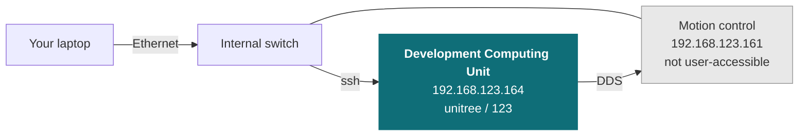

# R1

<Split ratio="wide-narrow">

<div>

Unitree's R1 humanoid, supplied as a development platform. Unitree's control stack handles balance and locomotion; you write your application against it over the robot's internal network, wired for anything touching low-level control.

This page does not repeat or replace Unitree's documentation. It highlights the information you reach for most often, and supplements it with what we have learned from supplying and supporting these units — configuration, verified values, and our own guides.

Unitree's own documentation:

* [Official product page](https://www.unitree.com/R1)
* [Official documentation](https://support.unitree.com/home/en/R1_developer)

</div>

<Figure
  src={require('../img/unitree/R1_robot.png').default}
  alt="Unitree R1 humanoid robot"
  size="hero" />

</Split>

## Getting started

Read [Operational Safety](/tutorial/operational-safety) before powering the robot for the first time. The R1 is a bipedal robot that can fall, and the guidance there on supporting it during early testing prevents the most common damage — see also [Emergency stop](#emergency-stop) and [Safety notes](#safety-notes) below.

Bring-up in outline:

1. **Power on** — see [Power on / off](#power-on--off).
2. **Connect your machine** to the robot's internal network over Ethernet — see [Network layout](#network-layout).
3. **SSH to the Development Computing Unit** (R1-EDU only) — see [Logins and IP addresses](#logins-and-ip-addresses).
4. **Install the SDK** and run one of Unitree's examples to confirm the chain works.

## Key information

A quick reference for the things you reach for most often, collected so you can find them with the robot in front of you. Values are as configured on the units we supply.

### Related resources

Files and repositories you clone or download to work with the robot.

| Resource | What it is | Where |
| --- | --- | --- |
| Developer documentation | Unitree's R1 documentation | [R1 developer](https://support.unitree.com/home/en/R1_developer) |
| C++ SDK | Primary development interface (same repo as Go2/B2/A2/G1) | [unitree_sdk2](https://github.com/unitreerobotics/unitree_sdk2) |
| Python SDK | Python bindings for the same interface | [unitree_sdk2_python](https://github.com/unitreerobotics/unitree_sdk2_python) |
| ROS 2 package | ROS 2 integration | [unitree_ros2](https://github.com/unitreerobotics/unitree_ros2) |
| URDF / CAD | Robot model — not in `unitree_model` or `unitree_mujoco` | [unitree_ros — r1_description](https://github.com/unitreerobotics/unitree_ros/tree/master/robots/r1_description) ([R1 Air variant](https://github.com/unitreerobotics/unitree_ros/tree/master/robots/r1_air_description)) |

Installing Weston Robot packages on the robot or your host? Add our package repository first: [Weston Robot Apt Source](/tutorial/installation/apt_source).

Vendor manuals, videos and the mobile app are on the official pages linked at the top of this page.

### Power on / off

**Stand up / lie down** is triggered by a physical button on the robot. The action runs **~3 s after** the voice prompt finishes — expect the delay, it's not a hang.

Unlike Go2/B2/A2's short-press-then-long-press sequence, no separate power-on button combination is documented for R1 — this button appears to be the only relevant control surface.

### Specifications

Only **R1-EDU** supports secondary development (your own code) — R1 Air and R1 Basic ship locked, with no `unitree_sdk2` / ROS 2 access.

| Item | R1 Air | R1 Basic / R1-EDU |
| --- | --- | --- |
| Dimensions, standing | 1230 × 357 × 190 mm | 1230 × 357 × 190 mm |
| Dimensions, folded | 690 × 450 × 300 mm | 690 × 450 × 300 mm |
| Weight (with battery) | ~27 kg | ~29 kg |
| Total DOF | 20 | 26 |
| Arm span | 0.435 m | 0.435 m |
| Leg length (upper + lower) | 0.6 m | 0.6 m |
| Max arm payload | ~2 kg | ~2 kg |
| Audio | 4-mic array + 2× 8 Ω 3 W speaker (5 W peak) | 4-mic array + 2× 8 Ω 3 W speaker (5 W peak) |
| Lighting | 256-colour RGB LED | 256-colour RGB LED |
| Connectivity | Gigabit Ethernet, WiFi 6, Bluetooth 5.2 | Gigabit Ethernet, WiFi 6, Bluetooth 5.2 |
| Onboard compute | 8-core CPU | 8-core CPU + Jetson Orin NX dev unit (EDU only; optional 40–100 TOPS module) |
| Battery | Quick-release smart battery, ~1 h runtime | Quick-release smart battery, ~1 h runtime |
| Dexterous hand | — | Optional Dex3-1 (×2), EDU only |

Joint limits, per joint, from the robot's URDF (left/right mirrored unless noted):

| Joint | Range (rad) | Effort limit |
| --- | --- | --- |
| Hip pitch | −2.93 to 2.55 | 60 N·m |
| Hip roll | −1.05 to 1.75 | 60 N·m |
| Hip yaw | ±2.74 | 60 N·m |
| Knee | −0.17 to 2.43 | 60 N·m |
| Ankle pitch | −0.87 to 0.58 | 50 N·m |
| Ankle roll | ±0.26 | 50 N·m |
| Waist roll — Basic/EDU only | ±0.52 | 60 N·m |
| Waist yaw — Basic/EDU only | ±2.62 | 60 N·m |
| Shoulder pitch | −3.14 to 2.09 | 60 N·m |
| Shoulder roll | −0.23 to 2.48 | 60 N·m |
| Shoulder yaw | ±1.92 | 33 N·m |
| Elbow | −0.98 to 2.19 | 33 N·m |
| Wrist roll | ±1.92 | 33 N·m |
| Head pitch — Basic/EDU only | ±0.63 | 33 N·m |
| Head yaw — Basic/EDU only | ±2.01 | 33 N·m |

R1 uses a four-bar ankle linkage — the two commanded degrees of freedom per ankle are pitch and roll. R1 Air (20 DOF) omits the waist, wrist-roll, and head joints entirely.

### Head camera

| Category | R1 Air (monocular) | R1 Basic / R1-EDU (binocular depth) |
| --- | --- | --- |
| Horizontal FOV | up to 146° | up to 146° |
| Vertical FOV | up to 110° | up to 124° |

Per camera module: RGB 1280 × 1088 @ 30 Hz, depth 544 × 448 @ 10 Hz, HDR, 850/940 nm NIR enhancement.

### Logins and IP addresses

**R1 Air and R1 Basic don't ship with the secondary-development module** — there's no dev computer to reach on those units. The table below applies to **R1-EDU** only.

| Computer | Address | Credentials | What it is |
| --- | --- | --- | --- |
| **Development Computing Unit** | `192.168.123.164` | `unitree` / `123` | NVIDIA Jetson Orin NX — where your code runs |
| Motion control | `192.168.123.161` | — | Unitree's locomotion stack. Not user-accessible |

You reach the development computer over SSH and talk to the control computer from there over DDS — you do not log into the control computer directly.

Use a **wired** connection for anything touching low-level control — WiFi dropouts can stall a control loop and drop the robot. WiFi is reasonable for high-level work and for internet access.

### Network layout

Both computers sit on the robot's internal `192.168.123.x` network. **Your code goes on the Development Computing Unit (EDU only).**



Set your host machine to a static IP on the same subnet (e.g. `192.168.123.200/24`), then:

```bash
ping 192.168.123.161   # motion control — replies once the robot has booted
ping 192.168.123.164   # development computer

ssh unitree@192.168.123.164   # password: 123
```

### Electrical interfaces

All on the robot's top panel:

| Group | What's there |
| --- | --- |
| Power outputs | Two XT30UPB-F connectors — 24V/3A and 36V/5A, for external accessories |
| Data | One USB 3.0 Type-C (on EDU, connects the rear compute module) and one Gigabit Ethernet (RJ45) for the SDK link |
| External E-Stop | GH1.25 connector for wiring an external switch — pin 1 = STOP, 2 = NC, 3 = GND |

For exact connector locations and any additional interfaces, see Unitree's [official R1 developer documentation](https://support.unitree.com/home/en/R1_developer).

### Emergency stop

This is what [Operational Safety](/tutorial/operational-safety#if-something-goes-wrong) means by "hit the emergency stop" on the R1.

| If… | Do this | Result |
| --- | --- | --- |
| Normal operation | Press and hold **L2 + B** | Damping — joints go limp |
| Robot is dancing | **Do not** double-click Start — let the routine finish | Unlike G1, double-clicking Start mid-dance triggers zero torque (joints go fully slack), not a graceful stop |
| Remote has a dedicated E-Stop button (latest gen.) | Press **E-Stop** once | Zero torque — joints go fully slack |
| Remote unresponsive | Short press, then long press the **power button** | Forces a shutdown |

> **This is a known immature behavior, expected to be fixed** — until then, treat double-clicking Start during a dance routine as unsafe on R1, unlike on G1. Let the routine finish on its own instead.

> Before forcing a shutdown: make sure the robot is on the hanger rack, seated, or lying down — a standing R1 collapses the instant power is cut.

### Safety notes

- **R1 is a bipedal robot that falls if unbalanced.** For first power-on and first motion, support the robot on a stand, hoist, or bracket, keep the e-stop in hand, and keep the surrounding space clear.

## Troubleshooting & FAQ

### Can I develop over WiFi instead of a wired connection?

Technically yes, and it is fine for high-level work. **Not for low-level control** — a WiFi latency spike or dropout can stall the control loop, and the R1 can lose balance and fall as a result. Use a cable for anything joint-level or balance-related. See [the full answer](/tutorial/operational-safety#while-you-are-developing).

### Questions that apply across our platforms

These are answered in the guides rather than repeated on every product page:

- [Is the robot waterproof?](/tutorial/operational-safety#where-you-can-operate) — and what the ratings mean across platforms
- [How often do I need to lubricate the joints?](/tutorial/robot-maintenance#quadrupeds-and-humanoids) — and what to do about stiffness or play
- [The robot has fallen over and does not respond to the controller](/tutorial/operational-safety#if-something-goes-wrong) — the recovery sequence

## Support

Collect the serial number, firmware version and logs before raising a ticket — [Before you contact us](/support/before-you-contact-us) lists what helps and includes the commands to gather it.

[Submit a support request](https://forms.office.com/r/qELKzYF33W).
