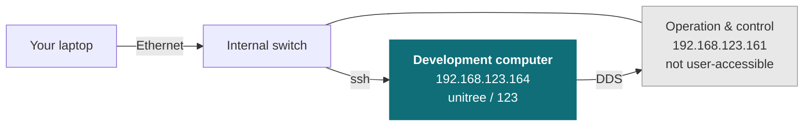

# R1

<Split ratio="wide-narrow">

<div>

Unitree's R1 humanoid, supplied as a development platform. Unitree's control stack handles balance and locomotion; you write your application against it over the robot's internal network, wired for anything touching low-level control.

This page does not repeat or replace Unitree's documentation. It highlights the information you reach for most often, and supplements it with what we have learned from supplying and supporting these units — configuration, verified values, and our own guides.

Unitree's own documentation:

* [Official product page](https://www.unitree.com/R1)
* [Official documentation](https://support.unitree.com/home/en/R1_developer)

</div>

<Figure
  src={require('../img/unitree/R1_robot.png').default}
  alt="Unitree R1 humanoid robot"
  size="hero" />

</Split>

:::caution This page is in preparation

The structure is in place; the platform-specific detail is not. Everything marked
**TODO** below needs confirming against units as we supply them — do not rely on
this page until those are filled in.

Delete this admonition once the page is complete.

:::

## Getting started

Read [Operational Safety](/tutorial/operational-safety) before powering the robot for the first time. The R1 is a bipedal robot that can fall, and the guidance there on supporting it during early testing prevents the most common damage.

Bring-up in outline:

1. **Power on** and pair the controller or the mobile app.
2. **Connect your machine** to the robot's internal network over Ethernet.
3. **SSH to the onboard computer** — see [Logins and IP addresses](#logins-and-ip-addresses).
4. **Install the SDK** and run one of Unitree's examples to confirm the chain works.

**TODO** — confirm the first-run sequence, and link our own bring-up guide if we publish one.

## Key information

A quick reference for the things you reach for most often, collected so you can find them with the robot in front of you. Values are as configured on the units we supply.

### Related resources

Files and repositories you clone or download to work with the robot.

| Resource | What it is | Where |
| --- | --- | --- |
| Developer documentation | Unitree's R1 documentation | [R1 developer](https://support.unitree.com/home/en/R1_developer) |
| C++ SDK | **TODO** — confirm which SDK applies to the R1 | |
| ROS 2 package | **TODO** | |
| URDF / CAD | **TODO** | |

Installing Weston Robot packages on the robot or your host? Add our package repository first: [Weston Robot Apt Source](/tutorial/installation/apt_source).

Vendor manuals, videos and the mobile app are on the official pages linked at the top of this page.

### Logins and IP addresses

**R1 Air and R1 Basic don't ship with the secondary-development module** (the backpack) — there's no dev computer to reach on those units. The table below applies to **R1-EDU** only.

| Computer | Address | Credentials | What it is |
| --- | --- | --- | --- |
| Operation & control | `192.168.123.161` | — | Unitree's locomotion stack. Not user-accessible |
| Development | `192.168.123.164` | `unitree` / `123` | Where your code runs |

You reach the development computer over SSH and talk to the control computer from there over DDS — you do not log into the control computer directly.

Use a **wired** connection for anything touching low-level control — WiFi dropouts can stall a control loop and drop the robot. WiFi is reasonable for high-level work and for internet access.

### Operating notes

| Item | Detail |
| --- | --- |
| Stand up / lie down | Physical button on the robot. Runs **~3 s after** the voice prompt finishes — expect the delay, it's not a hang. |
| External E-Stop | GH1.25 connector for wiring an external switch — pin 1 = STOP, 2 = NC, 3 = GND |
| Remote-control damping (e.g. G1's L2 + B) | **TODO** — not yet confirmed for R1's handheld controller |

### Serial number

**TODO** — where the serial number and model designation are found on this platform.

### Network layout

Both computers sit on the robot's internal `192.168.123.x` network. **Your code goes on the development computer.**



Set your host machine to a static IP on the same subnet (e.g. `192.168.123.200/24`), then:

```bash
ping 192.168.123.161   # operation & control — replies once the robot has booted
ping 192.168.123.164   # development computer

ssh unitree@192.168.123.164   # password: 123
```

### Electrical interfaces

**TODO** — interface locations and pinouts, for mounting a payload.

### What we supply

**TODO** — fitted sensors, onboard computer variant, and anything else that differs from a unit bought direct from Unitree. This is the section only we can write, so it matters most.

## Troubleshooting & FAQ

**TODO** — questions customers actually ask about this platform.

### Questions that apply across our platforms

These are answered in the guides rather than repeated on every product page:

- [Is the robot waterproof?](/tutorial/operational-safety#where-you-can-operate) — and what the ratings mean across platforms
- [How often do I need to lubricate the joints?](/tutorial/robot-maintenance#quadrupeds-and-humanoids) — and what to do about stiffness or play
- [The robot has fallen over and does not respond to the controller](/tutorial/operational-safety#if-something-goes-wrong) — the recovery sequence

## Support

Collect the serial number, firmware version and logs before raising a ticket — [Before you contact us](/support/before-you-contact-us) lists what helps and includes the commands to gather it.

[Submit a support request](https://forms.office.com/r/qELKzYF33W).
