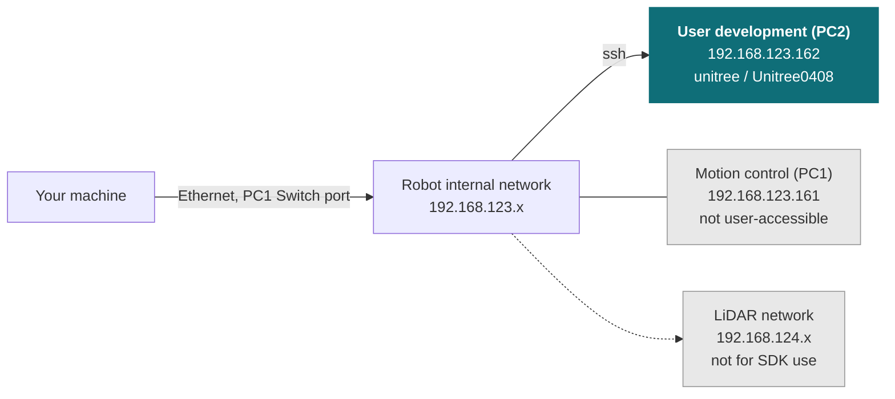

# A2

<Split ratio="wide-narrow">

Unitree's A2 quadruped, supplied as a development platform. Unitree's control stack handles locomotion; you write your application against it over the robot's internal network, wired for anything touching low-level control.

This page covers the standard, legged A2 — the variant we supply and have verified against a physical unit. The wheel-leg **A2-W** is a physically distinct product (16 DOF vs 12, different mass and dimensions) and cannot be field-converted to or from the legged A2. Most of the SDK and network information below still applies to A2-W, but treat the [Specifications](#specifications) table as A2-only.

This page does not repeat or replace Unitree's documentation. It highlights the information you reach for most often, and supplements it with what we have learned from supplying and supporting these units — configuration, verified values, and our own guides.

Unitree's own documentation:

* [Official product page](https://www.unitree.com/A2)
* [Official documentation](https://support.unitree.com/home/en/A2_SDK_Development_Guide)

Not the robot you have? The [As2](/robot/quadruped/as2) is Unitree's compact
industrial quadruped and is documented separately.

<Figure
  src={require('../img/unitree/A2_robot.png').default}
  alt="Unitree A2 quadruped robot"
  size="hero" />

</Split>

:::caution Two things on this page are still unconfirmed

Everything below is verified against a physical unit, except: the serial
number location, and electrical interface / payload-mounting details (marked
**TODO** — we don't yet have a photo or connector reference for this
platform).

:::

## Getting started

Read [Operational Safety](/tutorial/operational-safety) before powering the robot for the first time. The A2 is a legged robot that can fall, and the guidance there on keeping clear of the leg envelope prevents the most common injuries and damage.

Bring-up in outline:

1. **Power on** and pair the controller or the mobile app — same button sequence as Go2 and B2: short press, then a ~2 s long press until the LEDs illuminate and you hear a chime.
2. **Connect your machine** to the robot's internal network over Ethernet, via the **PC1 Switch Ethernet** port — see [Network layout](#network-layout).
3. **SSH to the user development computer (PC2)** — see [Logins and IP addresses](#logins-and-ip-addresses).
4. **Install the SDK** and run one of Unitree's examples to confirm the chain works.

## Key information

A quick reference for the things you reach for most often, collected so you can find them with the robot in front of you. Values are as configured on the units we supply.

### Related resources

Files and repositories you clone or download to work with the robot.

| Resource | What it is | Where |
| --- | --- | --- |
| SDK development guide | Unitree's A2 SDK documentation | [A2 SDK Development Guide](https://support.unitree.com/home/en/A2_SDK_Development_Guide) |
| C++ SDK | Primary development interface (same repo as Go2/B2) | [unitree_sdk2](https://github.com/unitreerobotics/unitree_sdk2) |
| Python SDK | Python bindings for the same interface | [unitree_sdk2_python](https://github.com/unitreerobotics/unitree_sdk2_python) |
| ROS 2 package | ROS 2 integration | [unitree_ros2](https://github.com/unitreerobotics/unitree_ros2) |
| URDF / CAD | Robot model for simulation and mechanical design — not in `unitree_model`, lives in `unitree_ros` for this platform | [unitree_ros — a2_description](https://github.com/unitreerobotics/unitree_ros/tree/master/robots/a2_description) |

Installing Weston Robot packages on the robot or your host? Add our package repository first: [Weston Robot Apt Source](/tutorial/installation/apt_source).

Vendor manuals, videos and the mobile app are on the official pages linked at the top of this page.

### Specifications

| Item | Value |
| --- | --- |
| DOF | 12 |
| Mass — without / with dual batteries | ~35 kg / ~42 kg |
| Max joint torque (legs) | ~180 N·m |
| Max speed | 0–3.7 m/s typical, ~5 m/s peak (special configuration) |
| Walking payload | ~25 kg continuous (up to ~35 kg) |
| Standing payload | ~100 kg |
| Stair height | 30 cm max |
| Max slope | 45° |
| Battery runtime — unloaded | ~5 h / ~20 km |
| Battery runtime — 25 kg load | ~3 h / ~12.5 km |
| LiDAR | Hesai JT128 — front, plus rear on Pro variants. 360° × 189° FOV, 40 m range at 10% reflectivity |
| Camera | 1× head-mounted USB, 2568×1448 @ 15 fps |
| Audio | Microphone array + 5 W speaker; onboard offline speech recognition and text-to-speech |
| Ingress protection | **IP56** (body) — dust and high-pressure water jet resistant, **not submersible**. Pro-variant core components are IP67; the LiDAR unit itself is IPX7. |

Joint limits, per axis, from the robot's URDF/MJCF:

| Joint group | Range (rad) | Range (deg, approx) | Effort limit | Velocity limit |
| --- | --- | --- | --- | --- |
| All hips | −1.01 to 1.01 | ±58° | 120 N·m | 22.0 rad/s |
| Front thighs | −2.34 to 3.15 | −134° to 180° | 120 N·m | 22.0 rad/s |
| Rear thighs | −1.56 to 3.94 | −89° to 226° | 120 N·m | 22.0 rad/s |
| All calves | −2.77 to −0.54 | −159° to −31° | 180 N·m | 14.7 rad/s |

Front and rear thighs have different ranges — front legs swing further forward, rear legs further back.

### Serial number

**TODO** — where the serial number and model designation are found on this platform.

### Logins and IP addresses

A2 ships with **two independent onboard computers** on two private networks.

| Computer | Address | Credentials | What it is |
| --- | --- | --- | --- |
| **User Development Unit (PC2)** | `192.168.123.162` (also `192.168.124.162`) | `unitree` / `Unitree0408` (older firmware) or `Unitree#24226` (newer firmware) | Where your code runs |
| Motion Control Unit (PC1) | `192.168.123.161` | — | Real-time motion control. Not user-accessible — locked by Unitree, updates via OTA |

Use a **wired** connection for anything touching low-level control — WiFi dropouts can stall a control loop and drop the robot. WiFi is reasonable for high-level work and for internet access.

### Network layout

Connect to the **PC1 Switch Ethernet port** — a single cable puts you on the same subnet as both onboard computers.

A second, `.124.x` network carries LiDAR point-cloud traffic between PC2 and the onboard LiDAR units. It's preconfigured — SDK development on it is not supported; use the `.123.x` network above instead.

For Unitree's own connection diagram, see the official [About A2 — Internal Devices](https://support.unitree.com/home/en/A2_SDK_Development_Guide/about_a2) page.

### Electrical interfaces

**TODO** — interface locations and pinouts, for mounting a payload. We don't yet have a photo or connector reference for this platform.

### What we supply

We supply the standard, legged A2 — not A2-W, A2-Pro or A2-W-Pro — configured as described in [Specifications](#specifications) above.

**TODO** — anything else that differs from a unit bought direct from Unitree (accessories, custom configuration).

## Troubleshooting & FAQ

### Does the remote control interfere with my own SDK program?

Yes — the remote stays **active and additive** while your high-level SDK program is running; both command streams are executed simultaneously. It is only suppressed once you release motion-switcher mode for low-level control. Keep this in mind if the robot behaves unexpectedly during development.

### Should I disable auto-recovery when carrying a payload?

Yes. Auto-recovery flips the robot upright if it falls, which can damage head-mounted equipment (camera, LiDAR) if a payload is fitted. Disable it in the SDK before mounting a payload, and recover manually with the remote if the robot falls.

### Questions that apply across our platforms

These are answered in the guides rather than repeated on every product page:

- [Is the robot waterproof?](/tutorial/operational-safety#where-you-can-operate) — and what the ratings mean across platforms
- [How often do I need to lubricate the joints?](/tutorial/robot-maintenance#quadrupeds-and-humanoids) — and what to do about stiffness or play
- [The robot has fallen over and does not respond to the controller](/tutorial/operational-safety#if-something-goes-wrong) — the recovery sequence

## Support

Collect the serial number, firmware version and logs before raising a ticket — [Before you contact us](/support/before-you-contact-us) lists what helps and includes the commands to gather it.

[Submit a support request](https://forms.office.com/r/qELKzYF33W).
