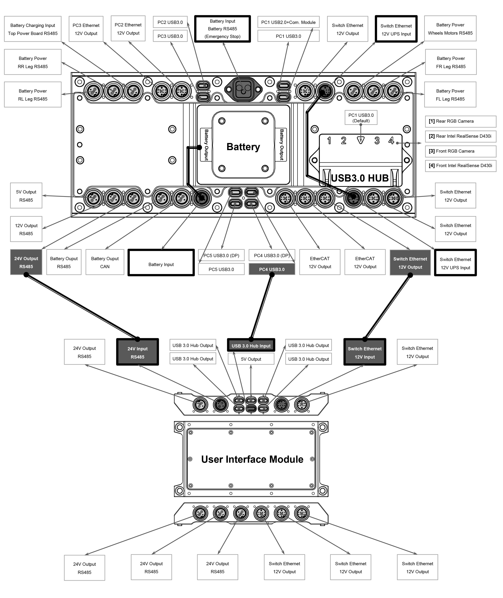

import B2_IMG from '../img/unitree/B2_robot.png';
import B2_4PIN_IMG from '../img/unitree/B2_4_pin.png';
import B2_10PIN_IMG from '../img/unitree/B2_10_pin.png';

# B2

## 1. Overview

The B2 is Unitree's industrial-grade quadruped robot designed for commercial and professional applications and weighs 60 kg with IP67 rating. Built with enhanced durability and weatherproofing capabilities, with its robust construction and intelligent sensing systems, the B2 excels in challenging environments where reliability and performance are critical, making it ideal for inspection, surveillance, and industrial automation tasks.

## 2. Specifications

### 2.1 Electrical Interfaces

#### User Interface Module Power Parameters

<table style={{textAlign: 'left'}}>
  <thead>
    <tr>
      <th style={{textAlign: 'left'}}>Interface</th>
      <th style={{textAlign: 'left'}}>Parameter</th>
      <th style={{textAlign: 'left'}}>Specification</th>
    </tr>
  </thead>
  <tbody>
    <tr>
      <td rowspan="2" style={{textAlign: 'left', verticalAlign: 'top'}}><strong>USB Interface (TYPE-C)</strong>  <em><strong>Note:</strong> This interface is powered from the PC processor in
        B2's abdomen and shares power with the TYPE-C interface
        of the B2 abdominal processor.</em></td>
      <td style={{textAlign: 'left'}}>1. Total USB output current</td>
      <td style={{textAlign: 'left'}}>3A</td>
    </tr>
    <tr>
      <td style={{textAlign: 'left'}}>2. Current limit per USB port</td>
      <td style={{textAlign: 'left'}}>1.5A</td>
    </tr>
    <tr>
      <td rowspan="4" style={{textAlign: 'left', verticalAlign: 'top'}}><strong>24V Power Interface (2+2PIN)</strong></td>
      <td style={{textAlign: 'left'}}>1. Total 24V output rating</td>
      <td style={{textAlign: 'left'}}>10A</td>
    </tr>
    <tr>
      <td style={{textAlign: 'left'}}>2. Total 24V output overload protection</td>
      <td style={{textAlign: 'left'}}>15A slow-blow fuse (one-time)</td>
    </tr>
    <tr>
      <td style={{textAlign: 'left'}}>3. Total 24V output overcurrent protection</td>
      <td style={{textAlign: 'left'}}>Trigger at 24A, reset at 16A (hiccup self-recovery)</td>
    </tr>
    <tr>
      <td style={{textAlign: 'left'}}>4. Current distribution per 24V interface</td>
      <td style={{textAlign: 'left'}}>None (internal wiring is parallel, sharing one power supply)</td>
    </tr>
    <tr>
      <td rowspan="5" style={{textAlign: 'left', verticalAlign: 'top'}}><strong>12V Network Interface (2+8PIN)</strong>  <em><strong>Note:</strong> This interface shares power with the B2 abdominal processor. The parameters listed below are the overall internal power parameters.</em></td>
      <td style={{textAlign: 'left'}}>1. Total 12V output rating</td>
      <td style={{textAlign: 'left'}}>10A</td>
    </tr>
    <tr>
      <td style={{textAlign: 'left'}}>2. Total 12V output overload protection</td>
      <td style={{textAlign: 'left'}}>15A slow-blow fuse (one-time)</td>
    </tr>
    <tr>
      <td style={{textAlign: 'left'}}>3. Total 12V output overcurrent protection</td>
      <td style={{textAlign: 'left'}}>Trigger at 24A, reset at 16A (hiccup self-recovery)</td>
    </tr>
    <tr>
      <td style={{textAlign: 'left'}}>4. Current distribution per 12V interface</td>
      <td style={{textAlign: 'left'}}>None (internal wiring is parallel, sharing one power supply)</td>
    </tr>
  </tbody>
</table>

  

#### (2+2) Power Line Interface

<table style={{textAlign: 'left'}}>
  <thead>
    <tr>
      <th style={{textAlign: 'left'}}>Pin</th>
      <th style={{textAlign: 'left'}}>Colour</th>
      <th style={{textAlign: 'left'}}>Specification</th>
    </tr>
  </thead>
  <tbody>
    <tr>
      <td style={{textAlign: 'left', verticalAlign: 'top'}}><strong>1</strong></td>
      <td style={{textAlign: 'left'}}>Black (14AWG)</td>
      <td style={{textAlign: 'left'}}>Power-</td>
    </tr>
    <tr>
      <td style={{textAlign: 'left', verticalAlign: 'top'}}><strong>2</strong></td>
      <td style={{textAlign: 'left'}}>Red (24AWG)</td>
      <td style={{textAlign: 'left'}}>485A-</td>
    </tr>
    <tr>
      <td style={{textAlign: 'left', verticalAlign: 'top'}}><strong>3</strong></td>
      <td style={{textAlign: 'left'}}>Black (24AWG)</td>
      <td style={{textAlign: 'left'}}>485B-</td>
    </tr>
    <tr>
      <td style={{textAlign: 'left', verticalAlign: 'top'}}><strong>4</strong></td>
      <td style={{textAlign: 'left'}}>Red (14AWG)</td>
      <td style={{textAlign: 'left'}}>Power+</td>
    </tr>
  </tbody>
</table>

  

#### (8+2) Signal Line Interface

<table style={{textAlign: 'left'}}>
  <thead>
    <tr>
      <th style={{textAlign: 'left'}}>Pin</th>
      <th style={{textAlign: 'left'}}>Colour</th>
      <th style={{textAlign: 'left'}}>Specification</th>
      <th style={{textAlign: 'left'}}>T568 Standard Ethernet Cable</th>
    </tr>
  </thead>
  <tbody>
    <tr>
      <td style={{textAlign: 'left', verticalAlign: 'top'}}><strong>1</strong></td>
      <td style={{textAlign: 'left'}}>Black</td>
      <td style={{textAlign: 'left'}}>Power-</td>
      <td style={{textAlign: 'left'}}>-</td>
    </tr>
    <tr>
      <td style={{textAlign: 'left', verticalAlign: 'top'}}><strong>2</strong></td>
      <td style={{textAlign: 'left'}}>Orange</td>
      <td style={{textAlign: 'left'}}>4N</td>
      <td style={{textAlign: 'left'}}>Brown</td>
    </tr>
    <tr>
      <td style={{textAlign: 'left', verticalAlign: 'top'}}><strong>3</strong></td>
      <td style={{textAlign: 'left'}}>Purple</td>
      <td style={{textAlign: 'left'}}>4P</td>
      <td style={{textAlign: 'left'}}>White Brown</td>
    </tr>
    <tr>
      <td style={{textAlign: 'left', verticalAlign: 'top'}}><strong>4</strong></td>
      <td style={{textAlign: 'left'}}>Brown</td>
      <td style={{textAlign: 'left'}}>1P</td>
      <td style={{textAlign: 'left'}}>White Orange</td>
    </tr>
    <tr>
      <td style={{textAlign: 'left', verticalAlign: 'top'}}><strong>5</strong></td>
      <td style={{textAlign: 'left'}}>Blue</td>
      <td style={{textAlign: 'left'}}>1N</td>
      <td style={{textAlign: 'left'}}>Orange</td>
    </tr>
    <tr>
      <td style={{textAlign: 'left', verticalAlign: 'top'}}><strong>6</strong></td>
      <td style={{textAlign: 'left'}}>White</td>
      <td style={{textAlign: 'left'}}>3N</td>
      <td style={{textAlign: 'left'}}>Blue</td>
    </tr>
    <tr>
      <td style={{textAlign: 'left', verticalAlign: 'top'}}><strong>7</strong></td>
      <td style={{textAlign: 'left'}}>Green</td>
      <td style={{textAlign: 'left'}}>3P</td>
      <td style={{textAlign: 'left'}}>White Blue</td>
    </tr>
    <tr>
      <td style={{textAlign: 'left', verticalAlign: 'top'}}><strong>8</strong></td>
      <td style={{textAlign: 'left'}}>Pink</td>
      <td style={{textAlign: 'left'}}>2N</td>
      <td style={{textAlign: 'left'}}>Green</td>
    </tr>
    <tr>
      <td style={{textAlign: 'left', verticalAlign: 'top'}}><strong>9</strong></td>
      <td style={{textAlign: 'left'}}>Grey</td>
      <td style={{textAlign: 'left'}}>2P</td>
      <td style={{textAlign: 'left'}}>White Green</td>
    </tr>
    <tr>
      <td style={{textAlign: 'left', verticalAlign: 'top'}}><strong>10</strong></td>
      <td style={{textAlign: 'left'}}>Red</td>
      <td style={{textAlign: 'left'}}>Power+(12V)</td>
      <td style={{textAlign: 'left'}}>-</td>
    </tr>
    <tr>
      <td style={{textAlign: 'left', verticalAlign: 'top'}}><strong>-</strong></td>
      <td style={{textAlign: 'left'}}>Deep Blue</td>
      <td style={{textAlign: 'left'}}>none</td>
      <td style={{textAlign: 'left'}}>-</td>
    </tr>
    <tr>
      <td style={{textAlign: 'left', verticalAlign: 'top'}}><strong>-</strong></td>
      <td style={{textAlign: 'left'}}>Yellow</td>
      <td style={{textAlign: 'left'}}>none</td>
      <td style={{textAlign: 'left'}}>-</td>
    </tr>
  </tbody>
</table>

### 2.2 On-board Computer

Go2 Edu has 1 onboard computer (expansion dock module):

- Operation & SLAM unit (Not accessible to public)
    - PC1 IP: 192.168.123.161
    - PC2 IP: 192.168.123.162
     
- User development computing units
    - PC3 IP: 192.168.123.163
    - PC4 IP: 192.168.123.164
    - PC5 IP: 192.168.123.165
    - Username: unitree
    - Password: Unitree0408
> **Note**: PC3 uses Intel i7 processor. PC4 & PC5 can be specified to Intel i7 or Orin NX. The PCs are running on Ubuntu 20.04 (Some models are on Ubuntu 22.04).

## 3. Resources

* **Training Slides**: [B2 Customer Training](https://tangrobot.sharepoint.com/:p:/s/Public-Outgoing/Ef2w_exJ67hLi1Xqsv0VjosBtS1pz0ZjTdHZcyOrTAc-mA?e=XiMFoT)
* **Unitree Support Page**: [Unitree](https://support.unitree.com/home/en/B2_developer/About%20B2)
* **C++ SDK**: [unitree_sdk2](https://github.com/unitreerobotics/unitree_sdk2)
* **Python SDK**: [unitree_sdk2_python](https://github.com/unitreerobotics/unitree_sdk2_python)
* **ROS2 Package**: [unitree_ros2](https://github.com/unitreerobotics/unitree_ros2)
* **B2 App, Robot Features, Tutorial Videos, Manuals**: [B2 Features](https://www.unitree.com/app/b2) 
* **User Interface Module CAD**: [B2 User Interface Module STEP](https://tangrobot.sharepoint.com/:u:/s/ProductDevelopment/EaH5OYxj8glKjJ10s0Xm2ooBU7ncVzAkqjGGkULEB9O_jA?e=uJayCQ)
* **Other Information**: [Other Information](https://support.unitree.com/home/en/B2_developer/Obtain%20SDK)
* **Tutorials Page**: [Link](/tutorial/intro)

## 4. FAQ

1. **Can the ports on the side of the B2 be used?**   
    A: Yes, the ports on the side of the B2 robot are accessible for use. However, we strongly recommend using the ports located on the User Interface Module whenever possible. This is because using the side ports could compromise the robot's waterproof capabilities. Users are urged to be familiar of the different ports before using them.

2. **What is the default speed of the B2 in AI mode?**   
    A: The default is Low speed. Double click L1 to switch to High Speed.

3. **Can the RealSense cameras on the B2 be used for secondary development?**   
    A: No, the RealSense cameras on the B2 robot are currently not accessible for users to directly control or integrate into their own development projects. These cameras are primarily used by the manufacturer to power the robot's built-in perception features.

4. **Can the contact charger be used outdoors?**   
    A: This contact charger is designed for indoor use. Avoid using it in wet or humid environments to prevent the risk of short circuits. Moisture can damage the charger and potentially pose a safety hazard.

5. **What does first foot control and second foot control represent?**   
    A: First Foot control represents Normal mode, while Second Foot control represents AI mode. When switched on, the B2 is in AI mode (Second Foot control) by default.

6. **Q: Does the robot support wireless development?**   
    A: Currently, the robot does not support wireless connection to internal computers.

7. **Q: How often do I need to lubricate the joints?**  
    A: If you encounter motor issues, stiffness or loosening of joints, please contact [Weston Robot Support Team](https://forms.office.com/pages/responsepage.aspx?id=NTNVCC0zFkWzGo_3Vcs_4KxdsbBJKHVIkFlOJLtAMMlUQkJZMU8wM1EyTkRUVUJCVzA2WVdQNzBSMCQlQCN0PWcu&route=shorturl).
    The *Serial Number (SN)* of the robot is located in the battery compartment. The SN (and the *Model*) can also be found in the app in `Device -> Robot Settings`.