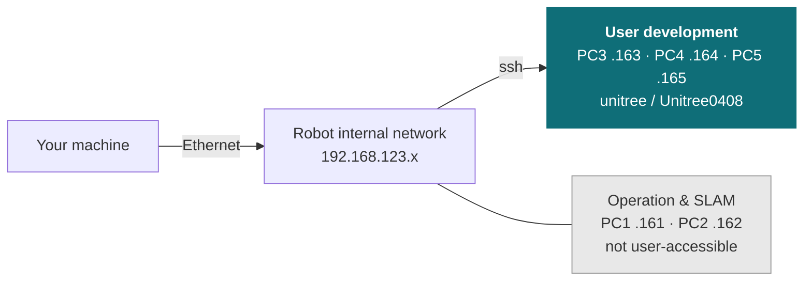

import B2_4PIN_IMG from '../img/unitree/B2_4_pin.png';
import B2_10PIN_IMG from '../img/unitree/B2_10_pin.png';

# B2

<Split ratio="wide-narrow">

The B2 is Unitree's industrial-grade quadruped, built for inspection, surveillance and industrial automation in demanding environments. We supply it as a development platform: Unitree's control stack handles locomotion, and you write your application against it over the robot's internal network, wired for anything touching low-level control.

This page does not repeat or replace Unitree's documentation. It highlights the information you reach for most often, and supplements it with what we have learned from supplying and supporting these units — configuration, verified values, and our own guides.

Unitree's own documentation:

* [Official product page](https://www.unitree.com/b2)
* [Official documentation](https://support.unitree.com/home/en/B2_developer)

<Figure
  src={require('../img/unitree/B2_robot.png').default}
  alt="Unitree B2 industrial quadruped robot"
  size="hero" />

</Split>

## Getting started

Read [Operational Safety](/tutorial/operational-safety) before powering the robot for the first time. The B2 is a 60 kg machine — it does real damage if it falls or collides.

Bring-up in outline:

1. **Power on** and pair the controller. The B2 starts in AI mode by default — see [the FAQ](#what-do-first-foot-control-and-second-foot-control-mean).
2. **Connect your machine** to the robot's internal network over Ethernet.
3. **SSH to one of the user development computers** — see [Logins and IP addresses](#logins-and-ip-addresses).
4. **Install the SDK** and run one of Unitree's examples.

Then see [Guides for this product](#guides-for-this-product).

### Serial number

The serial number and model designation are in the **battery compartment**, and in the mobile app under `Device → Robot Settings`. The app is usually faster and gives you both at once.

## Key information

A quick reference for the things you reach for most often, collected so you can find them with the robot in front of you. Values are as configured on the units we supply.

### Related resources

Files and repositories you clone or download to work with the robot.

| Resource | What it is | Where |
| --- | --- | --- |
| Training slides | Weston Robot's B2 training deck | [B2 Training](https://tangrobot.sharepoint.com/:p:/s/Public-Outgoing/Ef2w_exJ67hLi1Xqsv0VjosBtS1pz0ZjTdHZcyOrTAc-mA?e=XiMFoT) |
| User Interface Module CAD | STEP model of the module you mount payloads to | [B2 UIM STEP](https://tangrobot.sharepoint.com/:u:/s/ProductDevelopment/EaH5OYxj8glKjJ10s0Xm2ooBU7ncVzAkqjGGkULEB9O_jA?e=uJayCQ) |
| URDF / CAD | Robot model for simulation and mechanical design | [Unitree developer downloads](https://support.unitree.com/home/en/B2_developer/Obtain%20SDK) |
| C++ SDK | Primary development interface | [unitree_sdk2](https://github.com/unitreerobotics/unitree_sdk2) |
| Python SDK | Python bindings for the same interface | [unitree_sdk2_python](https://github.com/unitreerobotics/unitree_sdk2_python) |
| ROS 2 package | ROS 2 integration | [unitree_ros2](https://github.com/unitreerobotics/unitree_ros2) |

Installing Weston Robot packages on the robot or your host? Add our package repository first: [Weston Robot Apt Source](/tutorial/installation/apt_source).

Vendor manuals, videos and the mobile app are on the official pages linked at the top of this page.

### Logins and IP addresses

The B2 carries up to five computers. Two run Unitree's stack; the other three are yours.

| Computer | Address | Credentials | What it is |
| --- | --- | --- | --- |
| **PC3** | `192.168.123.163` | `unitree` / `Unitree0408` | User development — Intel i7 |
| **PC4** | `192.168.123.164` | `unitree` / `Unitree0408` | User development |
| **PC5** | `192.168.123.165` | `unitree` / `Unitree0408` | User development |
| PC1 | `192.168.123.161` | — | Operation & SLAM. Not user-accessible |
| PC2 | `192.168.123.162` | — | Operation & SLAM. Not user-accessible |

PC4 and PC5 can be configured with either Intel i7 (x86) or Orin NX (ARM) processors — x86 units ship with 512 GB of storage, ARM units with 2 TB. All run Ubuntu 20.04, or 22.04 on newer models. Check which you have before assuming an architecture in your build.

:::note Different password from the Go2

The B2 uses `Unitree0408`, the same as the [H1-2](/robot/humanoid/h1-2), not the `123` used on the [Go2](/robot/quadruped/go2) and [G1](/robot/humanoid/g1).

:::

Use a **wired** connection for anything touching low-level control — WiFi dropouts can stall a control loop and drop the robot. WiFi is reasonable for high-level work and for internet access.

### Network layout

All five computers sit on the robot's internal `192.168.123.x` network. **Your code goes on PC3, PC4 or PC5.**

```mermaid
flowchart LR
    L["Your machine"] -->|Ethernet| NET["Robot internal network<br/>192.168.123.x"]
    NET -->|ssh| DEV["<b>User development</b><br/>PC3 .163 · PC4 .164 · PC5 .165<br/>unitree / Unitree0408"]
    NET --- CTL["Operation &amp; SLAM<br/>PC1 .161 · PC2 .162<br/>not user-accessible"]
    style DEV fill:#0f6e78,stroke:#0f6e78,color:#fff
    style CTL fill:#e8e8e8,stroke:#999,color:#333
```

### Electrical interfaces

What you use when mounting a payload or wiring anything to the robot. Prefer the User Interface Module ports over the side ports — see the [FAQ](#can-the-ports-on-the-side-of-the-b2-be-used). Click to enlarge.

<Figure
  src={require('../img/unitree/B2_electrical_interfaces.png').default}
  alt="B2 electrical interface locations on the robot body"
  framed
  caption="Interface locations on the body." />

#### User Interface Module Power Parameters

<table style={{textAlign: 'left'}}>
  <thead>
    <tr>
      <th style={{textAlign: 'left'}}>Interface</th>
      <th style={{textAlign: 'left'}}>Parameter</th>
      <th style={{textAlign: 'left'}}>Specification</th>
    </tr>
  </thead>
  <tbody>
    <tr>
      <td rowspan="2" style={{textAlign: 'left', verticalAlign: 'top'}}><strong>USB Interface (TYPE-C)</strong>  <em><strong>Note:</strong> This interface is powered from the PC processor in
        B2's abdomen and shares power with the TYPE-C interface
        of the B2 abdominal processor.</em></td>
      <td style={{textAlign: 'left'}}>1. Total USB output current</td>
      <td style={{textAlign: 'left'}}>3A</td>
    </tr>
    <tr>
      <td style={{textAlign: 'left'}}>2. Current limit per USB port</td>
      <td style={{textAlign: 'left'}}>1.5A</td>
    </tr>
    <tr>
      <td rowspan="4" style={{textAlign: 'left', verticalAlign: 'top'}}><strong>24V Power Interface (2+2PIN)</strong></td>
      <td style={{textAlign: 'left'}}>1. Total 24V output rating</td>
      <td style={{textAlign: 'left'}}>10A</td>
    </tr>
    <tr>
      <td style={{textAlign: 'left'}}>2. Total 24V output overload protection</td>
      <td style={{textAlign: 'left'}}>15A slow-blow fuse (one-time)</td>
    </tr>
    <tr>
      <td style={{textAlign: 'left'}}>3. Total 24V output overcurrent protection</td>
      <td style={{textAlign: 'left'}}>Trigger at 24A, reset at 16A (hiccup self-recovery)</td>
    </tr>
    <tr>
      <td style={{textAlign: 'left'}}>4. Current distribution per 24V interface</td>
      <td style={{textAlign: 'left'}}>None (internal wiring is parallel, sharing one power supply)</td>
    </tr>
    <tr>
      <td rowspan="5" style={{textAlign: 'left', verticalAlign: 'top'}}><strong>12V Network Interface (2+8PIN)</strong>  <em><strong>Note:</strong> This interface shares power with the B2 abdominal processor. The parameters listed below are the overall internal power parameters.</em></td>
      <td style={{textAlign: 'left'}}>1. Total 12V output rating</td>
      <td style={{textAlign: 'left'}}>10A</td>
    </tr>
    <tr>
      <td style={{textAlign: 'left'}}>2. Total 12V output overload protection</td>
      <td style={{textAlign: 'left'}}>15A slow-blow fuse (one-time)</td>
    </tr>
    <tr>
      <td style={{textAlign: 'left'}}>3. Total 12V output overcurrent protection</td>
      <td style={{textAlign: 'left'}}>Trigger at 24A, reset at 16A (hiccup self-recovery)</td>
    </tr>
    <tr>
      <td style={{textAlign: 'left'}}>4. Current distribution per 12V interface</td>
      <td style={{textAlign: 'left'}}>None (internal wiring is parallel, sharing one power supply)</td>
    </tr>
  </tbody>
</table>

  

#### (2+2) Power Line Interface

<table style={{textAlign: 'left'}}>
  <thead>
    <tr>
      <th style={{textAlign: 'left'}}>Pin</th>
      <th style={{textAlign: 'left'}}>Colour</th>
      <th style={{textAlign: 'left'}}>Specification</th>
    </tr>
  </thead>
  <tbody>
    <tr>
      <td style={{textAlign: 'left', verticalAlign: 'top'}}><strong>1</strong></td>
      <td style={{textAlign: 'left'}}>Black (14AWG)</td>
      <td style={{textAlign: 'left'}}>Power-</td>
    </tr>
    <tr>
      <td style={{textAlign: 'left', verticalAlign: 'top'}}><strong>2</strong></td>
      <td style={{textAlign: 'left'}}>Red (24AWG)</td>
      <td style={{textAlign: 'left'}}>485A-</td>
    </tr>
    <tr>
      <td style={{textAlign: 'left', verticalAlign: 'top'}}><strong>3</strong></td>
      <td style={{textAlign: 'left'}}>Black (24AWG)</td>
      <td style={{textAlign: 'left'}}>485B-</td>
    </tr>
    <tr>
      <td style={{textAlign: 'left', verticalAlign: 'top'}}><strong>4</strong></td>
      <td style={{textAlign: 'left'}}>Red (14AWG)</td>
      <td style={{textAlign: 'left'}}>Power+</td>
    </tr>
  </tbody>
</table>

  

#### (8+2) Signal Line Interface

<table style={{textAlign: 'left'}}>
  <thead>
    <tr>
      <th style={{textAlign: 'left'}}>Pin</th>
      <th style={{textAlign: 'left'}}>Colour</th>
      <th style={{textAlign: 'left'}}>Specification</th>
      <th style={{textAlign: 'left'}}>T568 Standard Ethernet Cable</th>
    </tr>
  </thead>
  <tbody>
    <tr>
      <td style={{textAlign: 'left', verticalAlign: 'top'}}><strong>1</strong></td>
      <td style={{textAlign: 'left'}}>Black</td>
      <td style={{textAlign: 'left'}}>Power-</td>
      <td style={{textAlign: 'left'}}>-</td>
    </tr>
    <tr>
      <td style={{textAlign: 'left', verticalAlign: 'top'}}><strong>2</strong></td>
      <td style={{textAlign: 'left'}}>Orange</td>
      <td style={{textAlign: 'left'}}>4N</td>
      <td style={{textAlign: 'left'}}>Brown</td>
    </tr>
    <tr>
      <td style={{textAlign: 'left', verticalAlign: 'top'}}><strong>3</strong></td>
      <td style={{textAlign: 'left'}}>Purple</td>
      <td style={{textAlign: 'left'}}>4P</td>
      <td style={{textAlign: 'left'}}>White Brown</td>
    </tr>
    <tr>
      <td style={{textAlign: 'left', verticalAlign: 'top'}}><strong>4</strong></td>
      <td style={{textAlign: 'left'}}>Brown</td>
      <td style={{textAlign: 'left'}}>1P</td>
      <td style={{textAlign: 'left'}}>White Orange</td>
    </tr>
    <tr>
      <td style={{textAlign: 'left', verticalAlign: 'top'}}><strong>5</strong></td>
      <td style={{textAlign: 'left'}}>Blue</td>
      <td style={{textAlign: 'left'}}>1N</td>
      <td style={{textAlign: 'left'}}>Orange</td>
    </tr>
    <tr>
      <td style={{textAlign: 'left', verticalAlign: 'top'}}><strong>6</strong></td>
      <td style={{textAlign: 'left'}}>White</td>
      <td style={{textAlign: 'left'}}>3N</td>
      <td style={{textAlign: 'left'}}>Blue</td>
    </tr>
    <tr>
      <td style={{textAlign: 'left', verticalAlign: 'top'}}><strong>7</strong></td>
      <td style={{textAlign: 'left'}}>Green</td>
      <td style={{textAlign: 'left'}}>3P</td>
      <td style={{textAlign: 'left'}}>White Blue</td>
    </tr>
    <tr>
      <td style={{textAlign: 'left', verticalAlign: 'top'}}><strong>8</strong></td>
      <td style={{textAlign: 'left'}}>Pink</td>
      <td style={{textAlign: 'left'}}>2N</td>
      <td style={{textAlign: 'left'}}>Green</td>
    </tr>
    <tr>
      <td style={{textAlign: 'left', verticalAlign: 'top'}}><strong>9</strong></td>
      <td style={{textAlign: 'left'}}>Grey</td>
      <td style={{textAlign: 'left'}}>2P</td>
      <td style={{textAlign: 'left'}}>White Green</td>
    </tr>
    <tr>
      <td style={{textAlign: 'left', verticalAlign: 'top'}}><strong>10</strong></td>
      <td style={{textAlign: 'left'}}>Red</td>
      <td style={{textAlign: 'left'}}>Power+(12V)</td>
      <td style={{textAlign: 'left'}}>-</td>
    </tr>
    <tr>
      <td style={{textAlign: 'left', verticalAlign: 'top'}}><strong>-</strong></td>
      <td style={{textAlign: 'left'}}>Deep Blue</td>
      <td style={{textAlign: 'left'}}>none</td>
      <td style={{textAlign: 'left'}}>-</td>
    </tr>
    <tr>
      <td style={{textAlign: 'left', verticalAlign: 'top'}}><strong>-</strong></td>
      <td style={{textAlign: 'left'}}>Yellow</td>
      <td style={{textAlign: 'left'}}>none</td>
      <td style={{textAlign: 'left'}}>-</td>
    </tr>
  </tbody>
</table>

## Guides for this product

| Guide | What it covers | Reach for it when |
| --- | --- | --- |
| [B2 Diagnostics Guide](/tutorial/unitree/b2_diag_guide) | Reading diagnostic data and alarm information through the mobile app | Something is wrong and you need to know what |

**[All B2 guides](/tutorial/tags/b2)** — generated from the `b2` tag, so anything published later appears there without this page being edited.

## Troubleshooting & FAQ

### Can the ports on the side of the B2 be used?

Yes, but prefer the ports on the User Interface Module wherever possible. The B2 is IP67 rated **when properly sealed**, and reaching the side ports means opening protective covers, which compromises that seal while you are operating. Be familiar with the sealing procedure before using them.

### What do first foot control and second foot control mean?

First foot control is Normal mode; second foot control is AI mode. The B2 powers on in AI mode by default.

### What is the default speed in AI mode?

Low. Double-click L1 to switch to high speed.

### Can the RealSense cameras be used for my own development?

No. They drive the robot's built-in perception features and are not exposed for user control or integration.

### Can the contact charger be used outdoors?

No — it is an indoor device. Keep it out of wet or humid environments: moisture can short it and is a safety hazard.

### Can I develop over WiFi instead of a wired connection?

Technically yes, and it is fine for high-level work. **Not for low-level control** — a WiFi latency spike or dropout can stall the control loop and the B2 can fall as a result. Use a cable for anything joint-level or balance-related. See [the full answer](/tutorial/operational-safety#while-you-are-developing).

### Questions that apply across our platforms

These are answered in the guides rather than repeated on every product page:

- [Is the robot waterproof?](/tutorial/operational-safety#where-you-can-operate) — the B2 is IP67 when sealed; what that means in practice
- [How often do I need to lubricate the joints?](/tutorial/robot-maintenance#quadrupeds-and-humanoids) — and what to do about stiffness or play
- [The robot has fallen over and does not respond to the controller](/tutorial/operational-safety#if-something-goes-wrong) — the recovery sequence

## Support

Collect the serial number, firmware version and logs before raising a ticket — [Before you contact us](/support/before-you-contact-us) lists what helps and includes the commands to gather it.

[Submit a support request](https://forms.office.com/r/qELKzYF33W).
