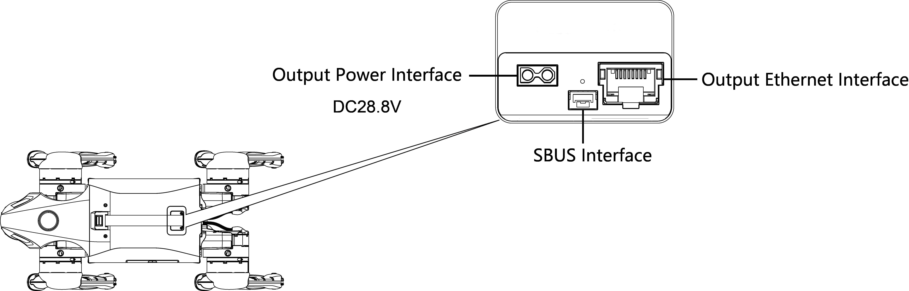

import GO2_IMG from '../img/unitree/Go2_robot.png';

# Go2

## 1. Overview

The Go2 robot dog is a new and improved intelligent bionic quadruped robot empowered with AI and weighs 15 kg. The Go2 has Unitree's self-developed 4D LIDAR L1 with 360°x90° hemispherical ultra-wide recognition to make Go2 traverse complex terrain.

## 2. Specifications

### 2.1 Electrical Interfaces

> **Note**: The expansion dock module is only available for the Edu version.

> **Note**: The output power interface voltage is from the battery.

### 2.2 On-board Computer

Go2 Edu has 1 onboard computer (expansion dock module):

- Operation & Control computing unit (Not accessible to public)
    - IP: 192.168.123.161
     
- Expansion dock module
    - IP: 192.168.123.18
    - Username: unitree
    - Password: 123

## 3. Resources

* **User Guide**: [Go2 User Guide](https://tangrobot.sharepoint.com/:p:/s/Public-Outgoing/ESCOlfuKT5lPkwCnOFUoYbwB5Jr5o4meAyXd2lpGB09W5w?e=ixXe5e)
* **Unitree Support Page**: [Unitree](https://support.unitree.com/home/en/developer/about_Go2)
* **Payload Mounting**: [Guide](https://support.unitree.com/home/en/developer/Payload)
* **C++ SDK**: [unitree_sdk2](https://github.com/unitreerobotics/unitree_sdk2)
* **Python SDK**: [unitree_sdk2_python](https://github.com/unitreerobotics/unitree_sdk2_python)
* **ROS2 Package**: [unitree_ros2](https://github.com/unitreerobotics/unitree_ros2)
* **Go2 App, Robot Features, Tutorial Videos, Manuals**: [Go2 Features](https://www.unitree.com/app/go2) 
* **Other Information**: [Other Information](https://support.unitree.com/home/en/developer/Obtain%20SDK)
* **Tutorials Page**: [Link](/tutorial/intro)

## 4. FAQ

1. **Q: What is account insufficient?**  
    A: Each new GO2 comes with a complimentary RMB120 credit, which can be utilized for data transfer and GPT services. Consult the **Connection Mode** table to determine which connection modes will utilize this credit. When the account balance is insufficient, the GO2 can only be connected via AP mode.

2. **Q: How can I recharge my account when the credit is insufficient?**  
    A: Please contact [Weston Robot Support Team](https://forms.office.com/pages/responsepage.aspx?id=NTNVCC0zFkWzGo_3Vcs_4KxdsbBJKHVIkFlOJLtAMMlUQkJZMU8wM1EyTkRUVUJCVzA2WVdQNzBSMCQlQCN0PWcu&route=shorturl) for more information.

3. **Q: How often do I need to lubricate the joints?**  
    A: If you encounter motor issues, stiffness or loosening of joints, please contact [Weston Robot Support Team](https://forms.office.com/pages/responsepage.aspx?id=NTNVCC0zFkWzGo_3Vcs_4KxdsbBJKHVIkFlOJLtAMMlUQkJZMU8wM1EyTkRUVUJCVzA2WVdQNzBSMCQlQCN0PWcu&route=shorturl).
    The *Serial Number (SN)* of the robot is located in the battery compartment. The SN (and the *Model*) can also be found in the app in `Device -> Robot Settings`.

4. **Q: How do I reflash the Expansion Dock?**   
    A: Expansion Dock Reflash Guide: [PDF](https://tangrobot.sharepoint.com/:b:/s/Public-Outgoing/EcQ3PHojLhZBsDg1oBpvPPIBWyJiSJPyAZMsk91ZnXbBJg?e=YaKBgf)

5. **Q: Does the robot support wireless development?**   
    A: Currently, the robot does not support wireless connection to internal computers.

6. **Q: Is the robot waterproof?**   
    A: No, the Go2 is not waterproof.

7. **Q: Does the robot have follow-me function?**   
    A: Yes, please refer to [usage guide](https://support.unitree.com/home/en/developer/UWB%20Application) and [Accompanying Mode video](https://www.unitree.com/app/go2).
