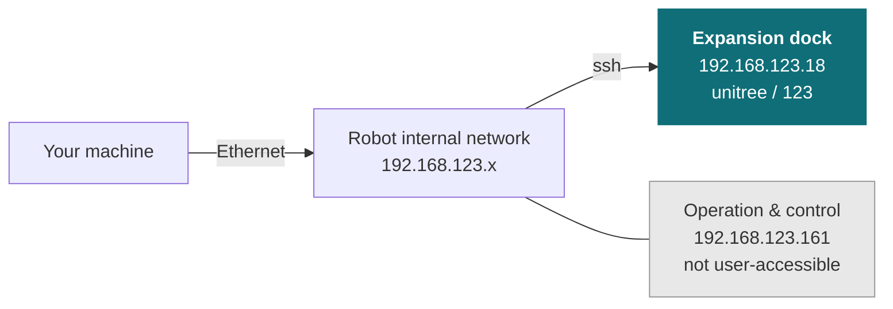

# Go2

<Split ratio="wide-narrow">

The Go2 is Unitree's compact quadruped, supplied as a development platform. Unitree's control stack handles locomotion; you write your application against it over the robot's internal network, wired for anything touching low-level control.

This page does not repeat or replace Unitree's documentation. It highlights the information you reach for most often, and supplements it with what we have learned from supplying and supporting these units — configuration, verified values, and our own guides.

Unitree's own documentation:

* [Official product page](https://www.unitree.com/go2)
* [Official documentation](https://support.unitree.com/home/en/developer/about_Go2)

<Figure
  src={require('../img/unitree/Go2_robot.png').default}
  alt="Unitree Go2 quadruped robot"
  size="hero" />

</Split>

## Getting started

Read [Operational Safety](/tutorial/operational-safety) before powering the robot for the first time.

The Go2 Edu we supply carries Unitree's 4D LIDAR L1 and, where fitted, the expansion dock that gives you a computer of your own to work on. Bring-up in outline:

1. **Power on** and pair the controller or the mobile app.
2. **Connect your machine** to the robot's internal network over Ethernet.
3. **SSH to the expansion dock** — see [Logins and IP addresses](#logins-and-ip-addresses).
4. **Install the SDK** and run one of Unitree's examples.

Then see [Guides for this product](#guides-for-this-product) for diagnostics and SLAM.

## Key information

A quick reference for the things you reach for most often, collected so you can find them with the robot in front of you. Values are as configured on the units we supply.

### Related resources

Files and repositories you clone or download to work with the robot.

| Resource | What it is | Where |
| --- | --- | --- |
| User guide | Weston Robot's Go2 user guide | [Go2 User Guide](https://tangrobot.sharepoint.com/:p:/s/Public-Outgoing/ESCOlfuKT5lPkwCnOFUoYbwB5Jr5o4meAyXd2lpGB09W5w?e=ixXe5e) |
| Expansion dock reflash | Recovering or updating the dock's firmware | [Reflash guide](https://tangrobot.sharepoint.com/:b:/s/Public-Outgoing/EcQ3PHojLhZBsDg1oBpvPPIBWyJiSJPyAZMsk91ZnXbBJg?e=YaKBgf) |
| Payload mounting | Mechanical mounting guidance | [Unitree payload guide](https://support.unitree.com/home/en/developer/Payload) |
| URDF / CAD | Robot model for simulation and mechanical design | [Unitree developer downloads](https://support.unitree.com/home/en/developer/Obtain%20SDK) |
| C++ SDK | Primary development interface | [unitree_sdk2](https://github.com/unitreerobotics/unitree_sdk2) |
| Python SDK | Python bindings for the same interface | [unitree_sdk2_python](https://github.com/unitreerobotics/unitree_sdk2_python) |
| ROS 2 package | ROS 2 integration | [unitree_ros2](https://github.com/unitreerobotics/unitree_ros2) |

Installing Weston Robot packages on the robot or your host? Add our package repository first: [Weston Robot Apt Source](/tutorial/installation/apt_source).

Vendor manuals, videos and the mobile app are on the official pages linked at the top of this page.

### Serial number

The serial number and model designation are in the **battery compartment**, and in the mobile app under `Device → Robot Settings`. The app is usually faster and gives you both at once.

### Logins and IP addresses

| Computer | Address | Credentials | What it is |
| --- | --- | --- | --- |
| **Expansion dock** | `192.168.123.18` | `unitree` / `123` | Where your code runs |
| Operation & control | `192.168.123.161` | — | Unitree's control stack. Not user-accessible |

:::note The expansion dock is Go2 Edu only

The expansion dock module is not compatible with the Go2 Air or Go2 Pro. Without it there is no user-accessible computer on the robot, and development happens from an external machine over the SDK.

:::

Use a **wired** connection for anything touching low-level control — WiFi dropouts can stall a control loop and drop the robot. WiFi is reasonable for high-level work and for internet access.

### Network layout

The control computer and the expansion dock sit on the robot's internal `192.168.123.x` network. **Your code goes on the expansion dock.**

```mermaid
flowchart LR
    L["Your machine"] -->|Ethernet| NET["Robot internal network<br/>192.168.123.x"]
    NET -->|ssh| DEV["<b>Expansion dock</b><br/>192.168.123.18<br/>unitree / 123"]
    NET --- CTL["Operation &amp; control<br/>192.168.123.161<br/>not user-accessible"]
    style DEV fill:#0f6e78,stroke:#0f6e78,color:#fff
    style CTL fill:#e8e8e8,stroke:#999,color:#333
```

### Electrical interfaces

What you use when mounting a payload or wiring anything to the robot. Click either image to enlarge.

<FigureGrid columns={2}>
  <Figure
    src={require('../img/unitree/Go2_expansion_dock_specs.png').default}
    alt="Go2 expansion dock connector and specification diagram"
    framed
    caption="Expansion dock interfaces — Go2 Edu only." />
  <Figure
    src={require('../img/unitree/Go2_electrical_interfaces.png').default}
    alt="Go2 electrical interface locations on the robot body"
    framed
    caption="Interface locations on the body." />
</FigureGrid>

> **Note**: The output power interface voltage comes directly from the battery.

## Guides for this product

| Guide | What it covers | Reach for it when |
| --- | --- | --- |
| [Go2 Diagnostics Guide](/tutorial/unitree/go2_diag_guide) | Reading diagnostic data and alarm information through the mobile app | Something is wrong and you need to know what |
| [Unitree SLAM Guide](/tutorial/unitree/go2_slam) | Mapping and navigation on the Go2 and Go2-W | Building a map or running autonomous navigation |

**[All Go2 guides](/tutorial/tags/go2)** — generated from the `go2` tag, so anything published later appears there without this page being edited.

## Troubleshooting & FAQ

### What does "account insufficient" mean?

Each new Go2 comes with a complimentary RMB 120 credit, used for data transfer and GPT services. Consult the **Connection Mode** table to see which connection modes consume it. When the balance runs out, the Go2 can only be connected in AP mode.

To top it up, [contact us](/support/before-you-contact-us).

### Does the Go2 support 4G?

Yes — insert a SIM card into the slot.

<Figure
  src={require('../img/unitree/Go2_simcard_slot.png').default}
  alt="Location of the SIM card slot on the Go2"
  framed
  size="md"
  caption="SIM card slot location." />

### Why does the robot suddenly enter damping mode?

The motors have overheated, and damping mode is protective. Avoid holding the locked stand mode for extended periods — that is the most common cause.

### Does the robot have a follow-me function?

Yes. See Unitree's [UWB application guide](https://support.unitree.com/home/en/developer/UWB%20Application) and the accompanying-mode video on the [official product page](https://www.unitree.com/go2).

### Can I develop over WiFi instead of a wired connection?

Technically yes, and it is fine for high-level work. **Not for low-level control** — a WiFi latency spike or dropout can stall the control loop and the Go2 can fall as a result. Use a cable for anything joint-level or balance-related. See [the full answer](/support/faq#can-i-develop-over-wifi-instead-of-a-wired-connection).

### Questions that apply across our platforms

These are answered once on the [Support FAQ](/support/faq) rather than repeated per model:

- [Is the robot waterproof?](/support/faq#is-the-robot-waterproof) — no, and what the ratings mean across platforms
- [How often do I need to lubricate the joints?](/support/faq#how-often-do-i-need-to-lubricate-the-joints) — and what to do about stiffness or play
- [The robot has fallen over and does not respond to the controller](/support/faq#the-robot-has-fallen-over-and-does-not-respond-to-the-controller) — the recovery sequence

## Support

Collect the serial number, firmware version and logs before raising a ticket — [Before you contact us](/support/before-you-contact-us) lists what helps and includes the commands to gather it.

- [Support centre](/support/intro) — all support resources
- [Warranty and RMA](/support/warranty-and-rma) — repairs, replacements and returns
