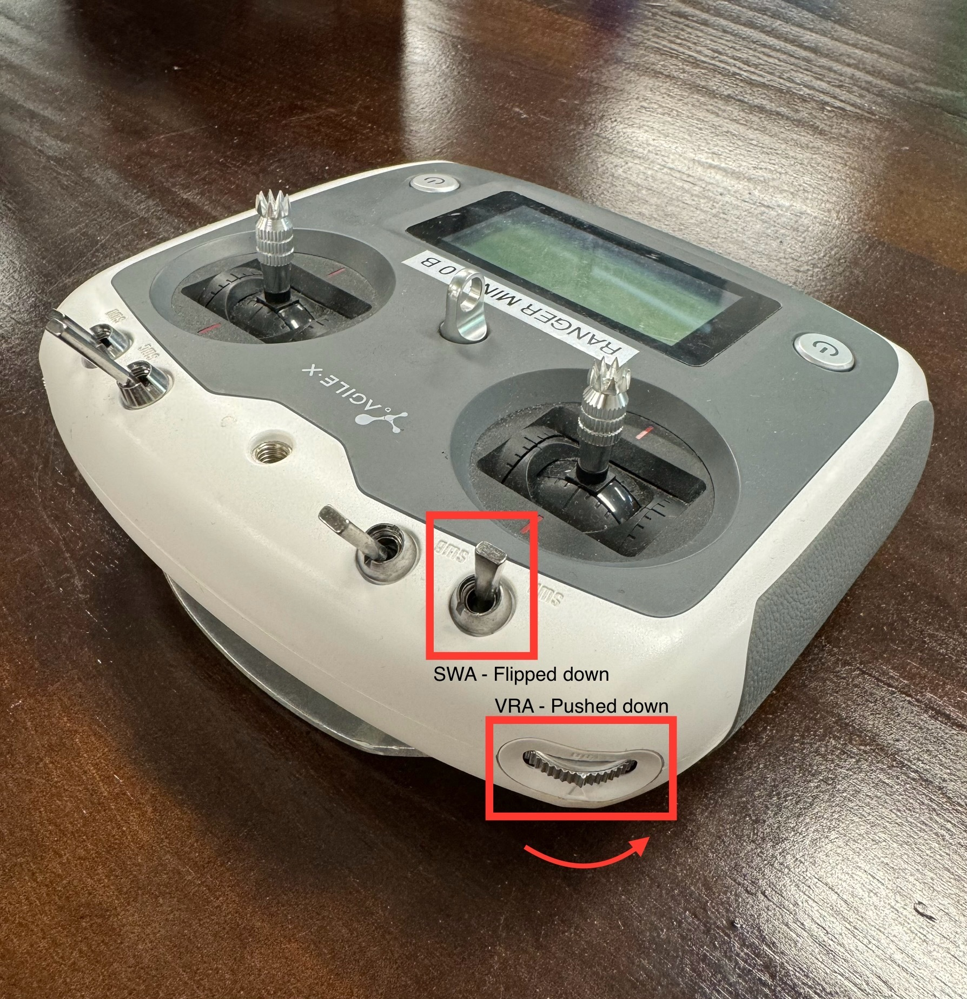
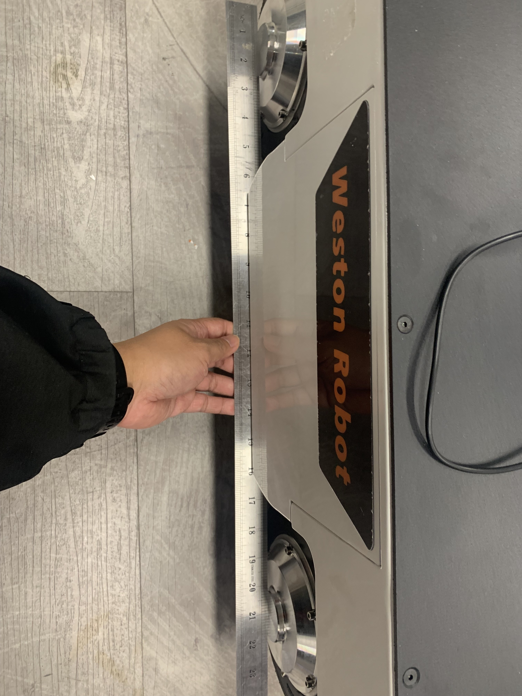

import RM2_IMG from '../img/agilex/ranger_mini_v2.png';
import RM_AUTO_CALIB_IMG1 from '../img/agilex/ranger_auto_calibration_1.jpg';
import RM_AUTO_CALIB_IMG2 from '../img/agilex/ranger_auto_calibration_2.jpg';
import RM_MANUAL_CALIB_IMG1 from '../img/agilex/ranger_calibration_1.jpg';
import RM_MANUAL_CALIB_IMG2 from '../img/agilex/ranger_calibration_2.jpg';

# Ranger Mini 2.0

## 1. Overview

The Ranger Mini 2.0 mobile robot is a four-wheel swerve-drive platform.

## 2. Resources

* **Manual**: 
  * [Ranger Mini 2.0 Manual (EN) PDF](https://tangrobot.sharepoint.com/:b:/s/Public-Outgoing/Eagd2Vrmnw9IiTzl4HaXjEwBuQJJ1unetL-IEpGHdBejag?e=YY4be5)
  * [Ranger Mini 2.0 Manual (CN) PDF](https://tangrobot.sharepoint.com/:b:/s/Public-Outgoing/EdlhLdKQBDlKlYL35YiVYDwBqyHDFgfliUiPDEmwy0WACA?e=TnIw9y)
* **C++ SDK**: [ugv_sdk](https://github.com/westonrobot/ugv_sdk)
* **ROS1 package**: [ranger_ros](https://github.com/westonrobot/ranger_ros)
* **ROS2 package**: [ranger_ros2](https://github.com/westonrobot/ranger_ros2)
* **Firmware**:
    * [V5.8.3](https://tangrobot.sharepoint.com/:u:/s/Public-Outgoing/EXvKUHspMMZCvaDj1uvucD8BVPiIHzmzNm1JJ2N29_58_g?e=tWXt2J) (With auto calibration)
    * [V5.8.7](https://tangrobot.sharepoint.com/:u:/s/Public-Outgoing/ESydg3zKcnhHizjnudyNDcgBiSuX7mgCCOMeiZ4ncy_faQ?e=2Up90z) (Without auto calibration)
    * [V5.9.1](https://tangrobot.sharepoint.com/:u:/s/Public-Outgoing/EasKzBaC07dIrhxGs9_4_WEBY-2gf81qeoZFdDFCFB0Ibw?e=CFUJ6T) (E-stop parks)
* **CAD Model**: [Ranger Mini 2.0 STEP file](https://tangrobot.sharepoint.com/:u:/s/Public-Outgoing/Efcf9NZa15JGkcNRaEoGLNsBfNuwNNzcgjNtEsDMMHAM4A?e=YcQ9AB)

## 3. Steering Motor Calibration

### Autocalibration

Turn on robot and controller. With SWA flipped to down position, and VRA pushed to bottommost position, press KEY1.

<!-- 
 -->

### Manual Calibration

Turn off robot and controller. While robot is turned off, adjust the position of the steering wheels. Using a long straight object to help straighten the wheels is generally sufficient.

<!--  -->

Turn on robot and controller. With SWA flipped to down position, and VRA pushed to topmost position, press KEY1.

<!--  -->

The controller display should flash a error code for 1-2 seconds then return to normal. Calibration is completed.