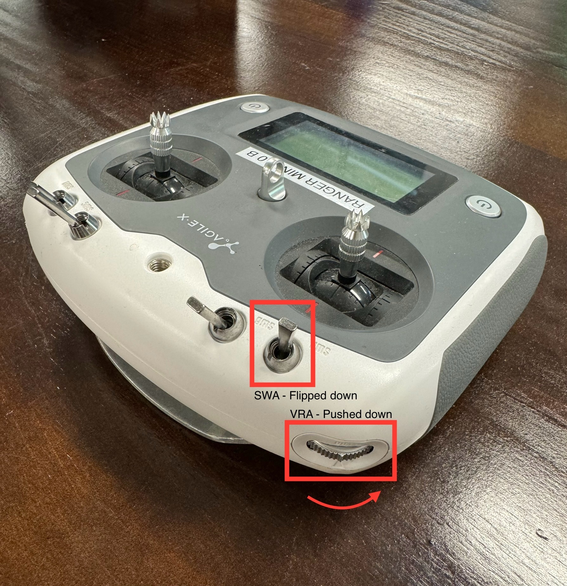
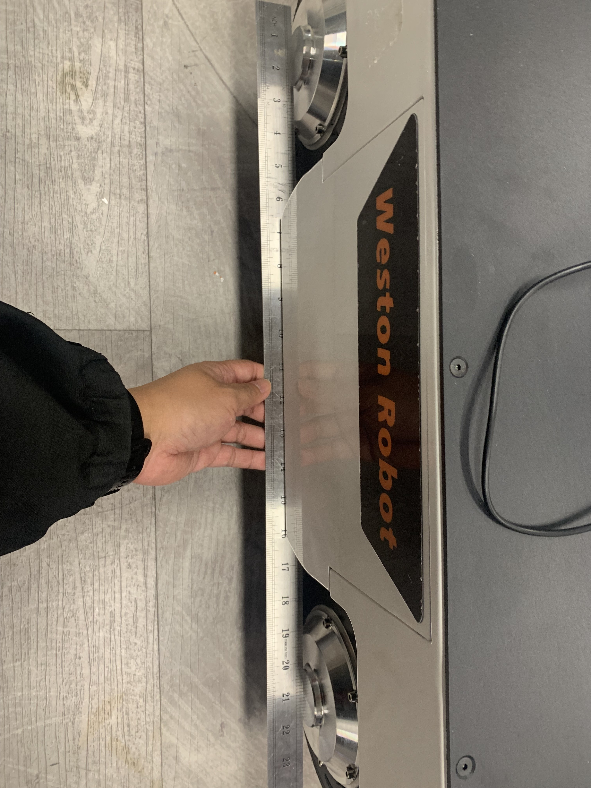

import RM3_IMG from '../img/agilex/ranger_mini_v3.png';
import RM_AUTO_CALIB_IMG1 from '../img/agilex/ranger_auto_calibration_1.jpg';
import RM_AUTO_CALIB_IMG2 from '../img/agilex/ranger_auto_calibration_2.jpg';
import RM_MANUAL_CALIB_IMG1 from '../img/agilex/ranger_calibration_1.jpg';
import RM_MANUAL_CALIB_IMG2 from '../img/agilex/ranger_calibration_2.jpg';

# Ranger Mini 3.0

## 1. Overview

The Ranger Mini 3.0 mobile robot is a four-wheel swerve-drive platform.

## 2. Resources

- **Manual**: [Ranger Mini 3.0 Manual (EN)](https://tangrobot.sharepoint.com/:b:/s/Public-Outgoing/EUjRgOZIXK9KnW006BR8w3sB2jU6vFv3z7WgxDFmJ_PPQQ?e=mcYaJs)
- **C++ SDK**: [ugv_sdk](https://github.com/westonrobot/ugv_sdk)
- **ROS1 package**: [ranger_ros](https://github.com/westonrobot/ranger_ros)
- **ROS2 package**: [ranger_ros2](https://github.com/westonrobot/ranger_ros2)
- **Firmware**:
    - [V6.0.5](https://tangrobot.sharepoint.com/:u:/s/Public-Outgoing/ET8rMyZGlnxBha4NuIoY3IYB3Cc9yJJ1DvJQ5UmqF_8MgQ?e=xVwAza)
- **CAD Model**: [Ranger Mini 3.0 STEP file](https://tangrobot.sharepoint.com/:u:/s/Public-Outgoing/EcOIV7nLuutLoPvKU2WfbkIBu7Izpp4fykdaXQnlAck0dw?e=85bhT2)

## 3. Steering Motor Calibration

### Autocalibration

Turn on robot and controller. With SWA flipped to down position, and VRA pushed to bottommost position, press KEY1.

<!-- 
 -->

### Manual Calibration

Turn off robot and controller. While robot is turned off, adjust the position of the steering wheels. Using a long straight object to help straighten the wheels is generally sufficient.

<!--  -->

Turn on robot and controller. With SWA flipped to down position, and VRA pushed to topmost position, press KEY1.

<!--  -->

The controller display should flash a error code for 1-2 seconds then return to normal. Calibration is completed.