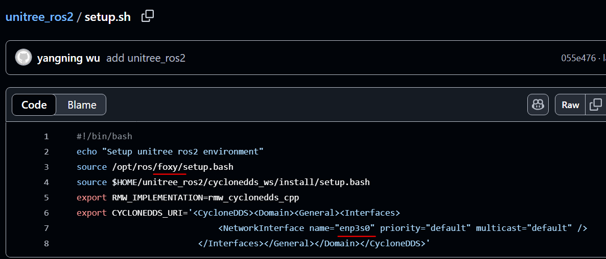

# SLAM Setup and Configuration

## 1. Setup

### 1.1 Preparation on user's computer

- Laptop (recommended) with Ubuntu 20.04 or 22.04
- ROS2 Foxy or [Humble](https://docs.ros.org/en/humble/Installation.html)(recommended)
	- ROS_DOMAIN_ID=0
- [Unitree_SDK_GO2](https://support.unitree.com/home/en/developer/Quick_start) (For programming capabilities)(for **GO2**)
- [Unitree_SDK_GO2-W](https://support.unitree.com/home/en/Go2-W_developer/Quick_Start) (For programming capabilities)(for **GO2-W**)
- [Unitree_ROS2](https://support.unitree.com/home/en/Go2-W_developer/ROS2_service) (For ros2 topics and communication on DDS)
	- Modify the network interface name to match the ethernet connection
	- Change the ros distro
	
	- [Cyclonedds](https://docs.ros.org/en/humble/Installation/RMW-Implementations/DDS-Implementations/Working-with-Eclipse-CycloneDDS.html)((Required for communication with robot)
	- Ethernet Cable
	
### 1.2 Additional Preparation
- [Unitree Go App Binding](https://support.unitree.com/home/en/developer/App_binding)
- [Payload Information/ Installation Guide](https://support.unitree.com/home/en/developer/Payload) – Expansion Dock, Depth Camera, XT16 Lidar
- [Expansion Dock Configuration ](https://support.unitree.com/home/en/developer/module_update) – Username & password, how to connect, expansion dock module update 
	- rviz configuration inside the “Expansion Dock Module Update Package” in **unitree/module/unitree_slam/rviz2/**
	- Username: unitree
	- Password: 123 (same for sudo password)
		- **ssh unitree@192.168.123.18**
	- If you encounter building/ make/ code running (e.g. **./unitree_slam**) error, use **sudo**

## 2. Configuration

### 2.1 Wire Connection

> This information is also present in the [Expansion Dock Configuration](https://support.unitree.com/home/en/developer/module_update).  

  

Set the wired connection as shown above after connecting to the robot dog (robot has to be on).
Once you have setup the connection successfully, you should be able to **ping 192.168.123.18** in a terminal; after **source unitree_ros2/setup.sh** and **ros2 topic list** you should be able to see the topics being displayed.

### 2.2 SLAM Usage

> This is done on the expansion dock (*through remote-ssh*).

- For YSN (if required), refer to the QR code behind the Lidar  

Default programs are found in /unitree/module/unitree_slam/bin.  

To make modifications to the keyDemo file (such as changing the speed and obstacle avoidance/detection), edit the file in the **/unitree/module/unitree_slam/example/src/keyDemo.cpp**.  

After editing, change directory to **/unitree/module/unitree_slam/example/** and create a build file is it has not been created.  
	- **cd /unitree/module/unitree_slam/example**
	- **mkdir -p build && cd build**
	- **sudo cmake ..** # if unable to **sudo cmake ..**, use **sudo su** and run **cmake .., exit** after executing this “cmake ..” command
	- **sudo make -j**  
	
You will need to open at least 3 terminals (+1 if you want to view rviz). Run the programs in this order (order matters):  
1. **cd /unitree/module/unitree_slam/bin**
2. **sudo ./unitree_slam**
3. **sudo ./xt16_driver**
4. **sudo /keyDemo eth0** # if running default keyDemo
	1. For edited keyDemo:
		1. **cd /unitree/module/unitree_slam/example/build**
		2. **sudo ./keyDemo eth0**
	2. You will see this  
	  
	
For rviz, on <u>your own computer</u>, open a terminal and source **unitree_ros2/setup.sh** and **cd unitree/module/unitree_slam/rviz2/**. Run **rviz2 -d mapping.rviz** or **relocation.rviz**  

Robot must start at the exact spot that mapping began, else it will have localisation issues, so choose the starting position wisely. Before mapping, ensure the robot <u>is standing</u>.  

When mapping, control the Go2/Go2-W via RC slowly around the area that you would like to map. Repeat the route twice to ensure that the map is detailed and written properly.  

- Press **W** to stop mapping
- Press **A** to start Relocation and Positioning Initialization
	- Starting position has to line up with map, use rviz to guide to starting position
- Press **S** to add node/edge (checkpoints)
	- The first node must always be the starting point
- Press **Any key** to stop SLAM and control the Go2/Go2-W to the starting point
- Press **A** to localize and press **D** to start the loop
	- Cautions:
		- Go2/Go2-W must be at the Initial Position before starting navigation
		- if you would like to pause the navigation, press **Z** before doing **CTRL+C** to all terminals
		- Remote will take precedence and stop SLAM navigation immediately when used
	- After navigating through all the nodes/edges, the Go2/Go2-W will navigate back to the starting point by itself
		- Eg. 1-2-3-2-1

