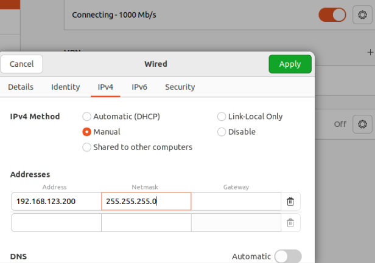
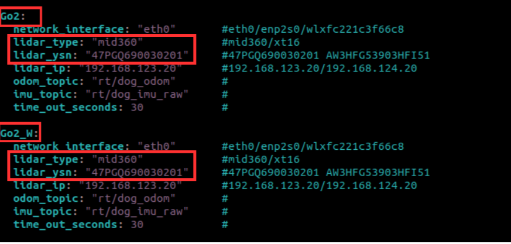
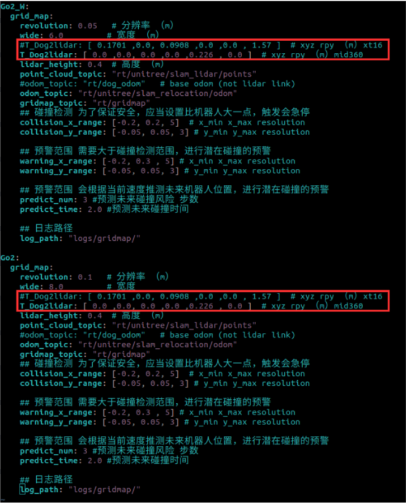
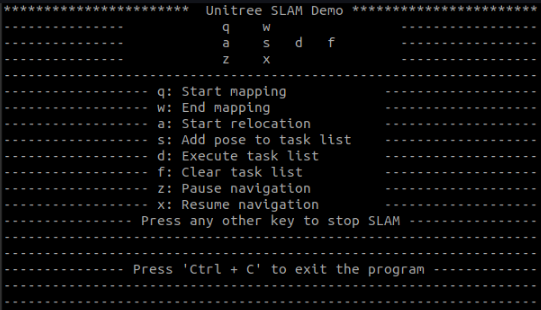

# Go2 & Go2-W

## 1. Setup  

Before jumping into SLAM, ensure that all required configurations are set up on the User PC.

### 1.1 What You Need  

- **User PC** running Ubuntu 20.04 or 22.04  
	- Ubuntu 22.04 is recommended.  
	- A laptop is recommended.  
	- You may refer to the [Ubuntu Installation Guide](https://ubuntu.com/tutorials/install-ubuntu-desktop).
- **ROS2 Foxy or Humble** installed  
	- Humble is recommended.  
	- You may refer to the [ROS2 Humble Installation Guide](https://docs.ros.org/en/humble/Installation/Ubuntu-Install-Debs.html).  
	- After installing ROS2, in the terminal, run **`export ROS_DOMAIN_ID=0`**.
- **Unitree Software Development Kit** installed and set up  
	- You may refer to the [Unitree_SDK_Go2 Installation Guide](https://support.unitree.com/home/en/developer/Quick_start) or the [Unitree_SDK_Go2-W Installation Guide](https://support.unitree.com/home/en/Go2-W_developer/Quick_Start).
- **Unitree ROS2 Services Interface** installed  
	- You may refer to the [ROS2 Services Interface Installation Guide](https://support.unitree.com/home/en/developer/ROS2_service).
	- Ensure Cyclone DDS is used as the middleware.
- **Ethernet cable**  
	- Used to connect the laptop to the Robot's PC.  
	- A cable longer than 5 meters is recommended.

### 1.2 Additional Preparation  

- **Payload Installation**  
	- You may refer to the [Payload Installation Guide](https://support.unitree.com/home/en/developer/Payload).  
	- Make sure the Expansion Dock and External LiDAR (XT16 or MID-360) are installed properly.
- **SLAM Service Expansion Dock Module Update Package**  
	- You may refer to the [Expansion Dock Configuration Guide](https://support.unitree.com/home/en/developer/module_update).

### 1.3 Notes  

- The RViz configuration files can be found in the **Expansion Dock Module Update Package** installed in the previous steps.
- **Robot's PC details:**  
	- Username: `unitree`  
	- Password: `123`  
	- IP address: `192.168.123.18`
- Secure Shell into the Robot's PC by running **`ssh unitree@192.168.123.18`** in the terminal.  
	- When prompted, enter the password above.  
	- Select **1** when prompted for the ROS version.
- If you encounter issues when running commands in the terminal, try adding **`sudo`** at the front (e.g. **`sudo nano /etc/default/grub`**).
- If you are using **ROS2 Humble** instead of **ROS2 Foxy**, replace any references to *Foxy* with *Humble* when following the steps above.

---

## 2. Configuration  

### 2.1 Wired Connection  

- Make sure the User PC is connected to the Expansion Dock on the Go2/Go2-W as shown below.  

- Ensure that the network interface connected to the robot is configured with the following settings.  

- In the terminal:
	- Verify the connection by running:  
		- **`ping 192.168.123.18`** for the Robot's PC  
		- **`ping 192.168.123.20`** for the External LiDAR  
		- **`ping 192.168.123.161`** for the Motion Control PC
	- Verify the ROS2 setup by running:  
		- **`source unitree_ros2/setup.sh`**  
		- **`ros2 topic list`**
	- Expected output:  
	

---

### 2.2 Expansion Dock Configuration for SLAM

- Check that the Power Mode of the Robot's PC is set to 0:MAXN by passing the command **sudo /usr/sbin/nvpmodel -q**. If it is not the desired Power Mode, then pass the command **sudo /usr/sbin/nvpmodel -m 0** to set it.   
- Modify the Maximum Receive Buffer Size in the cyclonedds by passing the following command to the Robot's PC:
	- **`sudo su`**
	- **`echo "net.core.rmem_max=52428800" >> /etc/sysctl.conf`**   
	- **`echo "net.core.wmem_max=52428800" >> /etc/sysctl.conf`**   
	- **`sysctl -p`**  
	- **`exit`**
	- **`sudo chmod 777 -R /unitree/module/unitree_slam`**  
- Make sure you have the [Unitree Software Development Kit](#12-additional-preparation) installed.  
- Make sure the [SLAM Service Expansion Dock Module Update Package](#12-additional-preparation) is installed.  
- In the User PC, clone the Unitree Software Development Kit repository.
	- **`sudo git clone https://github.com/unitreerobotics/unitree_sdk2.git`**  
- Transfer the Software Development Kit from User PC to the Robot's PC.
	- **`scp -r ~/unitree_sdk2 unitree@192.168.123.18:/home/unitree/`**  
- Clean, rebuild and install Unitree Software Development Kit in the Robot’s PC.
	- **`cd /home/unitree/unitree_sdk2`**
	- **`sudo mkdir -p build && cd build`**
	- **`sudo cmake ..`**
	- **`sudo make install`**
- Build the SLAM Example
	- **`cd /unitree/module/unitree_slam/example`**
	- **`sudo mkdir -p build && cd build`**
	- **`sudo cmake -Dunitree_sdk2_DIR=/home/unitree/unitree_sdk2/build/unitree_sdk2 ..`**
	- **`sudo make`**

### 2.3 LiDAR Parameter Configuration

- Check for the model of the external LiDAR installed.      

  

    

      
      
Livox LiDAR Mid-360

    

  

  

    

      
      
Hesai XT16 LiDAR

    

  

- Acquire the YSN value. If not available, please contact [Weston Robot Support Team](https://forms.office.com/pages/responsepage.aspx?id=NTNVCC0zFkWzGo_3Vcs_4KxdsbBJKHVIkFlOJLtAMMlUQkJZMU8wM1EyTkRUVUJCVzA2WVdQNzBSMCQlQCN0PWcu&route=shorturl).  
- Using the Robot's PC, enter the following commands to view the SLAM interface parameters.   
	- **`cd /unitree/module/unitree_slam/config/slam_interfaces_server_config`**  
	- **`sudo vim param.yaml`**
- Move your arrow keys to the desired field and press the "i" key on your keyboard to enter edit mode. Enter the desired LiDAR model and YSN value. After editing, press the "esc" key to exit editing mode and press the ":", "w" then "q" buttons in order to save and exit. Type ":", "q" then "a" to exit without saving. Please refer to below example.  
  
- Using the Robot's PC, enter the following commands to view the Gridmap Configurations.  
	- **`cd /unitree/module/unitree_slam/config/gridmap_config`**
	- **`sudo vim config.yaml`**  
- Move your arrow keys to the desired field and press the "i" key on your keyboard to enter edit mode. Comment out the line which coresponds to the non-desired LiDAR model by adding "#" to the start of the line and remove the "#" from the line with the desired LiDAR model. After editing, press the "esc" key to exit editing mode and press the ":", "w" then "q" buttons in order to save and exit. Type ":", "q" then "a" to exit without saving. Please refer to below example.  
  

### 2.4 SLAM Usage  

> The following steps are performed on the Go2/Go2-W PC via [Secure Shell](#13-notes).

#### Run SLAM
- Open a terminal (Terminal 1).  
- **`cd /unitree/module/unitree_slam/bin`**  
- **`sudo ./unitree_slam`** to start the SLAM service.  
- Keep this terminal open.

#### Run the LiDAR Driver
- Open a new terminal (Terminal 2).  
- **`cd /unitree/module/unitree_slam/bin`**  
- Run the appropriate driver based on the installed LiDAR:  
	- **`sudo ./mid360_driver`** or  
	- **`sudo ./xt16_driver`**  
- Keep this terminal open.

#### Run keyDemo
- Open a new terminal (Terminal 3).  
- **`cd /unitree/module/unitree_slam/bin`**  
- **`sudo ./keyDemo eth0`**  
- The terminal should display the following output:  

---

> The following steps are performed on the **User PC**.

#### Run RViz
- Open a terminal.  
- **`source unitree_ros2/setup.sh`**  
- **`cd unitree/module/unitree_slam/rviz2/`**  
- **`rviz2 -d mapping.rviz`**  
- This allows monitoring of the mapping process.  
- You may also run **`rviz2 -d relocation.rviz`** to monitor the relocation and localization process.

---

> The following steps involve robot manipulation using the <u>RC (remote controller)</u> and interaction with <u>Terminal</u> 3.

#### Mapping
- Press **Q** to start mapping.  
- Make sure the robot is at the exact intended start location and is standing.  
- Move the robot around the area <u>slowly and thoroughly</u>. Repeat this process twice to achieve a more detailed and accurate map.  
- On <u>Terminal 3</u>, press **W** to stop mapping.  
- Return the robot to the exact position and orientation of the original start location.

#### Relocation and Positioning
- On <u>Terminal 3</u>, press **A** to start relocation and positioning initialization.  
- Press **S** to add the first node (checkpoint), which should always be the start location.  
- Move the robot to desired checkpoints using the RC and save each position by pressing **S**.  
- **Note:**  
	- The distance between the target point and the current position must not exceed <u>10 meters</u>.  
	- The minimum distance between each node is recommended to be more than <u>1.5 meters</u>. 	
	- The robot moves in straight lines.  
	- Due to the LiDAR field of view, obstacles should be at least <u>20 cm</u> high.  
	- Avoid sharp turns.
	- Turn off the obstacle avoidance mode that comes with the robot, and the head light will turn blue.
- After saving all desired nodes, press any other key in <u>Terminal 3</u> to exit SLAM navigation mode.

#### Localization
- Return the robot to the exact position and orientation of the original start location.  
- Review the map and relocation process on the User PC.  
- On <u>Terminal 3</u>, press **A** to localize.  
- Press **D** to start the navigation loop.  
- After completing all saved nodes, the robot will return to the original start location.  
- Robot will move along the nodes in order and return to original position with reverse order e.g. 1-->2-->3-->2-->1 (repeats until stopped)  
- **Note:**  
	- To pause navigation, press **Z** on <u>Terminal 3</u>, then press **CTRL+C** on all terminals.  
	- Using the RC will immediately stop SLAM navigation and takes precedence.
