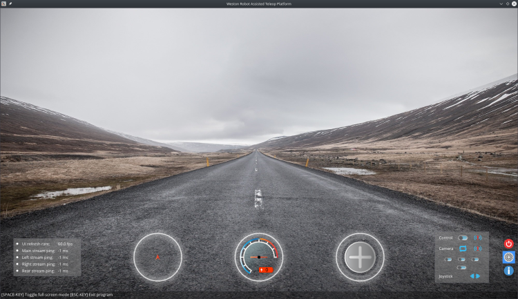
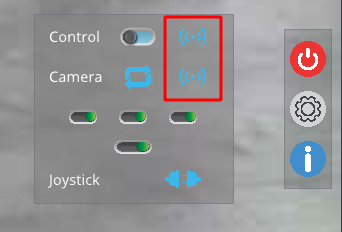
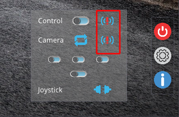
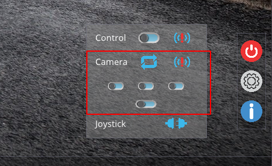
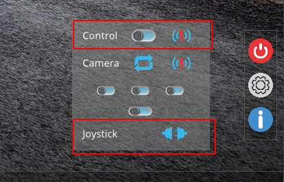
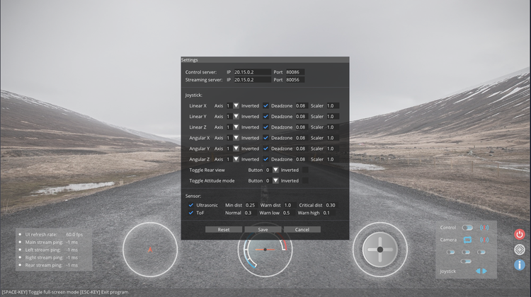
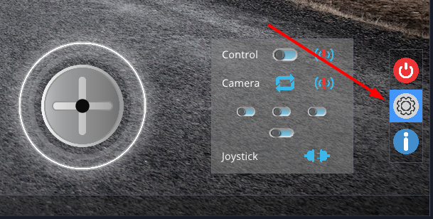
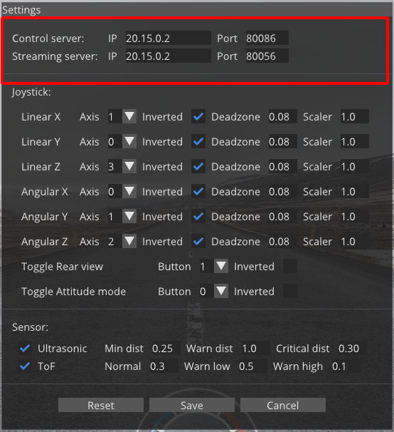
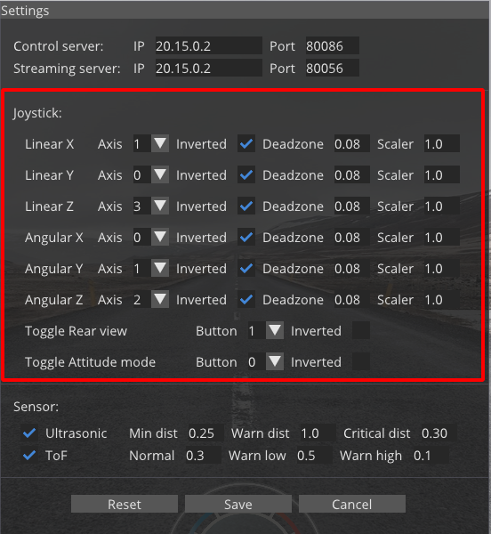

# Weston Robot Assisted Driving Toolbox (ADT) V1

Weston Robot proudly presents the Assisted Driving Toolbox (ADT) V1, a teleoperation system designed and developed by Weston Robot for usage on multiple mobile robot platforms. The system allows the control and operation of a robot through a shared network, with a wide coverage of its surroundings using mounted onboard camera modules.



## Assisted Driving Server Setup

### Service Management

The Assisted Driving Toolbox servers has been configured to startup upon the robot's boot up as a systemd service.

- To restart the server:
  
```bash
sudo systemctl restart wr_adt_server.service
```

- To stop the server (does not carry over through reboots):
  
```bash
sudo systemctl stop wr_adt_server.service
```

- To permanently enable/disable the server (carry over through reboot):
  
```bash
sudo systemctl enable/disable wr_adt_server.service
```

### Video Streaming Configuration

The following parameters can be configured:

1. Camera (**/opt/weston_robot/docker/wr_adt_server/config.yaml**)
  
   * Image resolution
   * Compression rate
   * Video stream endpoints
  
2. Server (**/opt/weston_robot/docker/wr_adt_server/docker-compose.yaml**)
   
   * Streaming ip address
  
You can refer to comments inside the cooresponding configuration file for available options.

## Assisted Driving Client Setup

### System Requirements

1. Host computer running Ubuntu 18.04 or 20.04
2. Joystick for control with the Assisted Driving Toolbox Client
3. Shared network between the robot and host computer

### Client Software Installation

Follow the following commands in a terminal to install the Assisted Driving Toolbox Client on the host computer.

```bash
sudo apt-get install libglfw3-dev libyaml-cpp-dev libopencv-dev
echo "deb https://westonrobot.jfrog.io/artifactory/wrtoolbox-release $(lsb_release -cs) main" | sudo tee /etc/apt/sources.list.d/weston-robot.list
curl -sSL 'https://westonrobot.jfrog.io/artifactory/api/security/keypair/wr-deb/public' | sudo apt-key add -
sudo apt-get update
sudo apt-get install wr_assisted_teleop
```

Before continuing, retrieve the IP address of the robot's wlan0 interface for client configuration later (see _configuration_ below).

To add path to environment:

```bash
echo 'export PATH=/opt/weston_robot/bin:$PATH' >> ~/.bashrc
```

To (re)start the client:

```bash
wr_assisted_teleop
```

- The icons below show the status of the control and video streaming servers. The icons on the left screenshot indicates the services are online, while the one on the right indicates the services offline.




- If system has been configured before, camera streams will automatically be enabled. To toggle individual camera streams, use the buttons below:



- To toggle control of the robot (control disabled by default) and to view the status of attached joystick, use the buttons below:
   
   - **NOTE**: Set height to the neutral position (50%) and check joystick behaviour (see below) before enabling control to avoid sudden movements.



- The joystick gauge displays the current state of the attached controlling joystick.
   
   - **Please ensure that the joystick behaves as expected before enabling control of the robot.**
   - **If behaviour is incorrect, configure the joystick in the client's settings menu.**


- The obstacle detection gauge displays the current feedback on any range finders in the system (when applicable):


- The Speedo- and Battery meter gauge displays the current speed and battery's charge (Upcoming feature):


### Client Configuration

On client's first startup, "Settings" popup will prompt user to input the relevant settings for teleoperation, key settings include:
  - Control server IP and port numbers
  - Streaming server IP and port numbers
  - Joystick mapping settings



- To change settings after first startup, click the settings button at the bottom right of the client to access settings:



- Changing the IP address and ports of the Servers is as simple as changing the values below:
   - This IP address should correspond to the robot's wlan0 interface IP address by default



- Changing the joystick mapping is as simple as changing the values below:
   - Mappings:
      - Linear X - Forward/Reverse movement
      - Linear Y - Side-Side movement
      - Linear Z - Body height adjustment
      - Angular X - Body roll
      - Angular Y - Body pitch
      - Angular Z - Yaw movement 
   - Below shows an example configuration using Logitech's Extreme3DPro joystick:


