# Weston Robot Assisted Driving Toolbox (ADT) V2

Weston Robot proudly presents the Assisted Driving Toolbox (ADT) V2, a teleoperation system designed and developed by Weston Robot for usage on multiple mobile robot platforms. The system allows the control and operation of a robot through a shared network, with a wide coverage of its surroundings using mounted onboard camera modules.

## Assisted Driving Client Setup

### System Requirements

1. Host computer running Ubuntu 20.04/22.04
2. Joystick for control via the Assisted Driving Toolbox Client
3. Shared network between the robot and host computer

### Client Software Installation

Follow these steps to install the Assisted Driving Toolbox Client on the host computer. If you have installed packages from the Weston Robot repository before, you can skip to step 2.

1. Follow the instructions [here](https://docs.westonrobot.com/software/installation_guide.html#add-weston-robot-s-apt-source) to add the Weston Robot package source to your system's software repository list.

2. Now you can update the apt index and install the ADT package with "apt-get" command.

    > **Note:** Installation of additional third-party dependency packages may be required for this package.

    ```bash
    $ sudo apt-get update
    $ sudo apt-get install wr-ad-toolbox
    ```

### TLS Certificate Installation

To run the Assisted Driving Toolbox Client, you need to install a set of TLS certificates. These certificates are used to establish a secure connection between the client and the robot for control. You should have received a password-protected zip file containing the certificates from Weston Robot.

1. Extract the zip file to a location of your choice.
2. Open a terminal and navigate to the directory where you extracted the zip file.
3. Run the following command to install the certificates:

    ```bash
    $ sudo ./install_certificates.sh
    ```

### Running the Assisted Driving Toolbox Client

To open the application, locate the Assisted Driving Toolbox Client in the application menu:

- Press the Windows key on your keyboard to open the application search bar. Search for "WR Assisted Driving Toolbox".
- Click on the application icon to open the Assisted Driving Toolbox Client.

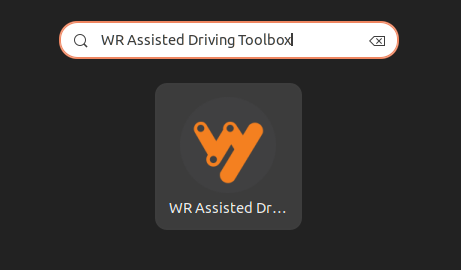

The Assisted Driving Toolbox Client will open with the following screen:

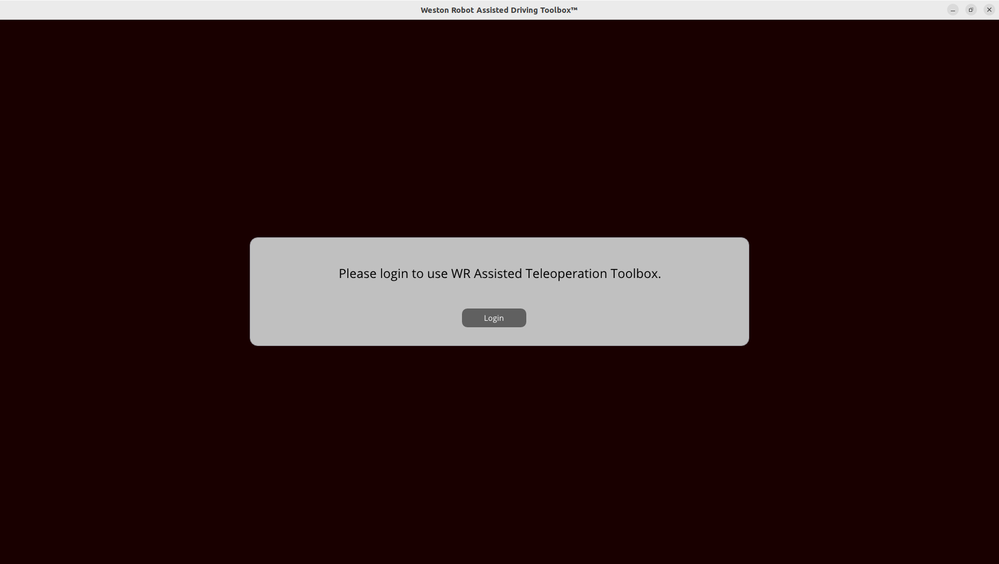

Click on the "Login" button. A new browser window will open with the following login page:

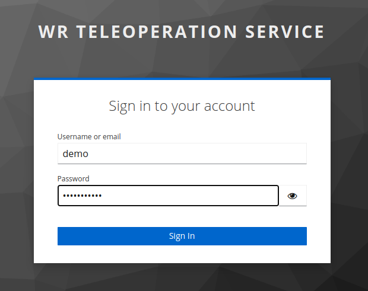

Login with your credentials. After successful login, the Assisted Driving Toolbox Client will prompt you to select the robot you want to control:

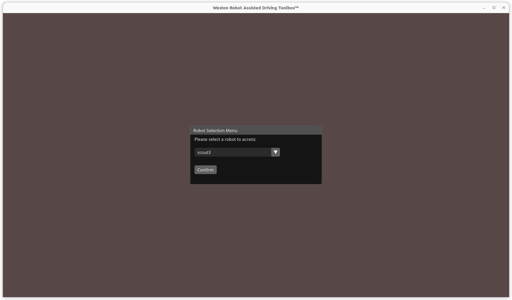

If this is your first time using the Assisted Driving Toolbox Client, a settings menu will automatically open for you to configure the joystick and camera settings.

## Key Application Features

### Teleoperation Panel

The teleoperation panel serves as the main control interface for the robot. It allows you to control the robot's movement and observe the robot's surroundings through the robot's onboard cameras in real-time.

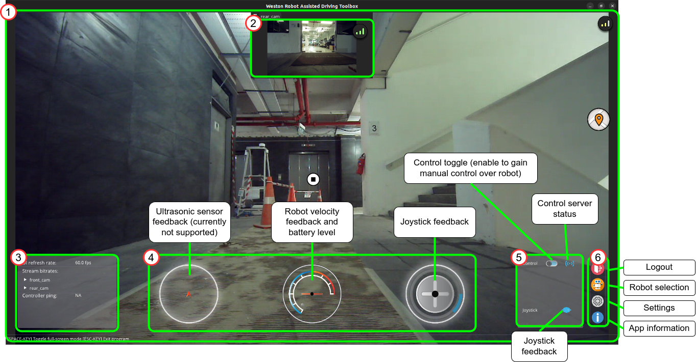

### Settings Menu

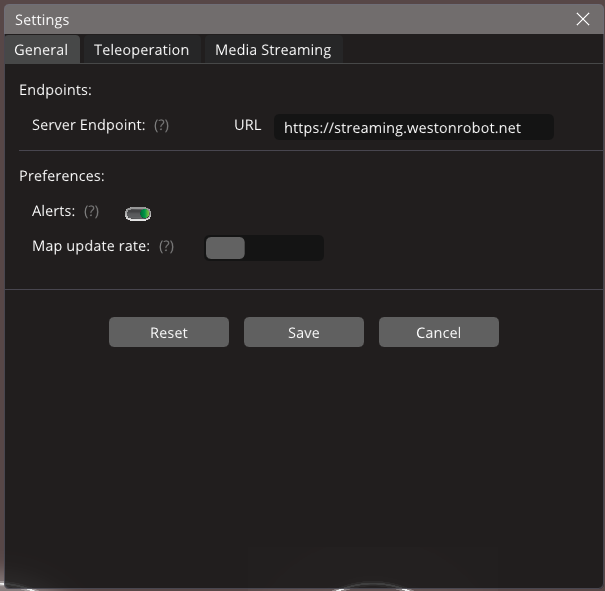

The settings menu allows you to configure the joystick and camera settings. You can access the settings menu by clicking on the gear icon in the bottom right corner of the Assisted Driving Toolbox Client.

## Manual Control with Wireless PS4 Controller

To start manually controlling the robot, at least 1 controller (joystick, gamepad, etc.) must be connected. To connect a Bluetooth PS4 gamepad to the Ubuntu system, you may follow these general steps:

1. Open Bluetooth settings window. Click the top right corner of your screen to open the toolbar menu. Subsequently select "Bluetooth Settings".

    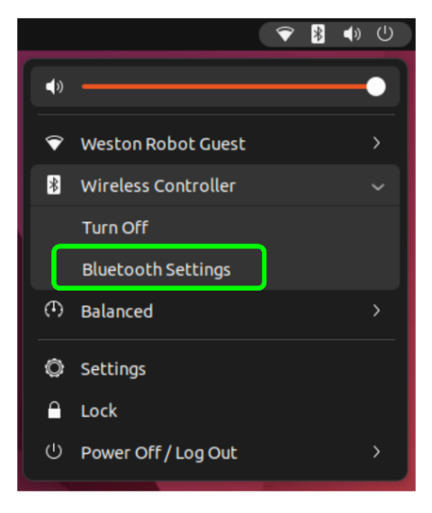

2. Turn on Bluetooth pairing mode of the PS4 controller by **holding onto the PlayStation button and "Share" button simultaneously** until a flashing blue light is observed on the PS4 gamepad's LED.

    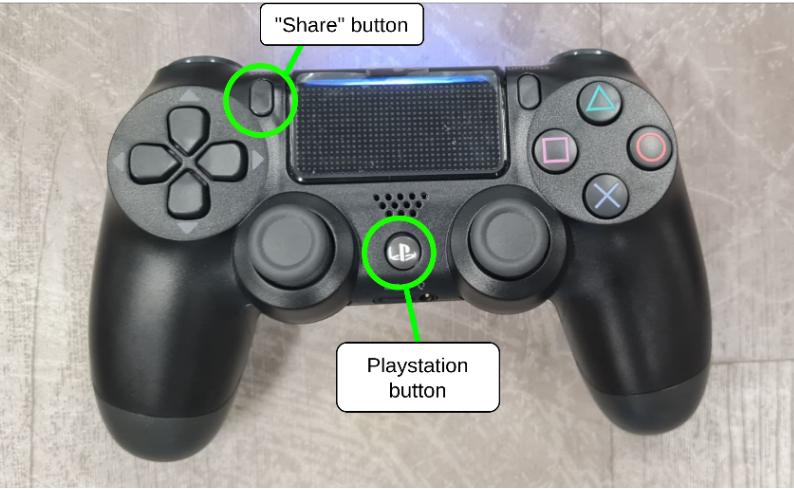

3. On the Ubuntu system's Bluetooth settings, find the device named "Wireless Controller" and connect to it.

    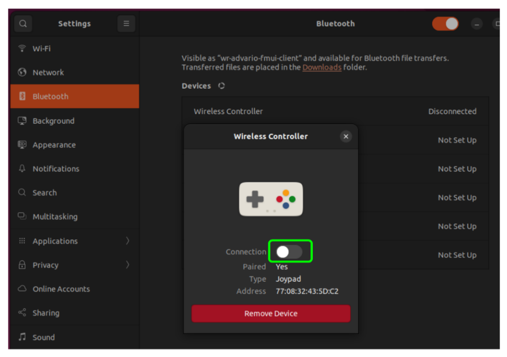

4. Upon successful connection to the gamepad, you should see the following icon in the teleoperation panel of the user application. The LED on the controller should also turn **solid blue**.

    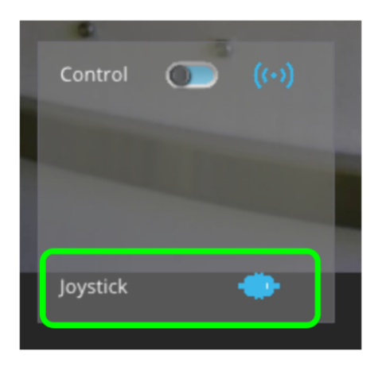

5. After switching to the teleoperation panel, request for control from the robot by clicking the following toggle switch.

    > **Note:** Do check your settings to ensure that the joystick is properly configured before requesting control.

    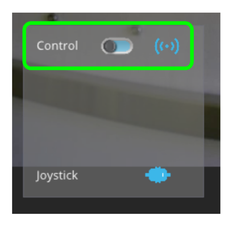

6. Upon successfully obtaining robot control, the robot may be controlled as follows:

    - Left Joystick: Moves the robot forward and backwards.
    - Right Joystick: Rotates the robot right and left.

    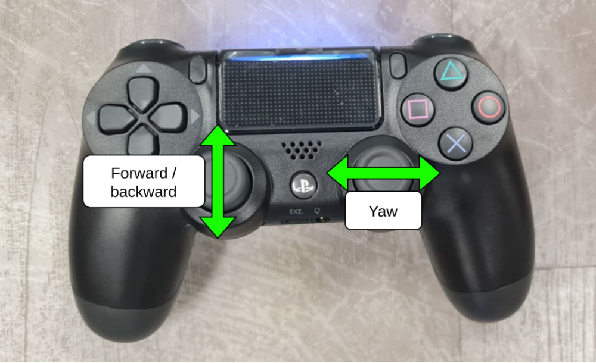
