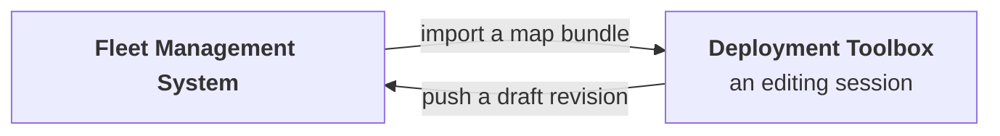

# Deployment Toolbox

A 3D scan of a building is just points. A robot needs to know where the floor is, where it may drive, where it must not go, and which places matter. Somebody supplies that meaning once per site, and this is the tool they use.

What comes out is the **site map** — the artifact everything else depends on. It is pushed to the [Fleet Management System](/solution/fleet-management), and reaches the robots from there.

Preparing a site is a once-per-site job rather than a once-per-mission one, and the map is revisited afterwards only when the building itself changes — new racking, a wall moved, a door now permanently shut. Editing a site's map requires the **Site Admin** role for that site; operators and observers use maps without changing them.

Key features of the toolbox are summarized in the table below, and each is covered in its own section.

| Feature | What it gives you |
| --- | --- |
| **Map inspector** | Opens a map to examine it and check that routes solve |
| **Map editor** | Turns a 3D scan of a site into the map robots navigate by |

## Map layers

A site map is not one file. What travels between the Toolbox and the fleet is a **bundle** of layers, and each answers a different question.

| Layer | What it is | Where it is used |
| --- | --- | --- |
| **Navigation graph** | The TMG document: nodes, segments, zones and levels | What the robot navigates by, and what the fleet reads a site's waypoints and routes from |
| **Point cloud** | The 3D scan the map was authored against | Loaded back into the editor, so a later revision is drawn against the same scan |
| **Occupancy grid** | A flat grid of what is free and what is blocked, one per level | Drawn beneath the graph, so its nodes, segments and zones can be read against the building |

<Figure
  src={require('../img/toolbox-graph-over-occupancy.png').default}
  alt="A site's navigation map: the occupancy grid drawn in white showing the walls and structure of an office floor, with the TMG graph over it in blue — labelled nodes joined by segments, each wrapped in a shaded zone, and a marked home position"
  size="full"
  framed
  caption="The two layers together. White is the occupancy grid — the building. Blue is the graph — the nodes, segments and zones the robot reasons about." />

The graph is written in **TMG** — Topometric Navigation Graph, a map specification Weston Robot defines and publishes. It is *topometric* because it carries both the topology, meaning which places connect to which, and the metric detail, meaning exactly where each of them is. **The graph is the map; the rest is the ground it was drawn over** — a separation that shows in practice, since a bundle whose occupancy layer is missing still opens as a usable navigation graph, with the absent underlay reported rather than the whole map refused.

The occupancy grid's role today is visualisation: the fleet and the toolbox draw it under the graph so a node or a zone can be related to the floor plan it sits on rather than read as bare coordinates, while a robot navigates from the graph. One further surface is computed rather than stored — the **height grid**, derived from the point cloud against the level being edited, is what surface snapping uses to settle a node onto the floor, and it exists only while you are working.

## Map elements

The navigation graph is where a map's meaning lives, and these are the elements it is built from. TMG exists because the formats already available describe a *space* without describing what is *allowed to happen* in it: a point cloud says where the walls are, not that this doorway is a route and that one is off limits.

| Element | What it is |
| --- | --- |
| **Node** | A point the robot can be sent to — a **waypoint**, or a **charging** station |
| **Segment** | A connection between two nodes: the ways the robot may travel |
| **Zone** | An area whose boundary applies rules inside it, including no-go |
| **Level** | A floor. Nodes and zones each belong to one |
| **Transition** | How a robot moves between levels |

Most zones on a finished map were never drawn by hand — one is generated around every node and along every segment, marking the envelope the robot may drive within. The ones you *do* draw are how you say "slow down here" or "never go here".

<Figure
  src={require('../img/toolbox-map-elements.png').default}
  alt="A close view of part of a site map: nodes as small points, segments as the lines joining them, a shaded zone around every node and along every segment, and one red rectangular zone drawn by hand"
  size="full"
  framed
  caption="Nodes are the points; the lines joining them are segments. Everything shaded is a zone — one around each node, one along each segment. The red rectangle is the only zone on this map that someone drew." />

**This release supports one level per site**, because robots do not use stairs or lifts on their own. Transition exists in the format for sites that span floors and has no use in a single-level one; a ramp within a level is not a change of level.

## Data exchange

The Toolbox and the Fleet Management System exchange maps at two moments and are otherwise independent of each other.

| Moment | Direction | What moves | Which tool |
| --- | --- | --- | --- |
| **Import from fleet** | Fleet → Toolbox | An existing map bundle, pulled down to work on | Editor or inspector |
| **Push to fleet** | Toolbox → Fleet | The finished map, as a new draft revision | **Editor only** |

**Only the editor writes back.** The inspector can pull a map down to look at it, and never sends one anywhere.

**Nothing passes between them in between.** A map open in the editor is a copy: it does not follow changes made in the fleet while you work, and the fleet knows nothing of your edits until you push them. Work in progress lives in your own browser rather than on a server, so the two systems share no state at all between an import and a push.

That is deliberate, and it has one practical consequence worth planning around: **whoever edits a site's map should import it at the start of the session rather than reusing yesterday's copy**, because nothing will tell them if it has moved on. It is also why two people editing the same site's map at the same time is a bad idea — neither would know.

**The Toolbox never talks to robots.** It pushes to the Fleet Management System, and robots are updated from there; there is no path from this tool to a machine in the field. A pushed map arrives as a **draft revision**, and someone in Fleet Management then **publishes** it and **activates** it — activation being what puts a map in front of robots, and neither step something the Toolbox can take.

<Figure
  src={require('../img/toolbox-import.png').default}
  alt="The toolbox's load panel, offering Import from Fleet as the highlighted option, with Upload TMG File and Upload Bundle beneath it"
  size="sm"
  framed
  caption="One end of the exchange: a map comes in from the fleet, or from a file on your machine." />

[Publishing to the fleet](/solution/deployment-toolbox/map-editor#publishing-to-the-fleet) covers the four things the push asks for, why the change summary is worth writing properly, the three steps from draft to activated, and what activation costs a robot.

## Map inspector

The inspector answers whether a map is sound, without changing it. It opens one from the fleet or from a file, reports what it holds — how many nodes, segments, zones and levels, and every element by name — and tests whether a robot could actually travel between two points you pick. That second job is the one that earns it: a map whose segments do not quite meet looks connected on screen and cannot be navigated, and this is where that surfaces in seconds rather than during a patrol.

<Figure
  src={require('../img/toolbox-inspector.png').default}
  alt="The Map Inspector with a site loaded, showing an overview counting its nodes, segments, zones and levels, a searchable list of named elements, and the graph drawn with its zones"
  size="full"
  framed
  caption="The inspector reading a map: what it holds, every element by name, and the graph drawn out." />

[Map inspector](/solution/deployment-toolbox/map-inspector) covers the two modes, where a map can be opened from, how to choose which routes to test, and when reaching for it is worth the time.

## Map editor

The editor is where a site map is made: it takes a 3D scan of a building and produces the graph a robot navigates by. That means cleaning up the scan, establishing the floor it sits on, and then placing the nodes, segments and zones themselves — work that is staged, so a map can be picked up and revised later rather than rebuilt from the beginning each time the building changes.

<Figure
  src={require('../img/toolbox-stages.png').default}
  alt="The map editor's stage bar showing five numbered stages in order: Load, Prepare, Levels, Edit, Export, with undo and redo alongside"
  size="full"
  framed
  caption="The editor's five stages, worked left to right, with undo and redo throughout." />

[Map editor](/solution/deployment-toolbox/map-editor) covers all five stages, what each needs before it will open, the point cloud formats accepted, and what surface snapping is for.

## Support

Before raising a ticket, note which site and map are involved, and whether the problem is with drawing it, pushing it, publishing it or activating it — those are four different stages, and only the first two happen in this tool. [Before you contact us](/support/before-you-contact-us) lists what helps.
