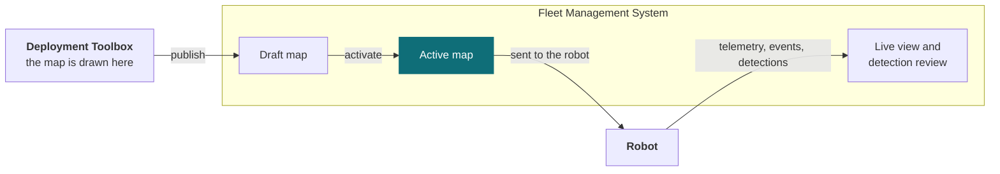

# Fleet Management System

The Fleet Management System is the web application you run your robots from. Missions are planned here, dispatched here, watched here, and everything the robots find is kept here. It runs in a browser, and there is nothing to install.

## Where it sits

A working deployment is the robots, the map they navigate by, and this system. Fleet Management is the part people use every day; the **Deployment Toolbox** prepares a site once, before any robot drives there. Detection algorithms — ours on the robot, or a partner's alongside it — report into this system too, so what they find arrives as events here.

| Part | What it does | How often you touch it |
| --- | --- | --- |
| [Deployment Toolbox](/solution/deployment-toolbox) | Turns a 3D scan of your site into the map robots navigate by | Once per site |
| **Fleet Management System** | Plan, dispatch, watch, review | Daily |
| Robot | Carries out the missions | — |

### How a map reaches a robot

The **site map** is what ties these parts together, and it travels in one direction only.

A map published from the Deployment Toolbox arrives here as a **draft** — stored, but not in use. Someone with the Site Admin role then **activates** it, and activation is what makes it the map robots are given. Until that happens robots keep the map they already have, so a robot never changes map part-way through a job. The Deployment Toolbox never talks to a robot itself.

Everything travelling the other way — where each robot is, what it is doing, and what it detected — arrives here from the robots.

## Key features

| Feature | What it gives you |
| --- | --- |
| **Fleet overview** | Every site and robot, with live status |
| **Mission planning** | Build missions from waypoints, the routes between them and a schedule; reuse them across sites |
| **Live monitoring** | Position on the site map, telemetry, camera feeds, health and activity |
| **Direct control** | Emergency stop, teleoperation, docking and posture commands — one operator at a time |
| **Detection review** | Everything the robots detected, filterable and reviewable, kept as a record that cannot be edited or deleted |
| **Users and roles** | Who may watch, who may command, who may change a site |
| **Audit log** | An append-only record of who did what |

The dashboard is the entry point: sites down the side, robots grouped by site, and a status count across the top.

<Figure
  src={require('./img/fleet-dashboard.png').default}
  alt="Fleet dashboard showing four sites and ten robots grouped by site, with operational, non-responsive and faulty status counts"
  size="lg"
  framed
  caption="The fleet dashboard — every site and robot, with current status." />

## The main workflow

Four things happen here, in this order.

### 1. Plan a mission

Missions are built in the browser from **waypoints** (the places on the site map a robot can be sent to), the routes between them, and a schedule, then kept in a library and reused. Revision comparison and duplication mean a second site starts from the first rather than from nothing.

Missions reference the site map, so a robot has to be on the map the fleet has activated before its missions can be edited or dispatched. **When a newer map is activated, that robot's missions are switched off and stay locked** until it confirms the new map — rather than running against waypoints that may have moved. Once it confirms, you check the missions and switch them back on.

<Figure
  src={require('./img/fleet-map-not-current.png').default}
  alt="A dialog headed 'This robot's map is not up to date', comparing the revision the fleet activated with the older revision on the robot, and explaining that its missions are switched off until it confirms the new map"
  size="md"
  framed
  caption="What you see when a robot is behind the activated map. Editing and dispatch stay locked until it catches up." />

### 2. Dispatch it

To **dispatch** a mission is to hand it to a named robot to run, either on demand or on a schedule. A robot can also be sent somewhere once, without building a mission at all — that is **Quick Dispatch**, on the map toolbar.

### 3. Watch it run

The robot view is where an operator spends their time: the site map with the robot's position on it, live camera feeds, **telemetry** (the readings a robot reports about itself, such as battery level and temperature), the current mission, alerts, and the controls.

<Figure
  src={require('./img/fleet-robot-view.png').default}
  alt="Robot detail view laying out the navigation map, the camera panel, mission status, telemetry showing battery and temperature, and the control panel"
  size="lg"
  framed
  caption="The operator's working view, with the site map, the camera panel, mission status and telemetry on one screen. The robot shown here is not connected, so the camera panel is empty." />

Direct control is taken deliberately, and it is held under a **lease** — an exclusive claim on that robot — so **only one person is driving at a time**. The main controls are emergency stop, **teleoperation** (driving the robot yourself from the browser) and set home (the place the robot returns to); a Commands tab adds docking and posture commands such as stand and sit. Teleoperation stops the robot if the connection to the fleet degrades, and refuses the controls to anyone who has not properly taken control.

<Figure
  src={require('./img/fleet-controls.png').default}
  alt="The robot control panel showing an idle mission, a scheduled patrol, and the emergency stop, teleoperation and set home controls with Commands and Missions tabs"
  size="md"
  framed
  caption="The control panel, closer up: what the robot is doing now, and the controls to intervene." />

### 4. Review what was found

Detections and events land in Detection Review and stay there: filterable by robot, type, priority and review state, and acknowledged by a named person. Each detection is kept with its image, stored so it cannot be edited or deleted afterwards, and reviewer notes are appended rather than replacing what was there.

**Video is live only.** Camera feeds are not recorded, so what remains after the fact is the detection record and its still image — never footage of the moment. Plan around that if an incident review at your site is expected to produce a clip.

## What happens during a mission

Battery level and the connection to the fleet both change what a running mission does.

- **Not enough battery** — the robot refuses to start a mission, and interrupts its schedule if the level becomes critical.
- **The connection to the fleet drops mid-mission** — what the robot does next is a policy you configure: stop safely, halt immediately, or carry on. Choose it deliberately; the right answer differs between a warehouse aisle and an open yard.

Two separate things are at work in that second case, and it is worth keeping them apart. **Navigating does not depend on the connection to the fleet.** The robot follows the map it already holds, so finishing the mission out of contact is genuinely possible, and "carry on" is a real option rather than a hopeful one. **What the robot actually does is still the policy's decision** — a robot perfectly capable of continuing will stop if that is what you configured. What is lost in every case is the live view and the ability to intervene: until the connection returns, nobody can watch that robot or send it a command.

## Events and alerts

Whatever detects something — a camera on the robot, or an analytics service elsewhere — reports it into the same list of event types, and each type carries a priority.

**An alert is raised at high priority and above.** That is 12 of the 25 event types, two of which are critical: fire or smoke, and a person down. Events below that are recorded and reviewable, but raise no alert. If you expect to be alerted about something, check the priority of its type rather than assuming every detection alerts.

**Alerts stay in the app.** There is no email, SMS, push notification or phone call, so an alert is only seen by someone with the dashboard open in front of them. That makes alerting a staffing question as much as a configuration one. Which event types raise an alert is fixed, and cannot be varied per site.

An event type the platform does not recognise is treated as lowest priority and shown as **Unclassified detection**, so an unexpected event from an integration can never raise an alert by surprise.

## Users and roles

Roles decide who may watch, who may command, and who may change a site. Three of them are assigned **per site**, so someone can be an Operator at one site and an Observer at another. Two are held across your whole **tenant** — your organisation's own space in the system, with its sites, robots, users and data — and apply everywhere at once.

| Role | Scope | Can |
| --- | --- | --- |
| **Observer** | One site | See the site and its robots. No commands |
| **Operator** | One site | Everything an Observer can, plus command robots — dispatch, teleoperate, emergency stop |
| **Site Admin** | One site | Everything an Operator can, plus manage and activate that site's maps — including its waypoints and the connections between them — and manage its robots |
| **Auditor** | Whole tenant | Read operational and audit logs across every site. No commands, no changes |
| **Tenant Administrator** | Whole tenant | Site Admin authority at every site, plus managing sites, users and roles |

<Figure
  src={require('./img/fleet-users-roles.png').default}
  alt="Tenant management screen listing sites with robot and map counts, and users with their assigned roles and activity"
  size="lg"
  framed
  caption="Sites and users in one place, with each person's role and last activity." />

**One thing worth planning around:** the same role that draws a map can also make it live. If your process requires a second person to approve a map before robots use it, that has to come from your process — the system does not require it.

## Updates and remote management

What can be done to a robot remotely is deliberately short: **change its credentials, and send it a new map.** There is no remote login, and a map sent to a robot changes nothing until it is activated — see [How a map reaches a robot](#how-a-map-reaches-a-robot).

**Robot software is not updated through the dashboard.** Updates are done by Weston Robot, either on site or over a VPN connection to the robot. If your security policy does not allow that, raise it before the site survey rather than at the first update — it decides how your robots get serviced.

## Deployment models

Which model your project uses is decided before deployment, and it is not a matter of preference.

| Model | Use it for | Why |
| --- | --- | --- |
| **Shared cloud**, hosted by Weston Robot | Short proofs of concept, demonstrations, evaluations | Nothing to provision |
| **Dedicated instance**, cloud | Real site deployments | Your own instance, upgraded on your schedule |
| **Dedicated instance**, on-premise | Real deployments with data-residency requirements | As above, and your data stays on your network |

**What decides it is tenancy, not location** — that is, whether your organisation shares infrastructure with other customers or has an instance to itself. On the shared cloud every customer sits on the same infrastructure: your data is kept separate, but upgrades are not — an upgrade for one customer restarts services everyone is using, and it cannot be scheduled around your operations. A dedicated instance is upgraded on your schedule, wherever it runs.

On-premise is the further step, and data residency is what decides it. If your rules require data to stay on your own network, on-premise is the answer; otherwise a dedicated cloud instance does the same job. Either way, the robots and the servers must be able to reach each other on your network.

## Known limitations

- **Alerting is in-app only, and its rules are fixed** — no email, SMS, push or phone, and which event types raise an alert cannot be varied per site.
- **Video is live only** — nothing is recorded, so a detection record carries a still image, never a clip.
- **No mission replay or export**, and run history does not survive a restart.
- **Remote management covers credentials and maps only** — not software updates, configuration or log retrieval.
- **Designed for desktop**, not for tablets or phones.
- **A detection is pinned to the robot, not to what it saw** — the record marks where the robot was standing, with no distance to the subject.

## Common questions

### We updated a map but the robots are still using the old one

Expected. A new map arrives as a draft and has to be activated. Until then robots keep the map they have — this is deliberate, so a robot never changes map in the middle of a job.

### A robot's missions are switched off and I cannot edit or dispatch them

That robot is on an older map than the one the fleet has activated, and waypoints may have moved. Its missions stay locked until it confirms the new map; then you check them and switch them back on. If the switch fails, it can be retried from the same place. Updating which map a robot is on is a Site Admin action.

### Something was detected but nobody was alerted

Check the priority of that event type. Alerts are raised at high priority and above; anything below is recorded without alerting anyone. Remember too that alerts appear only in the app, so someone has to have it open.

### Can two people drive the same robot?

No. Control is held under a lease, and only one person holds it at a time.

## Support

Before raising a ticket, note which site and robot are involved, what the robot was doing just before, and what you saw on screen. [Before you contact us](/support/before-you-contact-us) lists what helps.

[Submit a support request](https://forms.office.com/r/qELKzYF33W).
