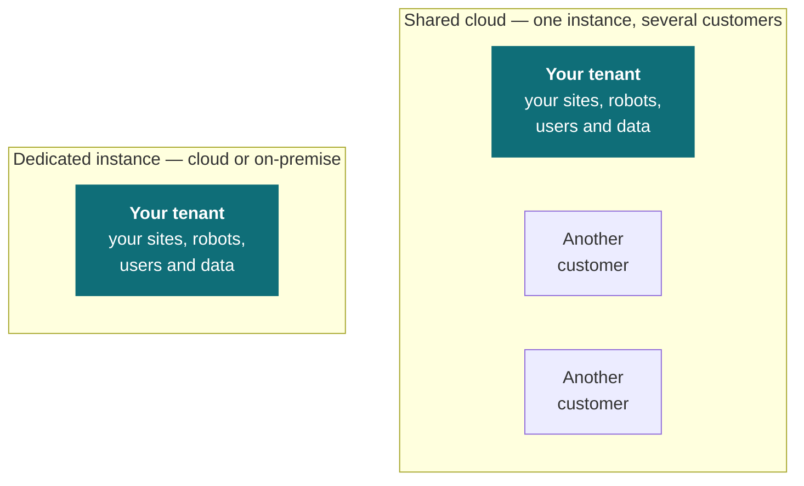

# Deployment and servicing

Two things sit alongside the day-to-day use of Fleet Management: where the system itself runs, and how robots and their software are kept current. Both are settled early in a project, and both shape what your team can schedule.

## Where the system runs

A project runs on one of three models, chosen before deployment.

| Model | Use it for | What you get |
| --- | --- | --- |
| **Shared cloud**, hosted by Weston Robot | Short proofs of concept, demonstrations, evaluations | Nothing to provision — the fastest way to a working fleet |
| **Dedicated instance**, cloud | Site deployments | An instance of your own, upgraded on your schedule |
| **Dedicated instance**, on-premise | Site deployments with data-residency requirements | An instance of your own, running on your network |

**Tenancy is what separates them, rather than location** — whether your organisation shares infrastructure with other customers or has an instance to itself. Your data is kept separate on every model. What a dedicated instance adds is control of timing: upgrades happen on your schedule rather than Weston Robot's, wherever that instance runs.

On-premise goes one step further and is decided by data residency. Where your rules require data to stay on your own network, on-premise is the model that satisfies them; otherwise a dedicated cloud instance does the same job with less to run. Either way, the robots and the servers need to reach each other on your network.

## Remote management

Remote management covers two things: **changing a robot's credentials, and sending it a new map.**

A map sent to a robot takes effect once it is activated, so a robot keeps the map it already has until an administrator makes the new one live. [How a map reaches a robot](/solution/fleet-management/tenant-management#how-a-map-reaches-a-robot) sets out that path and who takes each step.

## Software updates

**Robot software is updated by Weston Robot**, either on site or over a VPN connection to the robot.

That means the update path depends on access — a VPN connection and SSH to the robot, or an on-site visit. Settling which of those your site allows is worth doing before the site survey rather than at the first update, because it determines how your robots get serviced for the life of the deployment.

## Common questions

**Which model are we on?**  
Whoever arranged the deployment will know; it is fixed at the start of a project rather than chosen per site. If you are unsure, ask through [support](/support/before-you-contact-us).

**Do the robots need internet access?**  
They need to reach the Fleet Management instance over your network, wherever it runs. A robot navigates from the map it already holds, so a mission continues through an interruption in that link — what it does in that case is a policy you configure.

**Can we update the robot software ourselves?**  
Updates are carried out by Weston Robot. Arrange VPN access or an on-site visit through your usual contact.

