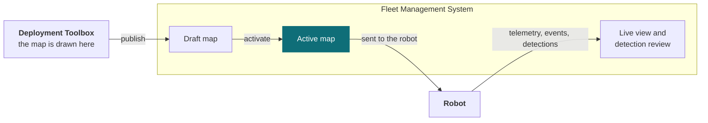

# Fleet Management System

The Fleet Management System is the web application you run your robots from. Missions are planned here, dispatched here, watched here, and everything the robots find is kept here. It runs in a browser, and there is nothing to install.

This page covers how the system is put together and how work moves through it. Each part of the workflow has a page of its own, linked as you go.

## Where it sits

A working deployment is the robots, the map they navigate by, and this system. Fleet Management is the part people use every day; the **Deployment Toolbox** prepares a site once, before any robot drives there. Detection algorithms — ours on the robot, or a partner's alongside it — report into this system too, so what they find arrives as events here.

| Part | What it does | How often you touch it |
| --- | --- | --- |
| [Deployment Toolbox](/solution/deployment-toolbox) | Turns a 3D scan of your site into the map robots navigate by | Once per site |
| **Fleet Management System** | Plan, dispatch, watch, review | Daily |
| Robot | Carries out the missions | — |

### How a map reaches a robot

The **site map** is what ties these parts together, and it travels in one direction only.

A map published from the Deployment Toolbox arrives here as a **draft** — stored, but not in use. Someone with the Site Admin role then **activates** it, and activation is what makes it the map robots are given. Until that happens robots keep the map they already have, so a robot never changes map part-way through a job. The Deployment Toolbox never talks to a robot itself.

Everything travelling the other way — where each robot is, what it is doing, and what it detected — arrives here from the robots.

## Key features

| Feature | What it gives you |
| --- | --- |
| **Fleet overview** | Every site and robot, with live status |
| **Mission planning** | Build missions from waypoints, the routes between them and a schedule; reuse them across sites |
| **Live monitoring** | Position on the site map, telemetry, camera feeds, health and activity |
| **Direct control** | Emergency stop, teleoperation, docking and posture commands — one operator at a time |
| **Detection review** | Everything the robots detected, filterable and reviewable, kept as a record that cannot be edited or deleted |
| **Users and roles** | Who may watch, who may command, who may change a site |
| **Audit log** | An append-only record of who did what |

The dashboard is the entry point: sites down the side, robots grouped by site, and a status count across the top.

<Figure
  src={require('../img/fleet-dashboard.png').default}
  alt="Fleet dashboard showing four sites and ten robots grouped by site, with operational, non-responsive and faulty status counts"
  size="lg"
  framed
  caption="The fleet dashboard — every site and robot, with current status." />

## How the work flows

Four things happen here, in this order.

### 1. Plan a mission

A **mission** is an ordered list of places on the site map, what the robot does at each of them, and when it should run. Missions are built in the browser, kept in a library, and reused — so a second site starts from the first rather than from nothing.

Because missions reference the site map, a robot has to be on the map the fleet has activated before its missions can be edited or dispatched.

→ [Mission editing and dispatch](/solution/fleet-management/mission-editing)

### 2. Dispatch it

To **dispatch** a mission is to hand it to a named robot to run, either on demand or on a schedule. A robot can also be sent somewhere once, without building a mission at all — that is **Quick Dispatch**.

→ [Mission editing and dispatch](/solution/fleet-management/mission-editing)

### 3. Watch it run

The robot view puts one robot on one screen: its position on the site map, live camera feeds, telemetry, the current mission, alerts, and the controls. Direct control is held under a **lease**, so only one person is driving at a time.

→ [Robot dashboard](/solution/fleet-management/robot-dashboard)

### 4. Review what was found

Detections and events land in Detection Review and stay there — filterable, acknowledged by a named person, and stored so they cannot be edited or deleted. Not every detection raises an alert: alerts start at high priority.

→ [Detection review](/solution/fleet-management/detection-review)

## In more detail

| Page | Covers | Mostly read by |
| --- | --- | --- |
| [Mission editing and dispatch](/solution/fleet-management/mission-editing) | Checkpoints, actions, schedules, saved locations, Quick Dispatch, and the map a robot must be on | Operators, site admins |
| [Robot dashboard](/solution/fleet-management/robot-dashboard) | The robot view, taking control, and how battery and connection loss change a running mission | Operators |
| [Detection review](/solution/fleet-management/detection-review) | What was found, which event types alert, and what the record keeps | Operators, reviewers |
| [Tenant and user management](/solution/fleet-management/tenant-management) | Sites, users, the five roles, and the audit log | Site and tenant admins |

## Updates and remote management

What can be done to a robot remotely is deliberately short: **change its credentials, and send it a new map.** There is no remote login, and a map sent to a robot changes nothing until it is activated — see [How a map reaches a robot](#how-a-map-reaches-a-robot).

**Robot software is not updated through the dashboard.** Updates are done by Weston Robot, either on site or over a VPN connection to the robot. If your security policy does not allow that, raise it before the site survey rather than at the first update — it decides how your robots get serviced.

## Deployment models

Which model your project uses is decided before deployment, and it is not a matter of preference.

| Model | Use it for | Why |
| --- | --- | --- |
| **Shared cloud**, hosted by Weston Robot | Short proofs of concept, demonstrations, evaluations | Nothing to provision |
| **Dedicated instance**, cloud | Real site deployments | Your own instance, upgraded on your schedule |
| **Dedicated instance**, on-premise | Real deployments with data-residency requirements | As above, and your data stays on your network |

**What decides it is tenancy, not location** — that is, whether your organisation shares infrastructure with other customers or has an instance to itself. On the shared cloud every customer sits on the same infrastructure: your data is kept separate, but upgrades are not — an upgrade for one customer restarts services everyone is using, and it cannot be scheduled around your operations. A dedicated instance is upgraded on your schedule, wherever it runs.

On-premise is the further step, and data residency is what decides it. If your rules require data to stay on your own network, on-premise is the answer; otherwise a dedicated cloud instance does the same job. Either way, the robots and the servers must be able to reach each other on your network.

## Known limitations

- **Alerting is in-app only, and its rules are fixed** — no email, SMS, push or phone, and which event types raise an alert cannot be varied per site.
- **Video is live only** — nothing is recorded, so a detection record carries a still image, never a clip.
- **No mission replay or export**, and run history does not survive a restart.
- **Remote management covers credentials and maps only** — not software updates, configuration or log retrieval.
- **Designed for desktop**, not for tablets or phones.
- **A detection is pinned to the robot, not to what it saw** — the record marks where the robot was standing, with no distance to the subject.

## Common questions

### We updated a map but the robots are still using the old one

Expected. A new map arrives as a draft and has to be activated. Until then robots keep the map they have — this is deliberate, so a robot never changes map in the middle of a job.

### A robot's missions are switched off and I cannot edit or dispatch them

That robot is on an older map than the one the fleet has activated. See [Missions and the site map](/solution/fleet-management/mission-editing#missions-and-the-site-map).

### Something was detected but nobody was alerted

Alerts are raised at high priority and above, and they appear only in the app. See [Which events raise an alert](/solution/fleet-management/detection-review#which-events-raise-an-alert).

### Can two people drive the same robot?

No. Control is held under a lease, and only one person holds it at a time.

## Support

Before raising a ticket, note which site and robot are involved, what the robot was doing just before, and what you saw on screen. [Before you contact us](/support/before-you-contact-us) lists what helps.

[Submit a support request](https://forms.office.com/r/qELKzYF33W).
