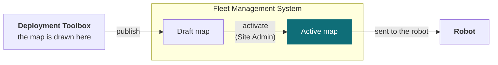

# Tenant and user management

Your **tenant** is your organisation's own space in the system, holding its sites, robots, users and data. Sites sit inside it, robots and maps belong to a site, and every person's authority is expressed as a role — either at one site or across the whole tenant.

<Figure
  src={require('../img/fleet-users-roles.png').default}
  alt="Tenant management screen listing sites with robot and map counts, and users with their assigned roles and activity"
  size="lg"
  framed
  caption="Sites and users in one place, with each person's role and last activity." />

## Roles

Roles decide who may watch, who may command, and who may change a site. Three are assigned **per site**, so someone can be an Operator at one site and an Observer at another. Two are held across the whole **tenant** and apply everywhere at once.

| Role | Scope | Can |
| --- | --- | --- |
| **Observer** | One site | See the site and its robots. No commands |
| **Operator** | One site | Everything an Observer can, plus command robots — dispatch, teleoperate, emergency stop |
| **Site Admin** | One site | Everything an Operator can, plus manage and activate that site's maps — including its waypoints and the connections between them — and manage its robots |
| **Auditor** | Whole tenant | Read operational and audit logs across every site. No commands, no changes |
| **Tenant Administrator** | Whole tenant | Site Admin authority at every site, plus managing sites, users and roles |

Each role contains the one above it, so there is one decision per person per site rather than a set of switches.

## Who can change a robot's behaviour

The line that matters most in practice is between watching and commanding, and it falls between Observer and Operator. Anything that changes what a robot does — dispatching a mission, taking the controls, stopping it — starts at Operator. Anything that changes the site the robots work in — the map, its waypoints, which robots belong there — is Site Admin.

**One thing worth planning around:** the same role that draws a map can also make it live. Authoring a map and activating it are both Site Admin authority, so a single person can do both. If your process requires a second person to approve a map before robots use it, that has to come from your process — the system does not require it.

## How a map reaches a robot

Maps are drawn in the Deployment Toolbox, but a map only reaches a robot through Fleet Management, and only once an administrator activates it. The path runs one way.

A map published from the Deployment Toolbox arrives in Fleet Management as a **draft** — stored, but not in use. Someone with the Site Admin role then **activates** it, and activation is what makes it the map robots are given. Until that happens robots keep the map they already have, so a robot never changes map part-way through a job. The Deployment Toolbox never talks to a robot itself.

## The audit log

Actions are recorded in an **append-only** log — entries are added, never changed or removed. Auditors can read it across every site without being able to command anything, which is what makes the role useful for a reviewer who should not be able to move a robot.

## Common questions

### Can someone have different roles at different sites?

Yes, for the three per-site roles. Observer, Operator and Site Admin are assigned per site, so someone can be an Operator at one and an Observer at another. Auditor and Tenant Administrator apply across the whole tenant at once.

### Who can activate a map?

A Site Admin for that site, or a Tenant Administrator. The Deployment Toolbox cannot activate a map at all — it publishes a draft, and activation happens here. See [How a map reaches a robot](#how-a-map-reaches-a-robot).

### Can an Auditor stop a robot in an emergency?

No. The Auditor role is read-only by design. Anyone who may need to intervene needs Operator at that site.

## Support

Before raising a ticket, note which tenant and site are involved, the person affected, and the role they hold. [Before you contact us](/support/before-you-contact-us) lists what helps.

[Submit a support request](https://forms.office.com/r/qELKzYF33W).
