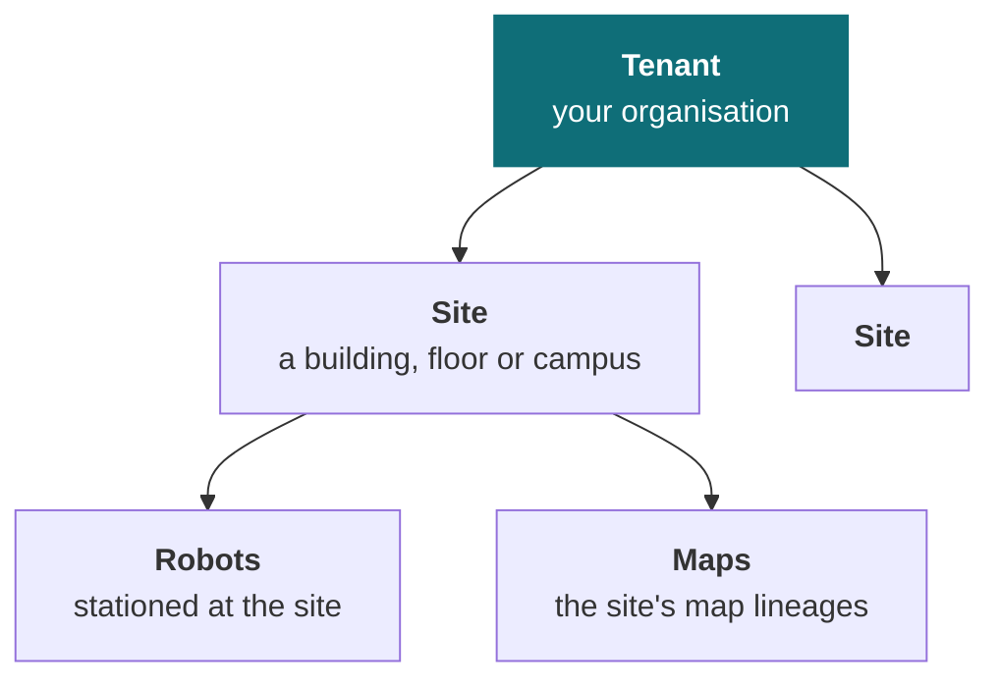
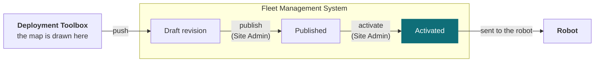

# Tenant management

Your **tenant** is your organisation's own space in the system. Sites sit inside it, robots and maps belong to a site, and every person's authority is expressed as a role — either at one site or across the whole tenant.

<Figure
  src={require('../img/fleet-users-roles.png').default}
  alt="Tenant management screen listing sites with robot and map counts, and users with their assigned roles and activity"
  size="full"
  framed
  caption="Sites and users in one place, with each person's role and last activity." />

## Tenant, sites and robots

Everything in Fleet Management hangs off three levels.

A **tenant** is your organisation's space: its sites, robots, users and data, separate from every other customer's.

A **site** is a place robots work — a building, a floor, a campus. It owns the robots stationed there and the maps they navigate by, and it is the unit most roles are granted at, so someone can be an Operator at one site and an Observer at another.

A **robot** belongs to one site and is assigned one map. Which map, and which version of it, is what the rest of this page is about.

## Roles

| Role | Scope | Can |
| --- | --- | --- |
| **Observer** | One site | See the site and its robots. No commands |
| **Operator** | One site | Everything an Observer can, plus command robots — dispatch, teleoperate, emergency stop |
| **Site Admin** | One site | Everything an Operator can, plus manage and activate that site's maps — including its waypoints and the connections between them — and manage its robots |
| **Auditor** | Whole tenant | Read operational and audit logs across every site. No commands, no changes |
| **Tenant Administrator** | Whole tenant | Site Admin authority at every site, plus managing sites, users and roles |

Observer, Operator and Site Admin are granted **per site**, so the same person can hold different roles at different buildings. Auditor and Tenant Administrator apply across the whole tenant at once.

Each role contains the one above it, so assigning access is one decision per person per site rather than a set of switches.

**One thing worth planning around:** authoring a map and activating it are both Site Admin authority, so a single administrator can take a map from draft to live. Where a process calls for a second person to approve it first, that approval comes from the process rather than from the system.

## A site's maps

A site does not hold one map; it holds a **map lineage** — a named map that is revised over time. Each publish from the Deployment Toolbox adds a **revision** to that lineage rather than replacing what was there, so `r4` and `r5` are the same map at two points in its life and the older one is still on record.

A revision moves through **draft**, then **published**, and one published revision at a time is **activated**. Activation is the decision that says "this is the revision robots should be running", and it is what the rest of the fleet reacts to. Revisions that are finished with can be archived without being deleted.

A site can hold more than one lineage where it needs them — a second building, or a floor mapped separately — and a robot is assigned to one of them.

### How a map reaches a robot

Maps are drawn in the Deployment Toolbox, but a map only reaches a robot through Fleet Management, and only once an administrator activates it. The path runs one way.

A revision reaches robots through three steps, and the Deployment Toolbox performs only the first.

| Step | Who | What it does |
| --- | --- | --- |
| **Push** | Deployment Toolbox | Sends the finished map into Fleet Management as a **draft** revision, either starting a new lineage or adding to an existing one |
| **Publish** | Site Admin | Marks the draft as a finished revision, ready to be used |
| **Activate** | Site Admin | Makes it *the* revision robots are given |

**The Toolbox stops at the draft.** Publishing and activating are both actions taken in Fleet Management by a person; the Toolbox can do neither, and never talks to a robot at all.

Until a revision is activated, robots keep the map they already have — so a robot never changes map part-way through a job.

### How a robot is assigned a map

Two facts are tracked for every robot, and the difference between them is the whole story:

| | |
| --- | --- |
| **Target** | The map and revision the fleet wants this robot to be running — its assigned lineage, at whatever revision is currently activated |
| **Reported** | The map and revision the robot last said it is actually running |

While the two agree, the robot is up to date. Activating a new revision changes the target for **every robot assigned to that lineage at once**, which makes them all out of date until each one catches up.

Applying a map to a robot is not a background operation. The robot **stops navigating and restarts its stack**, then re-acquires localisation before it can work again — so it is a change to make deliberately rather than to a robot mid-task.

### Catching a robot up to the map

Activating a map does not finish the job. A robot keeps the map it already holds until it confirms the new one, and **while it is behind, its missions are switched off and cannot be edited or dispatched** — rather than run against waypoints that may have moved.

<Figure
  src={require('../img/fleet-map-not-current.png').default}
  alt="A dialog headed 'This robot's map is not up to date', naming the robot and the map, comparing the revision the fleet activated with the older revision on the robot, warning that navigation restarts and re-acquires localization, and noting that updating the robot's map needs the robot-manage permission at this site"
  size="md"
  framed
  caption="A robot behind the activated map. The dialog names both revisions and what changing it will cost." />

The dialog names the map, the revision the fleet activated and the revision on the robot, so it is clear how far behind it is. The recovery is to send it the activated map and wait for it to confirm; then check the missions and switch them back on. If the switch fails it can be retried from the same place, and the missions unlock when it succeeds.

Two things to plan around. **Updating a robot's map restarts navigation**, which then has to re-acquire localisation — so it is not a change to make to a robot part-way through something. And it needs **robot-management permission at that site**, which is Site Admin authority.

## The audit log

Actions taken across your tenant are recorded in an append-only log, readable by Auditors and tenant administrators. [Audit log](/solution/fleet-management/audit-log) covers the two trails, what each entry records, and how to filter and export them.

## Common questions

**Can someone have different roles at different sites?**  
Yes, for the three per-site roles. Observer, Operator and Site Admin are assigned per site, so someone can be an Operator at one and an Observer at another. Auditor and Tenant Administrator apply across the whole tenant at once.

**We activated a map but the robots are still using the old one**  
A pushed map arrives as a draft, and has to be published and then activated before robots are given it. Until then they keep the map they already have, so a robot never changes map part-way through a job. If a robot is still behind after activation, it catches up when it confirms the new map — see [How a map reaches a robot](#how-a-map-reaches-a-robot).

**Who can activate a map?**  
A Site Admin for that site, or a Tenant Administrator. The Deployment Toolbox cannot publish or activate at all — it pushes a draft, and both later steps happen here.

**Can an Auditor stop a robot in an emergency?**  
No. The Auditor role is read-only by design. Anyone who may need to intervene needs Operator at that site.

