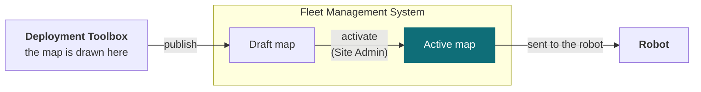

# Tenant and user management

Your **tenant** is your organisation's own space in the system. Sites sit inside it, robots and maps belong to a site, and every person's authority is expressed as a role — either at one site or across the whole tenant.

<Figure
  src={require('../img/fleet-users-roles.png').default}
  alt="Tenant management screen listing sites with robot and map counts, and users with their assigned roles and activity"
  size="full"
  framed
  caption="Sites and users in one place, with each person's role and last activity." />

## Roles

| Role | Scope | Can |
| --- | --- | --- |
| **Observer** | One site | See the site and its robots. No commands |
| **Operator** | One site | Everything an Observer can, plus command robots — dispatch, teleoperate, emergency stop |
| **Site Admin** | One site | Everything an Operator can, plus manage and activate that site's maps — including its waypoints and the connections between them — and manage its robots |
| **Auditor** | Whole tenant | Read operational and audit logs across every site. No commands, no changes |
| **Tenant Administrator** | Whole tenant | Site Admin authority at every site, plus managing sites, users and roles |

Observer, Operator and Site Admin are granted **per site**, so the same person can hold different roles at different buildings. Auditor and Tenant Administrator apply across the whole tenant at once.

Each role contains the one above it, so assigning access is one decision per person per site rather than a set of switches.

**One thing worth planning around:** authoring a map and activating it are both Site Admin authority, so a single administrator can take a map from draft to live. Where a process calls for a second person to approve it first, that approval comes from the process rather than from the system.

## How a map reaches a robot

Maps are drawn in the Deployment Toolbox, but a map only reaches a robot through Fleet Management, and only once an administrator activates it. The path runs one way.

A map published from the Deployment Toolbox arrives in Fleet Management as a **draft** — stored, but not in use. Someone with the Site Admin role then **activates** it, and activation is what makes it the map robots are given. Until that happens robots keep the map they already have, so a robot never changes map part-way through a job. The Deployment Toolbox never talks to a robot itself.

## Catching a robot up to the map

Activating a map does not finish the job. A robot keeps the map it already holds until it confirms the new one, and **while it is behind, its missions are switched off and cannot be edited or dispatched** — rather than run against waypoints that may have moved.

<Figure
  src={require('../img/fleet-map-not-current.png').default}
  alt="A dialog headed 'This robot's map is not up to date', naming the robot and the map, comparing the revision the fleet activated with the older revision on the robot, warning that navigation restarts and re-acquires localization, and noting that updating the robot's map needs the robot-manage permission at this site"
  size="md"
  framed
  caption="A robot behind the activated map. The dialog names both revisions and what changing it will cost." />

The dialog names the map, the revision the fleet activated and the revision on the robot, so it is clear how far behind it is. The recovery is to send it the activated map and wait for it to confirm; then check the missions and switch them back on. If the switch fails it can be retried from the same place, and the missions unlock when it succeeds.

Two things to plan around. **Updating a robot's map restarts navigation**, which then has to re-acquire localisation — so it is not a change to make to a robot part-way through something. And it needs **robot-management permission at that site**, which is Site Admin authority.

## The audit log

Actions are recorded in an **append-only** log: entries are added, never changed or removed, and the trail cannot be edited from the application. Times are shown in UTC throughout, so entries from different sites compare directly.

<Figure
  src={require('../img/fleet-audit-log.png').default}
  alt="The audit log filtered to mission events, each row showing a UTC timestamp, category, action, the actor, an outcome of accepted or rejected, and a plain-language description, with CSV and JSON export controls"
  size="full"
  framed
  caption="The audit trail: who did what, when, and whether it was accepted or refused." />

Every entry records the action taken, who took it, when, and **whether it was accepted or rejected** — refusals are recorded alongside successes, which is what lets the trail answer "was this attempted?" and not only "was this done?". Each carries a plain-language description, so a row reads as a sentence rather than as an identifier.

The trail is split in two: **fleet audit** for what was done to sites and robots, and **tenant audit** for changes to the tenant itself.

| Category | Covers |
| --- | --- |
| **Command** | Commands sent to a robot |
| **Mission** | Creating, updating, running, activating and deleting missions |
| **Authorization** | Who was granted or refused access to what |
| **Safety** | Safety-related actions |
| **Lifecycle** | Robots and sites entering and leaving service |
| **Fault** | Faults raised against a robot |

Entries filter by category, by outcome — including a failures-only view — by actor, by date range, and by free-text search. The result can be exported as **CSV or JSON** for review outside the application.

## Common questions

**Can someone have different roles at different sites?**  
Yes, for the three per-site roles. Observer, Operator and Site Admin are assigned per site, so someone can be an Operator at one and an Observer at another. Auditor and Tenant Administrator apply across the whole tenant at once.

**We activated a map but the robots are still using the old one**  
A new map arrives as a draft and has to be activated before robots are given it. Until then they keep the map they already have, so a robot never changes map part-way through a job. If a robot is still behind after activation, it catches up when it confirms the new map — see [How a map reaches a robot](#how-a-map-reaches-a-robot).

**Who can activate a map?**  
A Site Admin for that site, or a Tenant Administrator. The Deployment Toolbox cannot activate a map at all — it publishes a draft, and activation happens here.

**Can an Auditor stop a robot in an emergency?**  
No. The Auditor role is read-only by design. Anyone who may need to intervene needs Operator at that site.

**Why is an action I know was attempted missing from the log?**  
Check the category and date filters first, and the fleet and tenant tabs — the two hold different kinds of entry. If an entry still appears to be missing, raise it, since a gap in an append-only trail is worth investigating.

