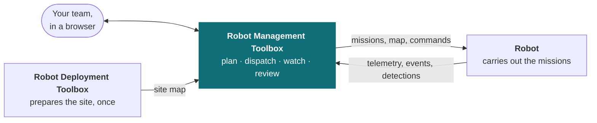

# Robot Management Toolbox

The Robot Management Toolbox is the web application you run your robots from. Missions are planned here, dispatched here, watched here, and everything the robots find is kept here. It runs in a browser, and there is nothing to install.

A working deployment is the robots, the map they navigate by, and this system — the part your team uses every day. The [Robot Deployment Toolbox](/solution/robot-deployment-toolbox) prepares a site once, before any robot drives there. Detection algorithms — ours on the robot, or a partner's alongside it — report into this system too, so what they find arrives as events here.

The **site map** ties these parts together, and it travels one way: the Robot Deployment Toolbox pushes it here as a draft, an administrator publishes and then activates it, and robots receive it from here. The deployment toolbox never reaches a robot directly.

Key features of the system are summarized in the table below, and each is covered in its own section.

| Feature | What it gives you |
| --- | --- |
| **Fleet overview** | Every site and robot, with live status |
| **Robot dashboard** | Position on the site map, telemetry, camera feeds, health and activity |
| **Robot teleoperation** | Drive a robot from the browser, plus docking and posture commands — one operator at a time. The E-Stop is separate: any role may press it, and it needs no turn at the controls |
| **Mission planning** | Build missions from waypoints, the routes between them and a schedule; reuse them across sites |
| **Detection review** | Everything the robots detected, filterable and reviewable, kept as a record that cannot be edited or deleted |
| **Tenant management** | Your sites and their robots, the maps they navigate by, the people who use them, and what each role may do |
| **Audit log** | An append-only record of who did what |

## Admin and Operator roles

Two roles cover nearly all daily use: an **Operator** runs the robots, and an **Admin** decides what
they are allowed to run. *Admin* here is the general term for a user with administrative
permissions — at a single site that is a Site Admin, and a Tenant Administrator holds the same
authority at every site.
[Roles](/solution/robot-management-toolbox/tenant-management#roles) defines all five roles and their
scope, and names the exact role wherever an action requires one; the table below is the practical
version — what each of the two everyday roles can actually do.

| What you want to do | Operator | Admin |
| --- | --- | --- |
| Watch the fleet, a robot, its telemetry, its schedule and its history | Yes | Yes |
| Send a robot somewhere once — Quick Dispatch | Yes | Yes |
| Send a robot home — Go Home | Yes | Yes |
| Run a saved mission now | Yes | Yes |
| Send missions to a robot — Send to Robot | Yes | Yes |
| Turn a saved mission on or off | Yes | Yes |
| Change **when** a mission runs — its run conditions | Yes | Yes |
| Pause and resume auto-dispatch | Yes | Yes |
| Acknowledge work that failed | Yes | Yes |
| Catch a robot up to the map | Yes | Yes |
| Teleoperate, E-Stop, dock and undock, stance commands | Yes | Yes |
| Create or edit **what** a mission is — its route, checkpoints and actions | — | Yes |
| Create, rename, move or delete a saved location | — | Yes |
| Author, publish and activate a site's map | — | Yes |
| Change a robot's name, model, capabilities or assigned map | — | Yes |

The split is worth reading twice, because it is not the obvious one. **Everything that commands a
robot is an operator's to do** — including sending missions to it, and including catching it up to
the map. What an operator cannot do is change the definitions: the mission, the locations it refers
to, and the map underneath both. So an operator can decide *when* a mission runs, and cannot change
*what* it does.

An **Observer** may see all of the above and command none of it, with one deliberate exception:
**the E-Stop is available to every role, and needs no control lease.** Safety is not something
to hold a lease for. Releasing it again is an Operator action, so an Observer who stops a robot will
need an Operator to reset it. Every other action is enforced against the role you hold, so one outside your role cannot be
performed.

**Above a site.** Managing people — inviting users, granting and removing roles — is a **Tenant
Administrator's**, across the whole tenant rather than one site. Creating tenants and sites, and
registering or decommissioning a robot, sit with Weston Robot rather than with your team; ask us,
and see [Deployment and servicing](/solution/robot-management-toolbox/deployment-and-servicing).

**Some actions need more than a role.** Holding the right role is necessary and sometimes not
sufficient:

- **Control is held under a lease.** Commanding a robot means holding its controls; a second person
  cannot command it until the first releases them. See [Taking
  control](/solution/robot-management-toolbox/robot-dashboard#taking-control).
- **The robot must be on the map the fleet activated.** A robot that is behind has its dispatch and
  Go Home controls withdrawn until it catches up — [Catching a robot up to the
  map](/solution/robot-management-toolbox/tenant-management#catching-a-robot-up-to-the-map).
- **Go Home needs a home.** Where none is set, the control reads **Set Home** instead.
- **Pausing is easier than resuming.** Pausing auto-dispatch asks nothing of the robot's state, though the
  E-Stop takes it with everything else while engaged.
  Resuming needs the robot's controls and a settled map, because resuming is a decision to let work
  start.

## Admin standard workflow

Setting a site up, once. The map arrives first and the missions refer to it, so the order matters.

1. Have the site surveyed and its map authored in the [Robot Deployment
   Toolbox](/solution/robot-deployment-toolbox), which pushes it here as a draft.
2. Publish and activate the map for the site — [A site's
   maps](/solution/robot-management-toolbox/tenant-management#a-sites-maps).
3. Get each robot onto that map — [Catching a robot up to the
   map](/solution/robot-management-toolbox/tenant-management#catching-a-robot-up-to-the-map).
4. Save the places the work refers to, and set each robot's home — [Saved
   locations](/solution/robot-management-toolbox/mission-editing#saved-locations).
5. Build the missions — [Mission
   editing](/solution/robot-management-toolbox/mission-editing). Setting their run conditions need
   not be your job: an Operator can do it too. But a mission needs one before it can be activated,
   and only an activated mission is carried by the next step.
6. Send the missions to the robots that will run them, and confirm the badge reads **robot
   confirmed** —
   [Sending missions to a robot](/solution/robot-management-toolbox/mission-editing#sending-missions-to-a-robot).
7. Give your team their roles — [Roles](/solution/robot-management-toolbox/tenant-management#roles).

## Operator standard workflow

Running the robots, every day.

1. Open the **Dashboard** and look for anything that needs attention.
2. Open the robot in question — [Robot
   dashboard](/solution/robot-management-toolbox/robot-dashboard).
3. Let the schedule run, or start something yourself: run a saved mission now, or Quick Dispatch the
   robot to one point.
4. Watch it in Operations, and use Go Home or the E-Stop if you need to intervene.
5. When a run fails, acknowledge it — and check that auto-dispatch is running again afterwards.
   [Recovery and
   acknowledgement](/solution/robot-management-toolbox/robot-dashboard#recovery-and-acknowledgement).
6. Review what the robots found — [Detection
   review](/solution/robot-management-toolbox/detection-review).

Anything an operator cannot do on that path — a mission that needs a new checkpoint, a location in
the wrong place, a robot that will not come onto the map — goes to an Admin. Where an action
will not proceed at all, [When an action cannot
proceed](/solution/robot-management-toolbox/mission-editing#when-an-action-cannot-proceed) explains
what you are being told.

## Fleet overview

The dashboard is the entry point, and it is built around the question an operator asks first: is anything wrong right now? Sites run down the side, robots are grouped under the site they belong to, and a status count across the top summarises the whole fleet — how many robots are operational, how many are not responding, how many are faulty.

That grouping is not cosmetic. A **site** is the unit nearly everything else is scoped to: a robot belongs to one, a map is activated for one, and most roles are granted for one rather than across your organisation. Someone responsible for two buildings sees two sites, and the authority they hold at each can differ.

The overview is deliberately shallow. It tells you which robot needs attention, not why — one click into a robot opens the [Robot dashboard](#robot-dashboard), where the detail lives.

<Figure
  src={require('../img/fleet-dashboard.png').default}
  alt="Fleet dashboard showing four sites and ten robots grouped by site, with operational, non-responsive and faulty status counts"
  size="full"
  framed
  caption="The fleet dashboard — every site and robot, with current status." />

## Robot dashboard

Opening a robot gives you that one machine on one screen. It is where an operator spends their time, and everything needed to judge a running mission is laid out together rather than behind tabs:

- **Where it is** — its position and heading drawn on the site map, so you can see it against the building rather than as a coordinate.
- **What it can see** — live feeds from its cameras.
- **What it is doing** — the mission running now, and what is scheduled next.
- **How it is holding up** — **telemetry**, meaning the readings a robot reports about itself, such as battery level and temperature.
- **What has been raised** — alerts for this robot, with the durable record in [Detection review](#detection-review).

Two things shape what you see here. **Camera feeds stream live from the robot**, so the panel shows its present view. And **navigation runs on the robot itself**, from the map it already holds, so a mission carries on through an interruption in the link — what the robot should do if that happens is set on the robot itself, not here — see [What happens during a mission](/solution/robot-management-toolbox/robot-dashboard#what-happens-during-a-mission).

<Figure
  src={require('../img/fleet-robot-view.jpg').default}
  alt="Robot detail view with the navigation map and the robot's pose, four live camera feeds, an operations panel showing scheduled missions, telemetry for battery, uptime, heartbeat and speed, an alerts panel, and the control panel"
  size="full"
  framed
  caption="One robot on one screen: the site map, its cameras, what it is doing, how it is holding up, and the controls." />

[Robot dashboard](/solution/robot-management-toolbox/robot-dashboard) covers the page in full: each panel, the telemetry readings and when a robot stops counting as reporting, the diagnostics view for a robot that is misbehaving, recovering localisation, and how battery level and connection loss change a running mission.

## Robot teleoperation

Beyond watching, an operator can intervene directly: drive the robot from the browser, stop it, send it home, dock it, or put it into a posture such as stand or sit.

Because these commands move a machine in a real building, taking control is deliberate rather than incidental. Control is held under a **lease** — an exclusive claim on that robot — so **only one person drives at a time**, and a second operator cannot take the controls until the lease is released. There is no ambiguity about who is responsible for a moving robot.

Teleoperation carries its own safeguards. It **stops the robot when the connection to the fleet degrades**, on the reasoning that driving a machine you can no longer see is worse than halting it, and it refuses the controls to anyone who has not properly taken control.

Commanding a robot is Operator authority, granted per site. An Observer at the same site sees everything described above and can do none of it — with one deliberate exception: **the E-Stop may be pressed by any role.** Releasing it afterwards is an Operator action, so an Observer who stops a robot will need an Operator to reset it.

**What the driving view shows depends on the robot.** The assisted view below — camera feeds stitched into a surround view, proximity zones drawn from the robot's own sensing, and a bird's-eye radar panel alongside speed and link quality — is tuned for a particular robot configuration and deployment. It is not part of every robot's teleoperation by default, so what a given robot presents depends on how that robot was set up.

<Figure
  src={require('../img/fleet-teleop.jpg').default}
  alt="An assisted teleoperation view on a robot configured for it, showing a stitched forward surround view with proximity zones overlaid, three additional camera feeds along the top, a bird's-eye radar panel, speed readouts, link latency and bandwidth, and an emergency stop control"
  size="full"
  framed
  caption="An assisted teleoperation view, on a robot fitted and configured for it: surround view, proximity zones, radar, and link quality." />

[Robot teleoperation](/solution/robot-management-toolbox/robot-teleoperation) covers driving in full: keyboard and gamepad control, remapping and inverting the axes, speed and deadzone, arranging the camera views, and audio. Taking and releasing the lease sits with the rest of the control panel on the [Robot dashboard](/solution/robot-management-toolbox/robot-dashboard#taking-control) page.

## Mission planning

A **mission** is an ordered list of places on the site map, what the robot does at each of them, and when it should run. It is the unit of work the system is organised around: built once, kept in a library, and reused rather than recreated.

The places come from the map. The site map defines **waypoints** — the points a robot can be sent to — and a mission's checkpoint is a waypoint together with a heading and, optionally, actions to perform on arrival, such as pausing for a set time or playing an announcement. The map says where a robot *can* go; the mission says what it *does* there.

Three things keep a growing library maintainable. **Saved locations** mean a place named once is reused, so correcting it later corrects every mission that uses it. **Duplication and revision comparison** mean the next mission starts from an existing one. And missions are **portable across sites**, so a second building starts from the first.

Dispatching hands a mission to a named robot, on demand or on its schedule. A robot can also be sent somewhere once, with no mission at all, through **Quick Dispatch**.

One constraint follows from missions referencing the map: **a robot must be on the map the fleet has activated before its missions can be edited or dispatched.** When a newer map is activated, that robot's missions are switched off and stay locked until it confirms the new map, rather than running against waypoints that may have moved.

<Figure
  src={require('../img/fleet-mission-editor.png').default}
  alt="The Mission Editor with a named mission, its route drawn on the site map with numbered checkpoints, and a checkpoint list showing positions, headings, pause and announce actions"
  size="full"
  framed
  caption="A mission being built: its checkpoints on the site map, and what the robot does at each of them." />

[Mission editing and dispatch](/solution/robot-management-toolbox/mission-editing) covers what a mission is made of, the editor's three stages, saved locations, run conditions and how they gate activation, sending missions to a robot and telling whether they arrived, and the history of what ran.

## Detection review

Everything a site's robots observe is collected in that site's Detection Review, and stays there. Observations may come from a robot-mounted camera or from an analytics service running elsewhere, so the record is complete regardless of which produced it. Detection Review is opened from the site page; there is no fleet-wide list spanning sites.

An observation is recorded as an **event**. An event whose priority is high enough is raised into an **alert**, and that is what puts it in front of an operator — everything else is kept and searchable without anyone being asked to look at it.

Entries filter by robot, type, priority and review state. **Alerts are the reviewable ones**: each is acknowledged, or marked a false alarm, against the name of whoever did it. The record keeps the image the detection was made from where one was stored, cannot be edited or deleted, and reviewer notes are appended rather than replacing what was there. The result is an evidence trail rather than a working queue: it will say the same thing when someone reads it back months later.

**Priority decides what raises an alert.** The platform recognises 25 event types, each carrying one, and an alert is raised at high priority and above — 12 of the 25, of which two are critical: fire or smoke, and a person down. The other 13 are recorded and searchable in the same list without alerting anyone. An event type the platform has not been told about is recorded at lowest priority as **Unclassified detection**, so an integration can introduce new types and they are still captured.

**Alerts are raised in the app**, on the dashboard an operator is already watching, so they arrive in the same place as the fleet they concern. Each detection is kept with the still image it was made from, and that image is what a review works from afterwards.

<Figure
  src={require('../img/fleet-detection-review.jpg').default}
  alt="Detection Review in gallery view, showing intrusion and perimeter-compromised detections as images with bounding boxes, each labelled with priority, camera, robot, time and who acknowledged it, beside a summary counting detections by priority and type"
  size="full"
  framed
  caption="Detection review: what was seen, when, by which robot, and who has signed it off." />

[Detection review](/solution/robot-management-toolbox/detection-review) covers the difference between an event and an alert, lists all 25 event types with the priority each carries, and explains filtering, acknowledging and marking false alarms, and what every record keeps.

## Tenant management

Your **tenant** is your organisation's own space in the system. Sites sit inside it, robots and maps belong to a site, and people are given roles within it — so seeing which robots and maps a site holds, activating a map, and granting somebody access are all the same job in the same place. Sites themselves are provisioned by Weston Robot rather than created here.

Access itself is expressed as roles rather than as individual permissions, and they form a ladder: watching, then commanding, then administering. Each level contains the one below it, so there is one decision per person per site instead of a set of switches.

Scope is the second half of the model. Three roles — Observer, Operator and Site Admin — are granted **per site**, so someone can be an Operator at one building and an Observer at another. Two are held across your whole **tenant**, meaning your organisation's own space in the system with its sites, robots, users and data, and apply everywhere at once: Auditor, which reads operational and audit logs without being able to command anything, and Tenant Administrator, which holds Site Admin authority at every site plus the management of sites, users and roles.

The line that matters most in daily use falls between Observer and Operator: anything that changes what a robot does starts at Operator. The line that matters most in planning falls at Site Admin, because that role both authors a site's map and activates it. A single administrator can therefore take a map from draft to live; where a process calls for a second person to approve it first, that approval comes from the process rather than from the system.

<Figure
  src={require('../img/fleet-users-roles.png').default}
  alt="Tenant management screen listing sites with robot and map counts, and users with their assigned roles and activity"
  size="full"
  framed
  caption="Sites and users in one place, with each person's role and last activity." />

[Tenant management](/solution/robot-management-toolbox/tenant-management) covers how a tenant, its sites and their robots fit together, all five roles and what each may do, how a site's maps are revised and activated, and how a robot is assigned one and caught up when it falls behind.

## Audit log

Actions are recorded in an **append-only** log: entries are added, never changed or removed. Together with detection records, which are stored the same way, it means the two things most likely to be asked about after an incident — what the robot saw, and what people told it to do — are both answerable from records that cannot have been tidied up afterwards.

The Auditor role exists for exactly this: it reads operational and audit logs across every site and can command nothing. A reviewer can be given the whole picture without being given the ability to move a robot.

<Figure
  src={require('../img/fleet-audit-log.png').default}
  alt="The audit log filtered to mission events, each row showing a UTC timestamp, category, action, the actor, an outcome of accepted or rejected, and a plain-language description, with CSV and JSON export controls"
  size="full"
  framed
  caption="The audit trail: who did what, when, and whether it was accepted or refused." />

[Audit log](/solution/robot-management-toolbox/audit-log) covers both trails — your own operations, and every visit Weston Robot staff made to your tenant under elevation — the categories entries fall into, pivoting to an actor, linking to a single entry, export and its limits, and the roles that can read them.

## Further topics

[**Deployment and servicing**](/solution/robot-management-toolbox/deployment-and-servicing) — where the system runs (shared cloud, a dedicated cloud instance, or on-premise), what that decides about upgrade scheduling and data residency, and how robots and their software are kept current.

## Support

Before raising a ticket, note which site and robot are involved, what the robot was doing just before, and what you saw on screen. [Before you contact us](/support/before-you-contact-us) lists what helps and how to submit a support request.
