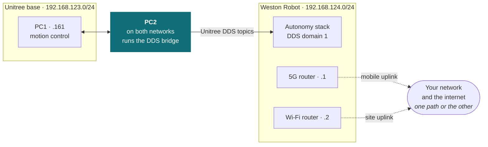

# Network configuration

:::caution Leave the network as delivered unless this has been handed to you

A platform's network is configured and tested by Weston Robot before it ships, and a
deployed robot should be left that way. This page exists for the specific handovers
where your team takes that on — it is not a general invitation to reconfigure.

If nobody has handed your team that responsibility, [talk to us](/support/before-you-contact-us)
rather than changing anything. A change that takes a robot off the network also removes
the means of putting it back remotely.

:::

A platform arrives with its network configured and tested. This page covers the parts your team can change afterwards — most often because the site's Wi-Fi changed, or the robot moved to a different site.

**The robot's internal network is not one of them.** The link between the onboard computers, the cameras and the LiDAR is set at integration and depends on it staying as delivered. Changing it stops the robot working, and it is not a customer-serviceable setting. Everything below concerns how the robot reaches *your* network and the internet, not how it talks to itself.

## What each platform carries

| | B2 | A2 | Go2 |
| --- | :-: | :-: | :-: |
| **Industrial 5G router** | ✅ | ✅ | — |
| **Wi-Fi router** | ✅ | ✅ | — |
| **PoE switch** | ✅ | ✅ | — |
| **Wi-Fi connectivity** | via router | via router | ✅ |
| **Ethernet switch** | via PoE switch | via PoE switch | ✅ |

**The B2 and A2 carry the same Wi-Fi and 5G routers, but their networks are arranged differently** — same hardware, different addressing, so do not carry settings or addresses from one to the other. Each has its own section below. The Go2 has neither router: it connects over Wi-Fi directly, and Weston Robot supplies a web interface for setting that up.

## A2

Everything we run on an A2 sits on **`192.168.124.0/24`**. That is the same subnet the base's second switch provides — see [the A2's network layout](/robot/quadruped/a2#network-layout) — so the payload shares it rather than adding a network of its own.

Two addresses on that subnet are the routers that connect the robot outward:

| Address | Device | Use it to change |
| --- | --- | --- |
| `192.168.124.1` | Industrial 5G router | The robot's mobile link, independent of anything your site provides |
| `192.168.124.2` | Wi-Fi router | Which wireless network the robot joins at your site |

Both are reached over the robot's own network, so you need to be on it before either address resolves.

### How the two networks connect

The base keeps its own network on `192.168.123.0/24`. **PC2 sits on both**, and a bridge there carries Unitree's DDS topics across to `192.168.124.0/24`, so our autonomy stack reads the base's state without being on the base's network.

Our autonomy software runs on `192.168.124.0/24` at **DDS domain ID 1**.

That last figure matters if your team runs ROS 2 nodes of its own alongside ours. A mismatched `ROS_DOMAIN_ID` fails silently — nodes simply never discover one another, with nothing logged to say why — so it is worth setting deliberately rather than leaving to a default.

### The two supported network configurations

A platform is commissioned in one of two configurations and stays in it until someone changes it. **There is no automatic failover between them** — the routers do not both carry traffic and switch when one fails.

| | 5G router (`.1`) | Wi-Fi router (`.2`) |
| --- | --- | --- |
| **Mobile uplink** | **Main router** — the robot's traffic leaves this way | Debugging access point only; it does not route, and it is switched off for deployment |
| **Site uplink** | Disabled | **Main router** — the robot's traffic leaves this way |

**Mobile uplink.** The robot reaches us over a mobile link that depends on nothing at your site. This is the configuration for a site with no usable wireless coverage, one where coverage does not reach the whole patrol route, or one where admitting a robot to the site network is not something your security policy allows.

The Wi-Fi router is still present, but only as an access point, and its purpose is narrow:

:::warning Switch the access point off before the robot goes into service

On a mobile uplink the access point exists so that someone working on the robot can get
onto its network. It is a debugging tool, not part of a running deployment.

A patrolling robot has no use for it, and leaving it on keeps a wireless way onto the
robot's internal network available to anyone within range for as long as the robot is
deployed. Switch it off when the work that needed it is finished.

:::

**Site uplink.** The robot joins a wireless network your site already provides, and reaches the [Robot Management Toolbox](/solution/robot-management-toolbox) over your network — on your addressing, under your network policy. The 5G router is disabled.

Which configuration a platform is on decides what a change to the other router achieves. On a mobile uplink, reconfiguring the Wi-Fi router changes only the wireless it presents, not how the robot reaches us. On a site uplink, the 5G router is not carrying traffic at all.

## B2

The B2 carries the same Wi-Fi and 5G routers as the A2, so what each one is *for* is the same. **How its network is arranged is not** — the addresses above do not apply to a B2, and the difference starts at the base: the B2 puts all five of its computers on one internal network, where the A2 splits across two switches. Compare [the B2's network layout](/robot/quadruped/b2#network-layout) with [the A2's](/robot/quadruped/a2#network-layout).

The B2's own addressing is not documented here yet. [Ask us](/support/before-you-contact-us) before changing anything on one.

## Go2

The Go2 joins a Wi-Fi network through a web interface we provide, rather than through a router in the payload.

## If the robot cannot reach the fleet

A robot that has lost its link keeps patrolling — see [what a robot decides for itself](/solution/robot-platforms#what-a-robot-decides-for-itself). What you lose is the live view, not the mission. Check the [diagnostics view](/solution/robot-management-toolbox/robot-dashboard#diagnostics) first: it reports each signal's freshness, which distinguishes a network problem from a robot that has stopped.

## Support

Network changes are worth telling us about before you make them, particularly a change of site or SIM. [Contact us](/support/before-you-contact-us) with the robot's model and serial number.
