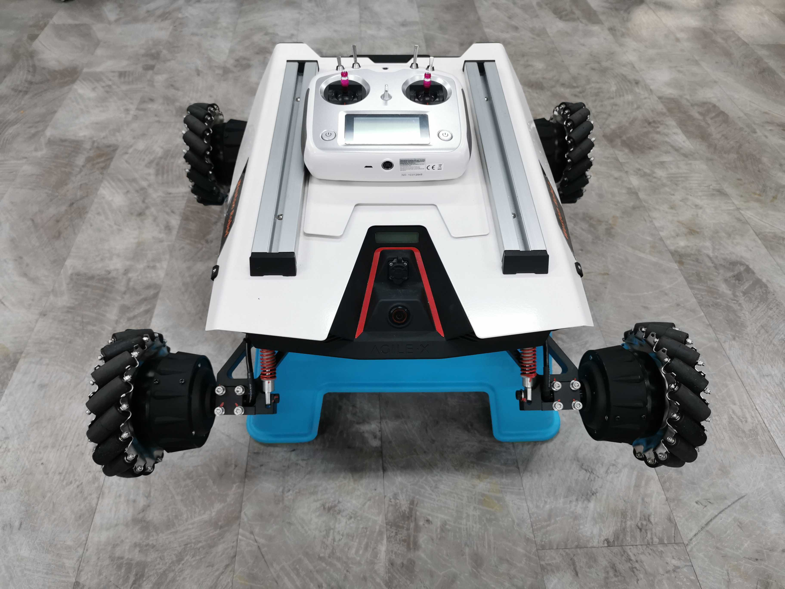

******************
Operational Safety
******************

Operation Environment
=====================

- Do not place the robot near heaters or heating elements.
- Do not use the robot in an environment with corrosive and flammable gases or combustible substances.
- Unless specially customized, the general robot models are not waterproof and shall not be operated in places with excessive humidity.
  
Software Development
====================

It's recommend to put the robot on a stable stool/bench that lifts the robot up so that you don't get unanticipated robot movement even when wrong motion commands are sent to the robot.

Keep the RC controller off when you're not intending to control the robot. Mishandling of the remote controller may lead to unexpected robot movement and cause damage to the robot or its surrounding properties.