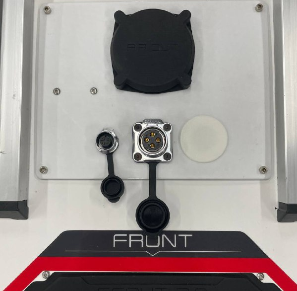
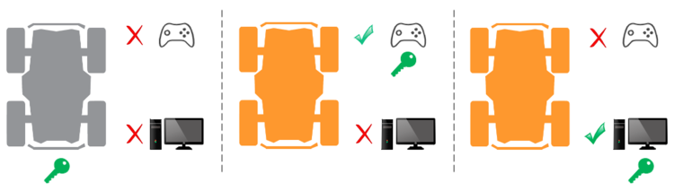
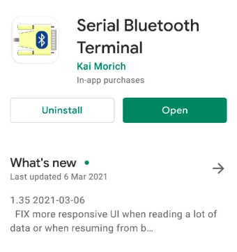
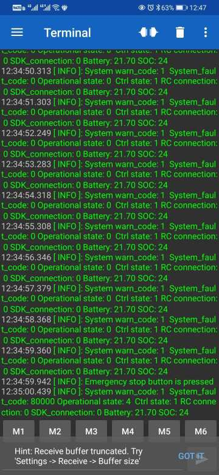

*********************
Scout V2.6 User Guide
*********************

1. Summary of Changes
=====================

1.1 Hardware Updates
--------------------

+---------------------+---------------------------+------------------+
|        Item         |          Current          | Previous (V2.5)  |
+=====================+===========================+==================+
| Top Interface Panel | CAN+POWER, Peripheral CAN | CAN+POWER, MicroUSB |
+---------------------+---------------------------+------------------+
| Battery             | 24V, 60Ah                 | 24V, 30Ah        |
+---------------------+---------------------------+------------------+

- The pinout of CAN+POWER connector (the bigger one) remains the same:
   - Pin 1 - Vcc (23V - 26.5V)
   - Pin 2 - GND
   - Pin 3 - CAN High
   - Pin 4 - CAN Low
- Peripheral CAN connector (the smaller one) can be used for extension, such as for adding ultrasonic sensors, TOF sensors
  
1.2 Software Updates
--------------------

- Updated CAN communication protocol 
- Deprecated RS232 support for robot control and monitoring
- Introduced the concept of control token for enhanced safety of robot operation
- The SDK is now provided as a Debian package for easy and convenient installation
- The ROS interface is provided with the "wrp_ros" package

2. Control Token
================

    
The robot can be controlled **manually** with a remote controller or **programatically** through the CAN interface from a Linux computer. Previously, there was no explicit way for the onboard computer (the navigation system by the user) to know whether it had control of the robot and this made it difficult to troubleshoot when the robot  does not execute the commands sent to it. To circumvent this problem, we introduced the concept of a control token to provide finer access control of the the robot.

- There is only one control token available and the token is initially held by the robot (commands from either remote controller or CAN bus will not be responded).
- Only the entity who has gained the control token will be able to control the robot to move
- The remote controller has a higher priority to take the control token than the CAN bus. This means the operator can always take over control from the onboard computer using the remote controller.
- Once the operator has finished manual control, the operator can switch the control mode back to **standby** and the control token will be returned to the robot.  (Switching off the remote controller will return the control token to the robot as well). The SDK will have to request to gain the control token to resume control via CAN bus . 
- An error code will be returned to the user if the SDK fails to gain the control token. Possible reasons include hardware failure, robot in manual control mode, etc.
- Only **one SDK instance** or **one ROS node** is allowed to communicate with the robot at a time.

.. image:: figures/scout_v2.6_03.png
    :width: 500 px

With the introduced control token feature, the functional mapping of "**SWA**" and "**SWB**" on the remote controller are slightly different:

- Initally, the robot is in standby mode when **SWB** stays at the up position (control token kept by the robot).
- The remote controller will gain the control token by placing **SWB** at the middle position, setting the robot to be in the manual control mode.
- Once the operator has finished manual control, the operator can switch the control mode back to **standby** by placing **SWB **to** up** position. This will return the control token to the robot. Switching off the remote controller will return the control token to the robot controller as well. 
- **SWA** acts as a wireless E-Stop. If **SWA **is switched to **down position,** the control token will remain with the robot, **neither remote controller** **nor SDK **would be able to control the robot until **SWA **is returned to **up **position. 

3. Key Operation Information
============================

3.1 System State Message
------------------------

Key information about the robot can be extracted from the system state message:

1. **rc_connected**: indicates whether remote controller is connected
   
   - 1 - RC connected
   - 0 - RC disconnected
  
2. **error_code**: system error or fault code
   
   - Please refer to Table 3.2.1 below for detailed error code meaning
  
3. **operational_state**: possible states and explanations are listed in the following table

+-------+-------------------+----------------------------------+
| Value | Operational state |            Situation             |
+=======+===================+==================================+
| 0x00  | OPERATIONAL       | Robot is at normal operation     |
+-------+-------------------+----------------------------------+
| 0x01  | INITIALIZATION    | Robot is starting up             |
+-------+-------------------+----------------------------------+
| 0x02  | MAINTENANCE       | Not applicable for now           |
+-------+-------------------+----------------------------------+
| 0x03  | SOFTWARE_UPDATE   | Not applicable for now           |
+-------+-------------------+----------------------------------+
| 0x04  | ESTOP_ACTIVATED   | Emergency stop button is pressed |
+-------+-------------------+----------------------------------+
| 0x05  | HARDWARE_FAULT    | There is fault error code        |
+-------+-------------------+----------------------------------+

4. **ctrl_state**: indicates which entity is in control of the robot

+-------+---------------------+-----------------------------------------------------------+
| Value |  Operational state  |                         Situation                         |
+=======+=====================+===========================================================+
| 0x00  | UNINITIALIZED       | Robot is starting up / recover from estop                 |
+-------+---------------------+-----------------------------------------------------------+
| 0x01  | STANDBY             | Robot is ready to be controlled                           |
+-------+---------------------+-----------------------------------------------------------+
| 0x02  | RC_HALT_TRIGGERED   | Robot is halted by remote controller (SWA is pushed down) |
+-------+---------------------+-----------------------------------------------------------+
| 0x03  | RC_MANUAL_CONTROL   | Robot is controlled by remote controller                  |
+-------+---------------------+-----------------------------------------------------------+
| 0x04  | CAN_COMMAND_CONTROL | Robot is controlled by SDK/ROS                            |
+-------+---------------------+-----------------------------------------------------------+

5. battery-state
   
   - contains information about battery voltage

**Note**: There are other feedback messages available in addition to the system state message. Please refer to the ROS package message definitions for more details.

3.2 Buzzer Alert
----------------

- There are two levels of alert: **Warn** and **Fault**. You can still control the robot when you get a **warn**-level alert but once a **fault**-level alert is triggered, the robot will stop and not respond to any motion commands to avoid possible hardware damage.
- Warn-level alert: buzzer will be triggered at a relatively **low frequency** (0.5Hz).
   - The robot **can still be controlled**, but the warning (buzzer) will remain until none of the **warning** conditions from Table 1.1 exist.
   - It is advised to take proper actions to get the robot back to normal.
- Fault-level alert: buzzer will be triggered **at higher frequency** (2Hz).
   - The robot **cannot be controlled** until all **faults **are resolved. 
   - For recoverable faults (e.g. over-heating), the robot may first recover back to warn-level condition before returning to normal, given enough time for cooling.
- Conditions that may trigger the alert are listed below
  
+---------------------+-----------------------------+----------------------------------------------+-----------------+------------------+
|      Condition      |            Warn             |                    Fault                     | Warn error code | Fault error code |
+=====================+=============================+==============================================+=================+==================+
| Battery             | State of Charge (SOC) < 25% | State of Charge (SOC) < 15%                  | 0x00000001      | 0x00010000       |
+---------------------+-----------------------------+----------------------------------------------+-----------------+------------------+
| Motor Temperature   | > 70 °C                     | > 100 °C                                     | 0x00000002      | 0x00020000       |
+---------------------+-----------------------------+----------------------------------------------+-----------------+------------------+
| Motor Current       | > 25 A                      | continuous 100A for 3ms (reported by driver) | 0x00000004      | 0x00040000       |
+---------------------+-----------------------------+----------------------------------------------+-----------------+------------------+
| Motor Communication | Not applicable              | Lost communication with motor drivers        | Not applicabl   | 0x00080000       |
+---------------------+-----------------------------+----------------------------------------------+-----------------+------------------+

**Table 3.2.1 Robot Warning and Fault Conditions**

4. Software Packages
====================

- Weston Robot Platform SDK
   - https://github.com/westonrobot/wrp_sdk
- ROS support package
   - https://github.com/westonrobot/wrp_ros

**Note**: Scout V2.6 is incompatible with ugv_sdk and scout_ros.

5. Preview Feature
==================

System state monitor with Bluetooth. You can download any Bluetooth serial terminal application to receive basic robot state information. We have tested the following app and you can download it from Play store.

You can scan Bluetooth devices **near the robot** and connect to the robot controller. The device name should be similar to "WR-SC210404".

6. FAQ
======

1. What is the expected battery life (60Ah) and runtime of the robot?
   
   - Full charging cycle using normal 10A charger takes about 5 hours
   - With maximum load, battery can last 4 hours
   - Without load, battery can last 5 hours 

2. What is the epxected motor temperature and current 
   
   - For **50kg** load running for **15 minutes**:
   - Average temperature for motor driver and motor about **55 degree Celcius**
   - Average current per motor is about **4.5A**

3. BMS
   
   - if <= SOC 10%, battery will enter protection mode
