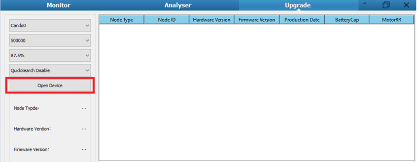
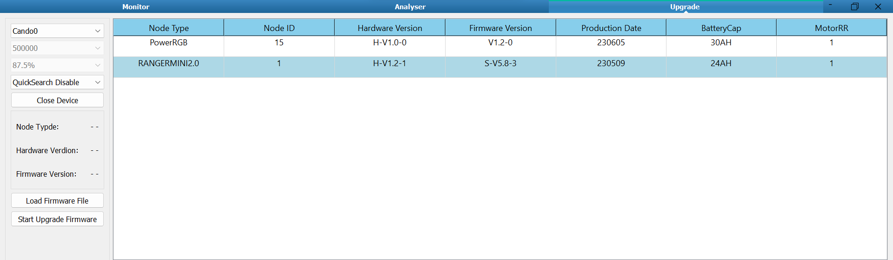
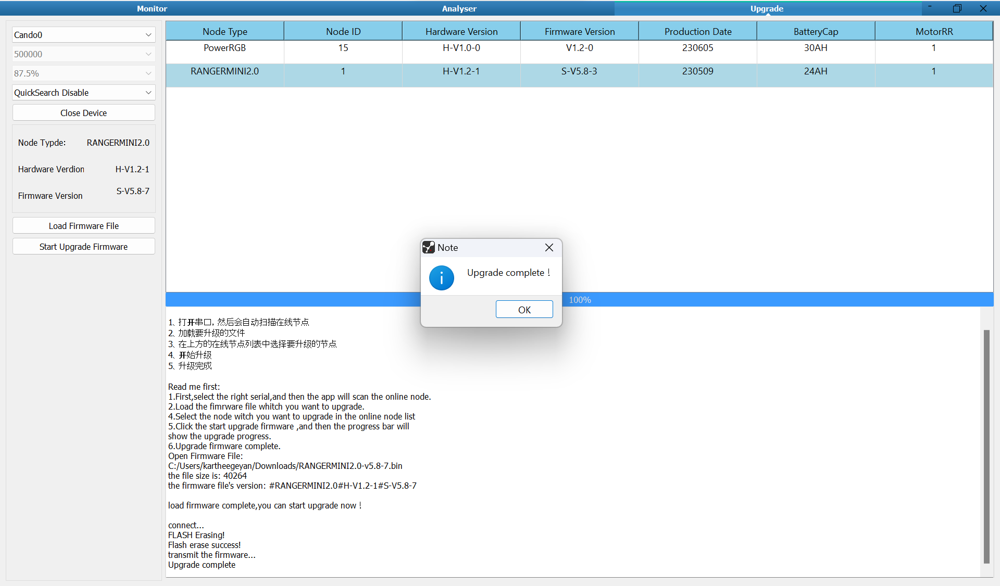

Firmware Upgrade Tool
=====================

- To upgrade the firmware, please ensure you have the following items
   - PC running on Windows
   - USB to CAN Adapter
   - Firmware upgrade tool, which can be downloaded `here <https://tangrobot.sharepoint.com/:u:/s/Public-Outgoing/EaPf9gpqXs1IlKpHQSwMhoMBIrPnCFtyhxf3HjwdGbsALw?e=IgD3tl>`_

- Follow the steps below in the order stated for the firmware upgrade to be successful.
   #. Turn **OFF** the robot, and connect it to your pc using the USB to CAN adapter.
   #. Start the firmware upgrade tool executable.
   #. Click Open Device.
   #. Turn on the robot.

- The robot should appear on the right node list.

- Load the new firmware file, select the robot in the node list, and start the upgrade.

