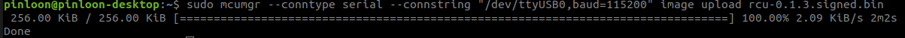
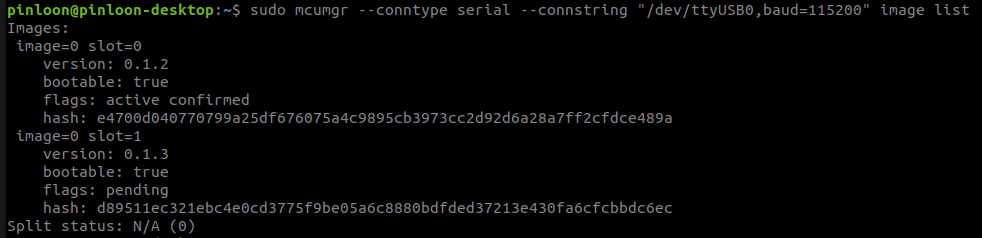
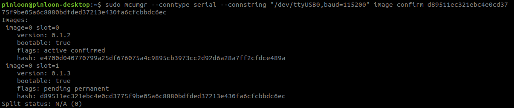
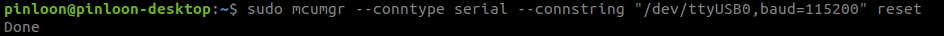

Scout V2.5 Robot
================

- To upgrade the firmware, please ensure you have the following items
   - Laptop running on Ubuntu
   - USB to Micro USB cable
   - Signed binary image from Weston Robot
   - MCU Manager installed (kindly refer for the installation guide below)

Installation guide for MCU Manager (mcumgr)
-----------------------------------------------

1. Installation for Go.

.. code-block:: bash

    $ sudo apt install golang-go

2. Verify whether Go is installed properly by the following command.

.. code-block:: bash

    $ go version

**Note: You will need go version >=1.12, if the version provided by the OS is too old, please manually install a newer version from golang's** `website <https://golang.org/doc/install>`_.

3. Now you can install mcumgr CLI.

- For Go version < 1.18

.. code-block:: bash

    $ go get github.com/apache/mynewt-mcumgr-cli/mcumgr

- For Go version >= 1.18

.. code-block:: bash

    $ go install github.com/apache/mynewt-mcumgr-cli/mcumgr@latest

4. Add in path for mcumgr into .bashrc file

.. code-block:: bash

    $ nano ~/.bashrc
    $ export PATH=$PATH:<path-to-home-directory>/go/bin/
    $ alias sudo='sudo env PATH=$PATH'

5. Verify whether mcumgr is installed properly by the following command.

.. code-block:: bash

    $ source ~/.bashrc
    $ mcumgr version

Firmware version check using MCU Manager through USB cable
--------------------------------------------------------
- After you have installed mcumgr, now you should be able to check the firmware version through USB cable.
- Connect your computer to the MicroUSB port on robot using USB to Micro USB cable.
- Check on your computer for the device connected by the following command.

.. code-block:: bash

    $ ls /dev

**Note:**
if there is only one USB device connected you should be able to see device named "ttyUSB0", if there are more instances such as "ttyUSB1", you might need to run the command before and after plugging in the USB cable to check the correct device name. 

- Assuming your USB device appeared on your computer is "/dev/ttyUSB0", you can check the firmware version by the following command.
.. code-block:: bash

    $ sudo mcumgr <connection string> image list

The default connection string is 

.. code-block:: bash

    --conntype serial --connstring "/dev/ttyUSB0,baud=115200"

- You should be able to see something like below

.. image:: figures/scout_v2.5_07.png

- If you don't get any response, replace the connstring to other USB instance appeared on your computer such as "/dev/ttyUSB1,baud=115200".

Firmware upgrade using MCU Manager through USB cable
--------------------------------------------------------

- After you have installed mcumgr, now you should be able to upgrade the firmware through USB cable.
- Connect your computer to the MicroUSB port on robot using USB to Micro USB cable.
- Check on your computer for the device connected by the following command.

.. code-block:: bash

    $ ls /dev

**Note:**
if there is only one USB device connected you should be able to see device named "ttyUSB0", if there are more instances such as "ttyUSB1", you might need to run the command before and after plugging in the USB cable to check the correct device name. 

- Assuming your USB device appeared on your computer is "/dev/ttyUSB0", you can check the firmware version by the following command.
.. code-block:: bash

    $ sudo mcumgr <connection string> image list

The default connection string is 

.. code-block:: bash

    --conntype serial --connstring "/dev/ttyUSB0,baud=115200"

- You should be able to see something like below

.. image:: figures/scout_v2.5_07.png

- If you don't get any response, replace the connstring to other USB instance appeared on your computer such as "/dev/ttyUSB1,baud=115200".
- Assuming your USB device appeared on your computer is "/dev/ttyUSB0", you can upload the image with the following command.

.. code-block:: bash

    $ sudo mcumgr <connection string> image upload <path-to-signed.bin>

- Wait for about 3 seconds, you should be able to see something like below

.. image:: figures/scout_v2.5_08.png

- Wait until the process is Done. 

- You can check whether the image is uploaded succesfully by the following command.

.. code-block:: bash

    $ sudo mcumgr <connection string> image list

    
- Copy the hash of latest image to be used in next step, in this example, it is  

.. code-block:: bash

    d89511ec321ebc4e0cd3775f9be05a6c8880bdfded37213e430fa6cfcbbdc6ec

- Now confirm the image by running the following command

.. code-block:: bash

    $ sudo mcumgr <connection string> image confirm <hash of image>

- Reset by the following command
  
.. code-block:: bash

    $ sudo mcumgr <connection string> reset

- Wait for about 30 seconds and run the following command

.. code-block:: bash

    $ sudo mcumgr <connection string> image list

- You should be able to see the following

.. image:: figures/scout_v2.5_12.png

- Now, you have upgraded the firmware successfully to a newer version.
- After uploading the new firmware, if you would like to revert the previous firmware, the old firmware image should still be present in the board. 
- To revert to this old firmware, confirm this old image again by repeating the last few steps and reset the board.