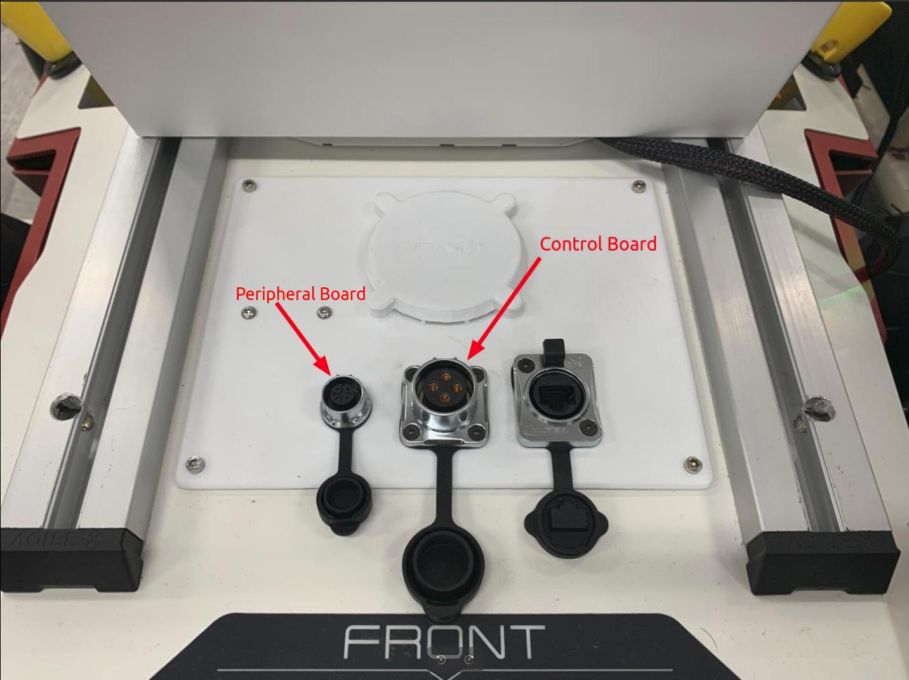

.. _Scout2.5+FWUpgrade:

Scout (>V2.5) Robot
===================

.. **Important:** Please approach us for Firmware Update Manager and latest firmware updates.

- To upgrade the firmware, please ensure you have the following items

   - Laptop running on Ubuntu 18.04/20.04
   - USB to CAN + Power cables for Peripheral and Control Board
   - Signed binary image from Weston Robot
   - Weston Robot Firmware Update Manager executable from Weston Robot

      - :download:`Ubuntu 18.04 (bionic) <./wr_firmware_mgr/bionic/wr_firmware_manager>`
      - :download:`Ubuntu 20.04 (focal) <./wr_firmware_mgr/focal/wr_firmware_manager>`
      - :download:`Ubuntu 22.04 (jammy) <./wr_firmware_mgr/jammy/wr_firmware_manager>`

    
    Middle aviation connector for Control Board. Left aviation connector for Peripheral Board

- Connect powered on robot
- Setup CAN connection for both/either boards

.. code-block:: bash

    $ sudo modprobe gs_usb
    # Replace can<X> e.g. can0
    $ sudo ip link set up can<X> type can bitrate 1000000 
    $ sudo ip link set can<X> txqueuelen 10000

- Launch Weston Robot Firmware Update Manager

    - (you may need to make the file executable first using chmod)

.. code-block:: bash

    $ ./wr_firmware_manager

- Verify the boards are connected

    - Select boards via drop-down menu at "Board Selection"
    - Click "Check"
    - The hardware and software versions are displayed, otherwise error will be displayed

- Upgrade the firmware

    - Select boards via drop-down menu at "Board Selection"
    - Browse and select binary file to be flashed
    - Click "Update"
    - Wait for for update to complete, robot will restart once flashing completes
        - Robot may beep during this time, this is normal behaviour
        - The "Confirm" action should be executed by default upon restarting, if it fails, restart the robot and click "Confirm"
