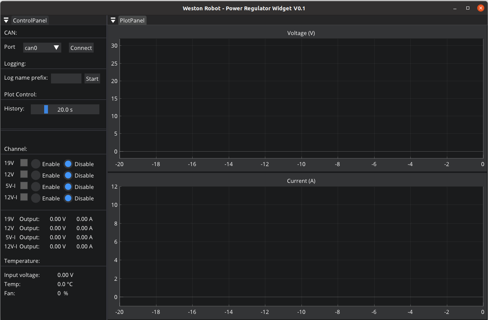

*******************************
Power Regulator V2.x User Guide
*******************************

Revision History
================

+----------+-------------------+----------+------------------------+
| Revision | Date (DD/MM/YYYY) | Author   | Changes                |
+==========+===================+==========+========================+
| 1        | 28/04/2022        | Ruixiang | Initial release        |
+----------+-------------------+----------+------------------------+
| 2        | 31/08/2022        | Kee Jin  | V2.2 release support   |
+----------+-------------------+----------+------------------------+

1. Overview
===========

The power management unit is designed by Weston Robot for mobile robot applications. It has the following features:

- Stable and low output ripple for all output channels
- All ports are fused for protection of both battery and connected devices
- Supports soft-start to avoid current surge during startup
- Temperature monitoring and regulation with active fan cooling
- The output ports can be controlled individually (on/off) for finer boot sequence control
- Output voltage and current feedback via CAN/RS485 communication port

2. Specifications
=================

Power Module
------------

+-----------------------+---------------+---------------+------------------------+------------+
|         Port          |    Voltage    | Current (Max) |         Power          |   Fused    |
+=======================+===============+===============+========================+============+
| Main input            | 18-32V        | 20A           | /                      | 20A fuse   |
+-----------------------+---------------+---------------+------------------------+------------+
| Output - 19V          | 19V           | 8A            | 150W                   | 10A fuse   |
+-----------------------+---------------+---------------+------------------------+------------+
| Output - 12V          | 12V           | 10A           | 120W                   | 15A fuse   |
+-----------------------+---------------+---------------+------------------------+------------+
| Output - 5V isolated  | 5V            | 4A            | 20W                    | Resettable |
+-----------------------+---------------+---------------+------------------------+------------+
| Output - 12V isolated | 12V           | 3.3A          | 40W                    | Resettable |
+-----------------------+---------------+---------------+------------------------+------------+
| Output - extension    | Input voltage | /             | Limited by total power | /          |
+-----------------------+---------------+---------------+------------------------+------------+ 

Control Module
--------------

+-------+----------+---------------------------------------------+
| Port  | Protocol |                  Function                   |
+=======+==========+=============================================+
| CAN   | CANopen  | monitoring and control, firmware upgrade    |
+-------+----------+---------------------------------------------+
| RS485 | /        | firmware upgrade (backup), future extension |
+-------+----------+---------------------------------------------+

3. Hardware Setup
=================

3.1 Startup and Operation
-------------------------
+------------------+---------------------+---------------------+
|                  | V2.1                | V2.2                |
|                  +---------+-----------+---------+-----------+
|       State      | Red LED | Green LED | Red LED | Green LED |
+                  |         |           |         |           |
|                  | Status  | Status    | Status  | Status    |
+==================+=========+===========+=========+===========+
| Initialisation   | ON      | ON        | ON      | ON        |
+------------------+---------+-----------+         |           |
| Calibration      | OFF     | OFF       |         |           |
+------------------+---------+-----------+---------+-----------+
|   Operational    | OFF     | BLINKING  | OFF     | BLINKING  |
+------------------+---------+-----------+---------+-----------+
| Firmware Upgrade | BLINKING| OFF       | BLINKING| OFF       |
+------------------+---------+-----------+---------+-----------+

Startup Sequence 
^^^^^^^^^^^^^^^^^
**V2.1:**

    - Upon start up, both red and green LEDs would light up for about 2 seconds as it is initialising. Both LEDs will then switch off for another 2 seconds, indicating that the regulator is going through a state of calibration.
**V2.2:**

    - Upon start up, both red and green LEDs would light up for about 18 seconds. During this phase, initialisation and calibration of the power regulator takes place

Operational State 
^^^^^^^^^^^^^^^^^^
- After calibration, the unit would go into operational state, where the red LED would be turned off while the green LED would be blinking

Firmware Upgrades 
^^^^^^^^^^^^^^^^^^
- If there is any firmware upgrade happening, the green LED would be turned off while red LED would be blinking

3.2 Output Connection
---------------------

The output ports of the power module are exposed with **Molex Megafit** connectors. For each port, 2 or 4 channels are provided. Note that the channels are interconnected internally, thus the total power consumption should not exceed the power ratings of the port.  

**Note**: The operation of the fan is dependent on the state of the 12V channel, it will operate only when the 12V channel is on.
The fan will be switched on once the temperature reaches 28°C, with fan speed reaching a maximum when the temperature rises to 45°C and above.

4. Software Setup
=================

The power regulator uses CANopen to communication with a computer. The CANopen driver for the power regulator is supported by wrp_sdk since version 1.0.0. 

* If you want to interact with the power regulator from your C++ program, you need to install the SDK.
* If you only need to monitor and control the power regulator with a GUI, you just need to install the widget. 

4.1 Install SDK
---------------

Follow the following instructions to install the latest SDK.

Install dependencies
^^^^^^^^^^^^^^^^^^^^

.. code-block:: bash

    $ sudo apt-get install -y software-properties-common 
    $ sudo add-apt-repository ppa:lely/ppa && sudo apt-get update
    $ sudo apt-get install -y pkg-config liblely-coapp-dev liblely-co-tools

Install the SDK
^^^^^^^^^^^^^^^

Please add the debian repository to your apt-get source list firt. Refer to section :ref:`Debian Repository <ref_add_debian_source>`

.. code-block:: bash

    $ sudo apt-get install wrp_sdk

.. _ref_power_regulator_software_setup:

4.2 Install the Widget
----------------------

Please make sure you have added the debian source as described in section :ref:`Debian Repository <ref_add_debian_source>`.

.. code-block:: bash

    # 1. install wr_regulator_widget dependencies
    $ sudo apt-get install libgl1-mesa-dev libglfw3-dev libcairo2-dev
    # 2. install the package 
    $ sudo apt-get install wr_regulator_widget

Once finished the installation, you can find the executable of the widget at "/opt/weston_robot/bin/regulator_widget".

.. code-block:: bash

    $ /opt/weston_robot/bin/regulator_widget/wr_regulator_widget

Run the widget and you should see the GUI like this:

5. Configuration
================

Setting Default State for Channels
----------------------------------

By default, all the output channels are disabled after the power regulator is powered on for safety purpose. Nevertheless, depending on your application, you may want to have a different initial state for the output channels. For example, if your main control computer is powered by the 19V channel, you would want this channel to be on by default, only after which you can control the power sequence of other channels from your control computer.

The default state is stored in non-volatile storage ROM. Thus, once set, the settings would persist. 

Install dependencies
^^^^^^^^^^^^^^^^^^^^

python-can can be used to set default state for channels, 

.. code-block:: bash

   pip3 install --user canopen python-can

Configure python-can to use your CAN adapter through its
configuration file. On GNU/Linux, the configuration looks similar to
this:

.. code-block:: bash

   cat << EOF > ~/.canrc
   [default]
   interface = socketcan
   channel = can0
   bitrate = 500000
   EOF

Next, bring up the CAN interface on the PC.

.. code-block:: bash

   sudo ip link set can0 type can bitrate 500000
   sudo ip link set up can0

Configure with Python scripts
^^^^^^^^^^^^^^^^^^^^^^^^^^^^^

The example code below demonstrates how to set all output channels to be on by default: 

.. code-block:: bash

    import canopen
    import os
    import time

    EDS = <your-path-to-eds> // eg. /opt/weston_robot/share/wrp_sdk/eds/regulator/regulator_v2.1.eds
    NODEID = 30

    network = canopen.Network()

    network.connect()

    node = network.add_node(NODEID, EDS)

    print("----------------------")
    print("Initial Output state:")
    print("----------------------")
    print("19V {}".format(node.sdo['Output state'][1].raw))
    print("12V {}".format(node.sdo['Output state'][2].raw))
    print("Isolated 12V {}".format(node.sdo['Output state'][3].raw))
    print("Isolated 5V {}".format(node.sdo['Output state'][4].raw))

    print("----------------------")
    time.sleep(1)
    print("Setting Output command:")
    print("----------------------")
    print("19V True")
    node.sdo['Output command'][1].raw = 1
    print("12V True")
    node.sdo['Output command'][2].raw = 1
    print("Isolated 12V True")
    node.sdo['Output command'][3].raw = 1
    print("Isolated 5V True")
    node.sdo['Output command'][4].raw = 1
    node.store() # store into ROM 
    # node.restore() # restore ROM
    network.disconnect()