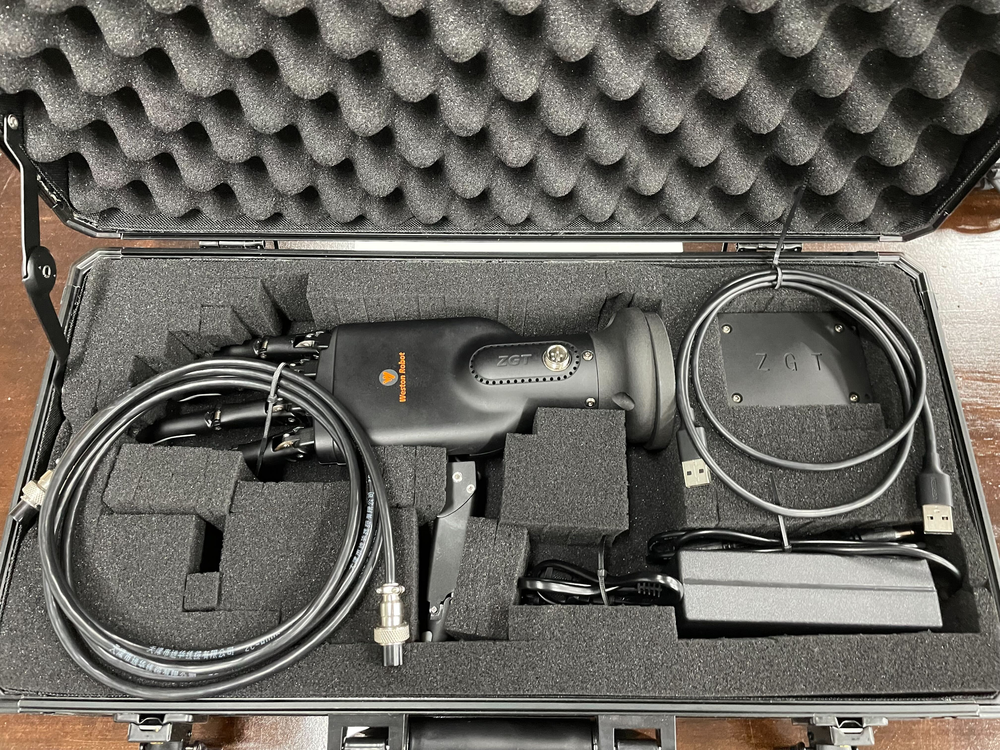
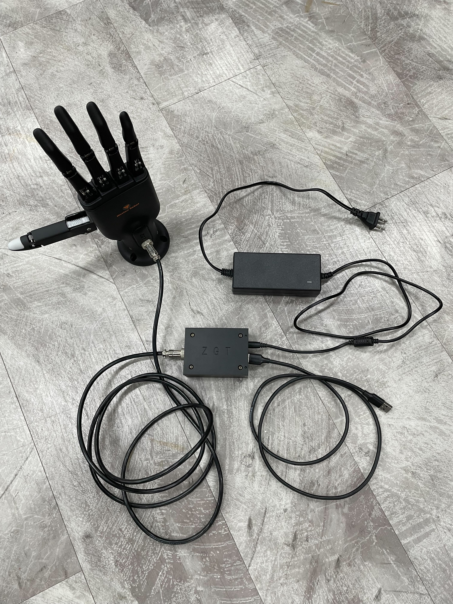

****************
Roger Robot Hand
****************

Revision History
================

+----------+-------------------+--------+-----------------+
| Revision | Date (DD/MM/YYYY) | Author | Changes         |
+==========+===================+========+=================+
| 1        | 06/10/2022        | Hans   | Initial release |
+----------+-------------------+--------+-----------------+

1. Overview
===========
The Roger robot hand is designed as a end-effector for collaborative robots.  It has the following feature:

- Grasping and holding of items
- Hand-like monitoring
- User interface: ROS1, Linux Application

2. Specifications
=================

2.1 General
-----------
+---------------------------+------------------+
| Physical Specifications   |                  |
+===========================+==================+
| Number of Fingers         | 5                |
+---------------------------+------------------+
| Degree of Freedom         | 6                |
+---------------------------+------------------+
| Weight                    | 0.3kg            |
+---------------------------+------------------+
| Strong Grip Mode Payload  | 2kg              |
+---------------------------+------------------+
| Precise Grip Mode Payload | 0.2kg            |
+---------------------------+------------------+
| Angular Motion Range      | 85degs           |
+---------------------------+------------------+
| Grasping Response Times   | < 1.5secs        |
+---------------------------+------------------+
| Motion Noise              | < 60dB           |
+---------------------------+------------------+
| Operating Temperature     | < 80degs celsius |
+---------------------------+------------------+

2.2 In the box
--------------

+---------------------------------------+--------+
| Item                                  | Amount |
+=======================================+========+
| Roger Hand                            | 1      |
+---------------------------------------+--------+
| Base Plate                            | 2      |
+---------------------------------------+--------+
| Power Supply                          | 1      |
+---------------------------------------+--------+
| Control Box                           | 1      |
+---------------------------------------+--------+
| Aviator CX12-5pin female-female cable | 1      |
+---------------------------------------+--------+
| USB A male-male cable                 | 1      |
+---------------------------------------+--------+

2.3 Control Box
---------------
+---------------+----------+-------------------------+
| Port          | Protocol | Function                |
+===============+==========+=========================+
| USB A port    | USB      | Communication interface |
+---------------+----------+-------------------------+
| Ethernet port | /        | Future extension        |
+---------------+----------+-------------------------+

3. Hardware Setup
=================

3.1 Startup and Operation
-------------------------

3.1.1 Connection
~~~~~~~~~~~~~~~~
1. Connect provided aviator cable to hand and control box.
2. Connect provided power supply to control box and power outlet.
3. Connect provided USB cable to control and host computer.
4. Switch on the power supply.

3.1.2 Computer
~~~~~~~~~~~~~~
* On Ubuntu
    * Device will show up as a /dev/ttyUSBx device.
* On Windows
    * Device will show up as a COMx port device.
    * :red:`You may need to install the CP210x driver first, available at:` https://www.silabs.com/developers/usb-to-uart-bridge-vcp-drivers?tab=downloads

4. Software Setup
=================
There are 2 ways to interface with the hand out-of-the-box.
    1. ROS1 Driver
    2. Linux Application

4.1 ROS1 Driver
---------------

4.1.1 Setting up
~~~~~~~~~~~~~~~~
| The ROS1 driver can be found here: https://github.com/westonrobot/roger_hand_ros
| Follow the README on the github repo to setup the hand for communication with computer.

4.1.2 Running
~~~~~~~~~~~~~
.. code-block:: bash

    $ roslaunch roger_hand_bringup roger_hand_server.launch

- Parameters

+-----------+-------------------------+----------------+
| Parameter | Description             | Default        |
+===========+=========================+================+
| port_name | port to the control box | "/dev/ttyUSB0" |
+-----------+-------------------------+----------------+

- Published Topics

+--------------+-----------------------------+-------------------+
| Topics       | Message Format              | Description       |
+==============+=============================+===================+
| ~/hand_state | roger_hand_msgs::hand_state | State of the hand |
+--------------+-----------------------------+-------------------+

- Services

+-----------------------+----------------------------------+-----------------------------+
| Name                  | Message Format                   | Description                 |
+=======================+==================================+=============================+
| ~/set_finger_pose     | roger_hand_msgs::finger_pose     | Set pose of one finger      |
+-----------------------+----------------------------------+-----------------------------+
| ~/set_hand_pose       | roger_hand_msgs::hand_pose       | Set pose of entire hand     |
+-----------------------+----------------------------------+-----------------------------+
| ~/clear_hand_error    | roger_hand_msgs::clear_error     | Clear any errors raised     |
+-----------------------+----------------------------------+-----------------------------+
| ~/set_ampere_feedback | roger_hand_msgs::ampere_feedback | Enable current feedback     |
+-----------------------+----------------------------------+-----------------------------+
| ~/set_hand_enable     | roger_hand_msgs::hand_enable     | (Dis/En)able hand operation |
+-----------------------+----------------------------------+-----------------------------+

- Finger IDs

+-------+------------------+
| Index | Joint            |
+=======+==================+
| 1     | Thumb            |
+-------+------------------+
| 2     | Thumb (rotation) |
+-------+------------------+
| 3     | Index            |
+-------+------------------+
| 4     | Middle           |
+-------+------------------+
| 5     | Ring             |
+-------+------------------+
| 6     | Little           |
+-------+------------------+

4.2 Linux Application
---------------------

4.2.1 Download
~~~~~~~~~~~~~~
- To use the application, please ensure you have the following items
    - Computer running Ubuntu 18.04/20.04 
        - `Ubuntu 18.04 (bionic) <https://tangrobot.sharepoint.com/:u:/s/Public-Outgoing/Ee0a7qRKQhZKgE9F1IFa8YwB_Tjeq8fgGgf2BagPVz5sOA?e=HV7BIr>`_
        - `Ubuntu 20.04 (focal) <https://tangrobot.sharepoint.com/:u:/s/Public-Outgoing/Ec3um8MndiJFqMPiu5uOt4sBX3qN4pxksN5htVa5MjfVTQ?e=6EiZ0h>`_

4.2.2 Running
~~~~~~~~~~~~~
.. code-block:: bash

    $ ./roger_hand_control