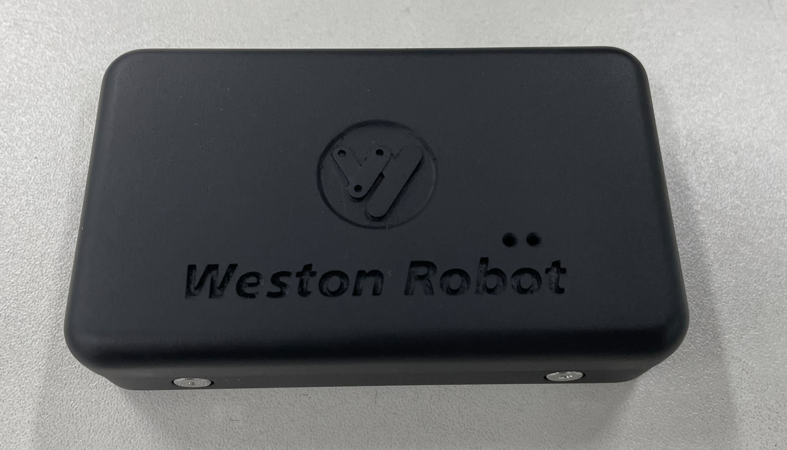
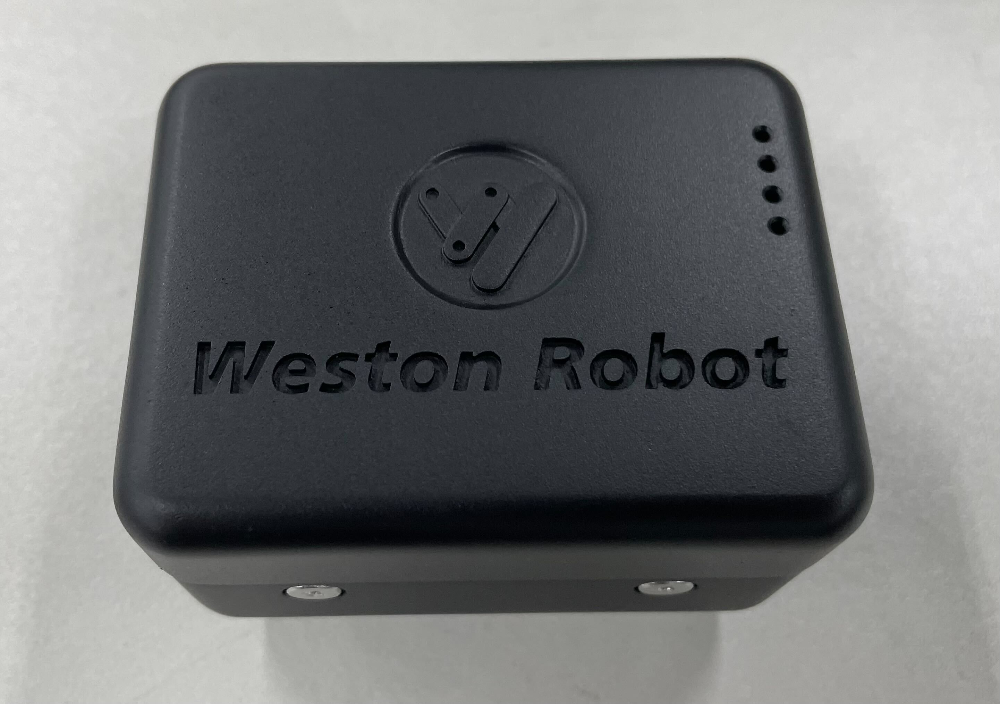

*******************************
UWB IOT Follow-Me V2 User Guide
*******************************

1. Overview
===========

The UWB IOT Follow-Me system is designed by Weston Robot for mobile robot applications. It has the following features:

- 1 Anchor to Multiple Tags "pairing"
- Distance Measurement Accuracy: ±5cm
- Angular Position Accuracy: ±5°
- Anchor Interface: ROS1

2. Specifications
=================

Anchor Module
------------

+-----------+----------+-------------------------+
| Port      | Protocol | Function                |
+===========+==========+=========================+
| Micro-usb | USB      | communication interface |
+-----------+----------+-------------------------+

Tag Module
--------------

+-----------+---------------------+
| Port      | Function            |
+===========+=====================+
| Micro-usb | charging of battery |
+-----------+---------------------+
| Button    | ON/OFF Toggle       |
+-----------+---------------------+

3. Hardware Setup
=================

Startup and Operation
---------------------

Anchor Module
------------

- Connect the module to the computer via a micro-usb cable.
- Upon start up, you should see a solid blue led and flashing green led.

Tag Module
------------

- To switch on, press **single press** the button.
- Upon start up, the 4 blue leds will light up, indicating battery level.
- To switch off, quickly **double press** the button.

1. Software Setup
=================

The Anchor module uses a ROS1 driver to communicate with a computer. The ROS1 driver can be found here https://github.com/westonrobot/nlink_parser.

4.1 Setup ROS1 Driver
---------------------

Follow the README guide on the github repo to setup the anchor for communication with tag modules.

4.2 Using ROS1 Driver
---------------------

- Launch the driver node

.. code-block:: bash

    $ roslaunch nlink_parser iot.launch

- Parameters

+-----------+---------------------------+----------------+
| Parameter | Description               | Default        |
+===========+===========================+================+
| port_name | port to the anchor module | "/dev/ttyUSB0" |
+-----------+---------------------------+----------------+
| baud_rate | baud rate of the module   | 921600         |
+-----------+---------------------------+----------------+

- Published Topics

+-------------------+-------------------------+-------------------------------------+
| Topics            | Message Format          | Description                         |
+===================+=========================+=====================================+
| /nlink_iot_frame0 | nlink_parser::IotFrame0 | Data from detected tags (<=10 tags) |
+-------------------+-------------------------+-------------------------------------+