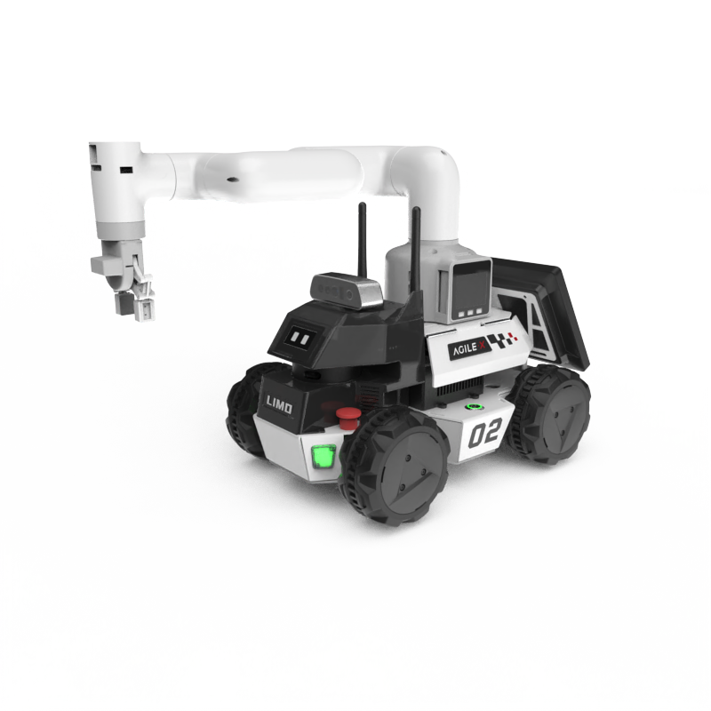

********
Limo PRO
********

Revision History
================

+----------+-------------------+----------+------------------------------------------------------+
| Revision | Date (DD/MM/YYYY) | Author   | Changes                                              |
+==========+===================+==========+======================================================+
| 1        | 12/4/2024         | Kang Wei | Initial release                                      |
+----------+-------------------+----------+------------------------------------------------------+

1. Overview
===========

The LIMO PRO robot is equipped with an Nvidia Orin Nano processor running ROS on Ubuntu 20.04, serving as a fundamental platform for autonomous mobile robot research 
and education. Users have the option to integrate a manipulator (Mycobot 280 M5), allowing for precise mobile grasping to fulfill diverse task requirements

2. Specifications
=================

.. list-table:: Technical Specifications
   :widths: 25 25
  
   * - Size
     - 322mm x 220mm x 251mm
   * - Weight
     - 4.8kg
   * - Payload
     - 4kg
   * - Minimum Ground Clearance
     - 24mm 
   * - Display
     - 7-inch 1024x600 IPS
   * - IPC
     - Jetson Orin Nano
   * - Camera
     - Orbbec DaBai
   * - LiDAR
     - EAI T-mini Pro
   * - Battery
     - 10Ah 12v
   * - Working Time
     - 2.5H
   * - Standby
     - 4H
   * - OS
     - Ubuntu 20.04
   * - Version
     - ROS1 Focal

3. MyCobot280 M5 Manipulator
============================
.. list-table:: Technical Specifications
   :widths: 25 25
  
   * - Weight
     - 800g
   * - Payload
     - 250g
   * - Model
     - M5Stack-basic/Atom
   * - Wireless
     - 2.4G 3D Antenna
   * - Bluetooth
     - 2.4G/5G
   * - Working Radius
     - 280mm

4. Resources
============

* Limo PRO Manual (EN): `limo_pro_manual <https://tangrobot.sharepoint.com/:b:/s/Public-Outgoing/ET1Kq-a-x_1Lg66P3V-p-pYBl_HD_IMGJ7xxw-RjiKmo2A?e=fGQ317>`_
* Limo PRO Manual (CN): `limo_pro_manual <https://tangrobot.sharepoint.com/:b:/s/Public-Outgoing/Ecuj0SjlKh1LrB_IIEU9w2UB83rLm9Gy3YABnEgupUwkQA?e=KEUDhW>`_
* Limo PRO Image: `limo_pro_img <https://tangrobot.sharepoint.com/:u:/s/Public-Outgoing/EZD8WoyBtypKlrB9FZW9De8BBTrrrAmZTF5lnoyfd9pB_g?e=aev4WM>`_
