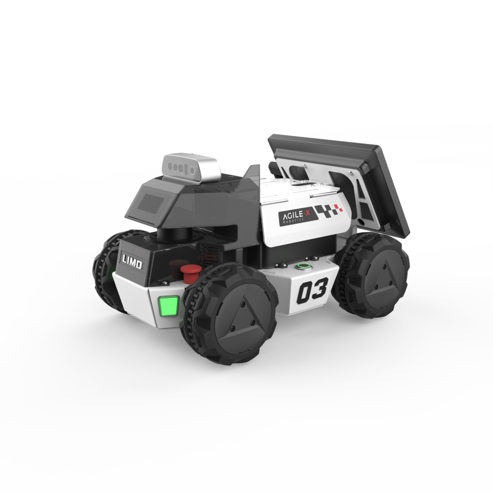

*********
Limo ROS2
*********

Revision History
================

+----------+-------------------+----------+------------------------------------------------------+
| Revision | Date (DD/MM/YYYY) | Author   | Changes                                              |
+==========+===================+==========+======================================================+
| 1        | 21/2/2024         | Kang Wei | Initial release                                      |
+----------+-------------------+----------+------------------------------------------------------+

1. Overview
===========

LIMO ROS2 robot features an Intel NUC i7 processor running ROS 2 on Ubuntu 22.04, providing an essential platform for autonomous mobile robot research and education.

2. Specifications
=================

.. list-table:: Technical Specifications
   :widths: 25 25
  
   * - Size
     - 322mm x 220mm x 251mm
   * - Weight
     - 4.8kg
   * - Payload
     - 4kg
   * - Minimum Ground Clearance
     - 24mm 
   * - Steering
     -  40Nm
   * - Display
     - 7-inch 
   * - IPC
     - Intel NUC
   * - Camera
     - Orbbec DaBai
   * - LiDAR
     - EAI T-mini Pro
   * - Battery
     - 10Ah 12v
   * - Working Time
     - 2.5H
   * - Standby
     - 4H
   * - OS
     - Ubuntu 22.04
   * - Version
     - ROS2 Humble

.. list-table:: In-Wheel Motor Specifications
   :widths: 25 25
  
   * - No-load Speed
     - 315rpm ± 10rpm
   * - No-load Current
     - ≤ 0.25A
   * - Rated Speed
     - 200rpm
   * - Rated Torque
     - 0.55Nm 
   * - Rated Current
     - 1.45A
   * - Maxiumum Efficiency
     - ≥ 50%
   * - Stall Torque
     - 1.1Nm
   * - Stall Current
     - ≤ 3.5A
   * - Rated Voltage
     - 18V DC
   * - Constant Torque
     - 0.37Nm/A
   * - Constant Speed
     - 17.5rpm/V
   * - Working Environment
     - -20°C ~ 45°C
   * - Weight
     - 300g 
   * - Encoder Resolution
     - 4096
   * - Relative Accuracy
     - 1024
   * - Noise Level
     - ≤ 52dB

3. Resources
============

* Limo ROS2 Manual: `limo_ros2_manual <https://github.com/agilexrobotics/limo_ros2_doc/blob/master/LIMO-ROS2-humble(EN).md>`_
* Dabai Camera Manual (CN): `Orbbec Dabai <https://tangrobot.sharepoint.com/:b:/s/Public-Outgoing/EVS9VBsLvEtBuNYUANL1G2wBgxu5_oVS0oCqaTLwUgfJBQ?e=GWREwn>`_
* ROS2 package: `limo_ros2 <https://github.com/westonrobot/limo_ros2>`_
