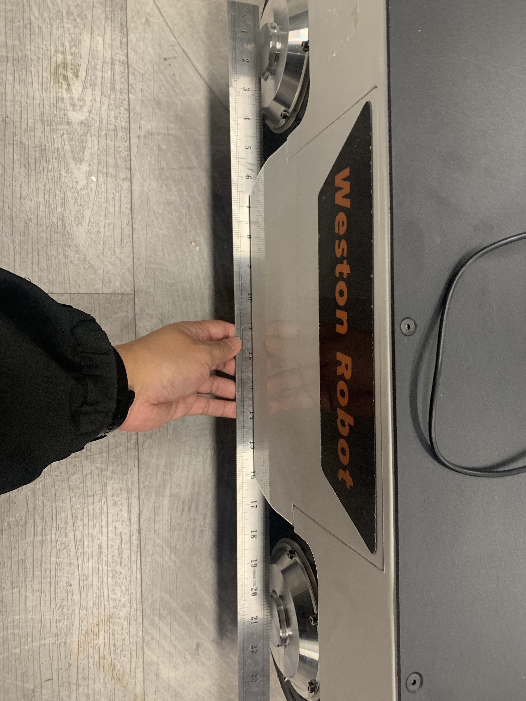

***************
Ranger Mini V2.0
***************

Revision History
================

+----------+-------------------+----------+------------------------------------+
| Revision | Date (DD/MM/YYYY) | Author   | Changes                            |
+==========+===================+==========+====================================+
| 1        | 04/05/2023        | Kee Jin  | Initial release                    |
+----------+-------------------+----------+------------------------------------+
| 2        | 04/05/2023        | Matthew  | Added steering wheel calibrations  |
+----------+-------------------+----------+------------------------------------+

1. Overview
===========
The Ranger Mini 2.0 mobile robot is an independent four-wheeled differential drive platform. 

2. Specifications
=================

.. list-table:: Technical Specifications
   :widths: 25 25

   * - Steering
     - Differential steering
   * - Size
     - 738mm x 500mm x 338mm	
   * - Minimum Ground Clearance
     - 107mm
   * - Operating Temperature
     - -10 - 40 ℃
   * - IP Rating
     - IP54
   * - Maximum Speed
     - 5.4m/s	
   * - Maximum Angle of Tilt
     - <15° (with loading)
   * - Charging Time
     - 1.5h
   * - User Power
     - 48V, 15A
   * - Weight
     - 64.5kg
   * - Rated Load
     - 80kg

3. Resources
============
* Ranger Mini 2.0 Manual: `PDF <https://tangrobot.sharepoint.com/:b:/s/Public-Outgoing/EVURuAx3ByVPi8Z4fuFz3xkBDFappiu2zvyZkAqbTcd7Aw?e=EYIYJn>`_
* C++ SDK: `ugv_sdk <https://github.com/westonrobot/ugv_sdk>`_
* ROS package: `ranger_ros <https://github.com/westonrobot/ranger_ros>`_
.. * ROS2 package: `ranger_ros2 <https://github.com/westonrobot/ranger_ros2>`_
* CAD File: `Ranger Mini 2.0 STEP file <https://tangrobot.sharepoint.com/:u:/s/Public-Outgoing/Efcf9NZa15JGkcNRaEoGLNsBfNuwNNzcgjNtEsDMMHAM4A?e=waofLQ>`_

1. Steering Motor Calibration
=============================

Turn off robot and controller. While robot is turned off, adjust the position of the steering wheels. 
Using a long straight object to help straighten the wheels is generally sufficient.

Turn on robot and controller. With SWA flipped to down position, and VRA pushed to topmost position, press KEY1.

.. image:: figures/ranger_calibration_2.jpg
.. image:: figures/ranger_calibration_3.jpg

The controller display should flash a error code for 1-2 seconds then return to normal. Calibration is completed.