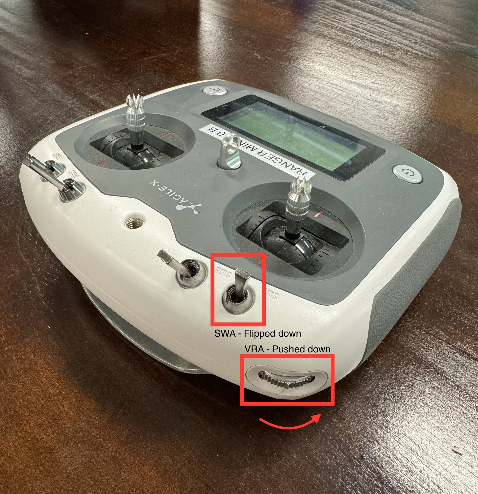

****************
Ranger Mini V2.0
****************

Revision History
================

+----------+-------------------+----------+------------------------------------+
| Revision | Date (DD/MM/YYYY) | Author   | Changes                            |
+==========+===================+==========+====================================+
| 1        | 04/05/2023        | Kee Jin  | Initial release                    |
+----------+-------------------+----------+------------------------------------+
| 2        | 04/05/2023        | Matthew  | Added steering wheel calibrations  |
+----------+-------------------+----------+------------------------------------+

1. Overview
===========
The Ranger Mini 2.0 mobile robot is an independent four-wheeled differential drive platform. 

2. Specifications
=================

.. list-table:: Technical Specifications
   :widths: 25 25

   * - Steering
     - 4-wheel steering
   * - Size
     - 738mm x 500mm x 338mm	
   * - Minimum Ground Clearance
     - 107mm
   * - Operating Temperature
     - -10 - 40 ℃
   * - IP Rating
     - IP54
   * - Maximum Speed
     - 5.4km/h	
   * - Maximum Angle of Tilt
     - <15° (with loading)
   * - Charging Time
     - 1.5h
   * - Battery
     - 48V, 24AH
   * - User Power Supply
     - 48V, 15A (Max) 
   * - Weight
     - 64.5kg
   * - Rated Load
     - 80kg
   * - Remote Control Range
     - 2.4G / 200m
   * - Charging Time
     - 1.5h

.. list-table:: Drift Specifications
   :widths: 25 25 25

   * - **Motion Type**
     - **Position Drift**
     - **Orientation Drift**
   * - Forward
     - ≤ 20cm
     - ≤ 3 degrees
   * - Side Slip
     - ≤ 30cm
     - ≤ 5 degrees
   * - Turn
     - --
     - ≤ 2 degrees

.. note::
    The above data was obtained on a 10-meter standard testing ground in the laboratory. Actual data may vary due to on-site environmental conditions and road conditions.

|

3. Steering Motor Calibration
=============================

Autocalibration
---------------

Turn on robot and controller. With SWA flipped to down position, and VRA pushed to bottommost position, press KEY1.

.. image:: figures/ranger_calibration_3.jpg
    :width: 380 px

Manual Calibration
------------------

Turn off robot and controller. While robot is turned off, adjust the position of the steering wheels. 
Using a long straight object to help straighten the wheels is generally sufficient.

.. image:: figures/ranger_calibration_1.jpg
    :width: 380 px

Turn on robot and controller. With SWA flipped to down position, and VRA pushed to topmost position, press KEY1.

.. image:: figures/ranger_calibration_2.jpg
    :width: 380 px

The controller display should flash a error code for 1-2 seconds then return to normal. Calibration is completed.

4. Resources
============
* Ranger Mini 2.0 Manual (EN): `PDF <https://tangrobot.sharepoint.com/:b:/s/Public-Outgoing/Eagd2Vrmnw9IiTzl4HaXjEwBuQJJ1unetL-IEpGHdBejag?e=YY4be5>`_
* Ranger Mini 2.0 Manual (CN): `PDF <https://tangrobot.sharepoint.com/:b:/s/Public-Outgoing/EdlhLdKQBDlKlYL35YiVYDwBqyHDFgfliUiPDEmwy0WACA?e=TnIw9y>`_
* C++ SDK: `ugv_sdk <https://github.com/westonrobot/ugv_sdk>`_
* ROS1 package: `ranger_ros <https://github.com/westonrobot/ranger_ros>`_
* ROS2 package: `ranger_ros2 <https://github.com/westonrobot/ranger_ros2>`_
* Firmware:
   * `V5.8.3 <https://tangrobot.sharepoint.com/:u:/s/Public-Outgoing/EXvKUHspMMZCvaDj1uvucD8BVPiIHzmzNm1JJ2N29_58_g?e=tWXt2J>`_ (With auto calibration)
   * `V5.8.7 <https://tangrobot.sharepoint.com/:u:/s/Public-Outgoing/ESydg3zKcnhHizjnudyNDcgBiSuX7mgCCOMeiZ4ncy_faQ?e=2Up90z>`_ (Without auto calibration)
   * `V5.9.1 <https://tangrobot.sharepoint.com/:u:/s/Public-Outgoing/EasKzBaC07dIrhxGs9_4_WEBY-2gf81qeoZFdDFCFB0Ibw?e=CFUJ6T>`_ (E-stop parks)
* CAD File: `Ranger Mini 2.0 STEP file <https://tangrobot.sharepoint.com/:u:/s/Public-Outgoing/Efcf9NZa15JGkcNRaEoGLNsBfNuwNNzcgjNtEsDMMHAM4A?e=YcQ9AB>`_

.. note::
    Please refer to the :doc:`Robot Upgrade Guide </getting_started/basics/robot_firmware_upgrade/agilex/firmware_upgrade_tool>` for firmware upgrade instructions.

| 