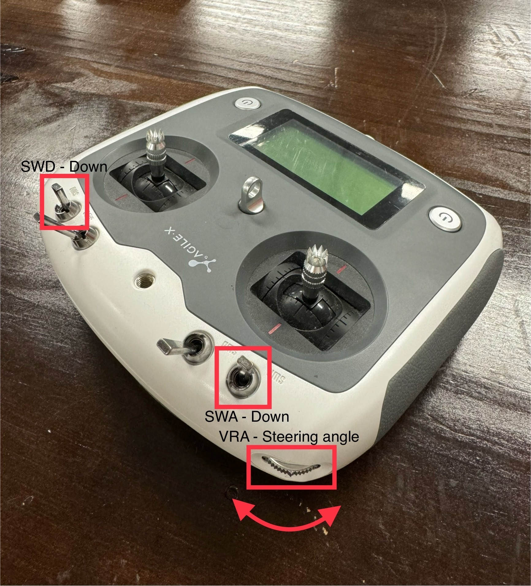
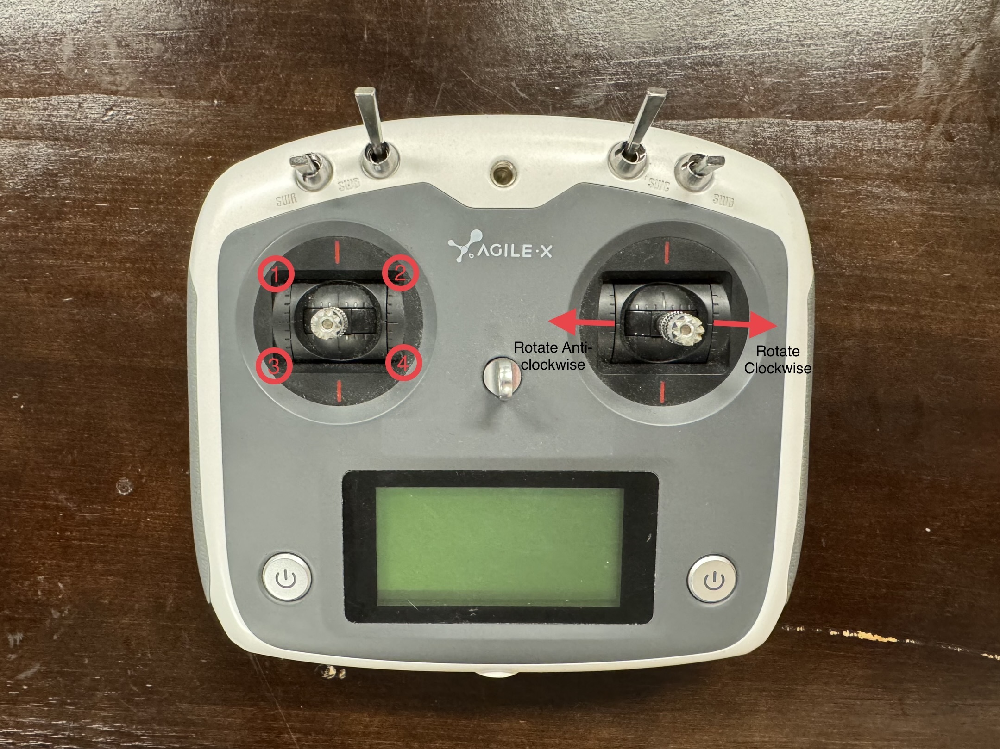

****************
Ranger Mini V3.0
****************

Revision History
================

+----------+-------------------+-----------+------------------------------------+
| Revision | Date (DD/MM/YYYY) | Author    | Changes                            |
+==========+===================+===========+====================================+
| 1        | 02/09/2024        | Kang Wei  | Initial release                    |
+----------+-------------------+---------+-+------------------------------------+

1. Overview
===========
The Ranger Mini 3.0 mobile robot is an independent four-wheeled differential drive platform. 

2. Specifications
=================

.. list-table:: Technical Specifications
   :widths: 25 25

   * - Steering
     - 4-wheel steering
   * - Size
     - 720mm x 500mm x 345mm	
   * - Minimum Ground Clearance
     - 105mm
   * - Operating Temperature
     - -10 - 40 ℃
   * - IP Rating
     - IP54
   * - Maximum Speed
     - 7.2km/h	
   * - Maximum Climbing Ability
     - <15° (25kg load)
   * - Charging Time
     - 1.5h
   * - Battery
     - 48V, 24AH
   * - User Power Supply
     - 46~50V, 15A (Max) 
   * - Weight
     - 75kg
   * - Max Load
     - <100kg
   * - Remote Control Range
     - 2.4G / limit distance 100m

3. Steering Motor Calibration
=============================
Turn on robot and controller. With SWA and SWD flipped to down position.

+-----------------+-----------------------------------------------------------------------------------------------+
| Control         | Description                                                                                   |
+=================+===============================================================================================+
| Left Joystick   | Controls the four steering motors based on joystick position. For example, placing the        |
|                 | joystick at the upper left corner (Position 1) corresponds to the front left steering motor.  |
+-----------------+-----------------------------------------------------------------------------------------------+
| Right Joystick  | Adjusts the steering angle of the selected motor.                                             |
+-----------------+-----------------------------------------------------------------------------------------------+
| VRA             | Cumulatively adjusts the steering angle of the selected motor.                                |
+-----------------+-----------------------------------------------------------------------------------------------+
| SWC             | Sensitivity adjustment for the angle: DOWN (large), MID (medium), UP (fine).                  |
+-----------------+-----------------------------------------------------------------------------------------------+
| KEY 1           | Sets the current position as the zero position.                                               |
+-----------------+-----------------------------------------------------------------------------------------------+

After adjusting the wheels angle, press KEY 1 to set the current position as the zero position. 

.. image:: figures/ranger_calibration_3.jpg
    :width: 380 px

4. Resources
============
* Ranger Mini 3.0 Manual (EN): `PDF <https://tangrobot.sharepoint.com/:b:/s/Public-Outgoing/EUXTEdF8y0JIkeVJ-foULMYB4ohYh-EBQzmZO7pBfAsjLQ?e=YJGnHM>`_
* C++ SDK: `ugv_sdk <https://github.com/westonrobot/ugv_sdk>`_
* ROS1 package: `ranger_ros <https://github.com/westonrobot/ranger_ros>`_
* ROS2 package: `ranger_ros2 <https://github.com/westonrobot/ranger_ros2>`_
* Firmware:
   * `V5.8.3 <https://tangrobot.sharepoint.com/:u:/s/Public-Outgoing/EXvKUHspMMZCvaDj1uvucD8BVPiIHzmzNm1JJ2N29_58_g?e=tWXt2J>`_ (With auto calibration)
   * `V5.8.7 <https://tangrobot.sharepoint.com/:u:/s/Public-Outgoing/ESydg3zKcnhHizjnudyNDcgBiSuX7mgCCOMeiZ4ncy_faQ?e=2Up90z>`_ (Without auto calibration)
   * `V5.9.1 <https://tangrobot.sharepoint.com/:u:/s/Public-Outgoing/EasKzBaC07dIrhxGs9_4_WEBY-2gf81qeoZFdDFCFB0Ibw?e=CFUJ6T>`_ (E-stop parks)
* CAD File: `Ranger Mini 3.0 STEP file <https://tangrobot.sharepoint.com/:u:/s/Public-Outgoing/EcOIV7nLuutLoPvKU2WfbkIBu7Izpp4fykdaXQnlAck0dw?e=85bhT2>`_

.. note::
    Please refer to the :doc:`Robot Upgrade Guide </getting_started/basics/robot_firmware_upgrade/agilex/firmware_upgrade_tool>` for firmware upgrade instructions.

| 