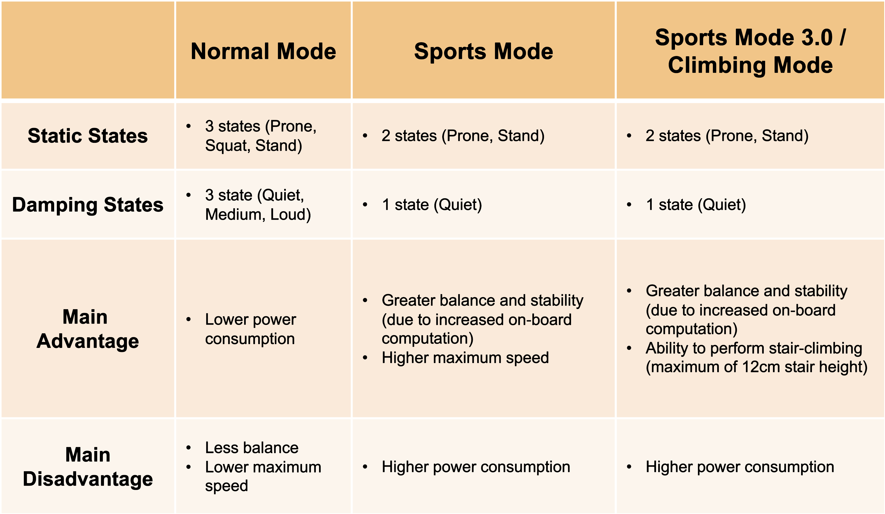
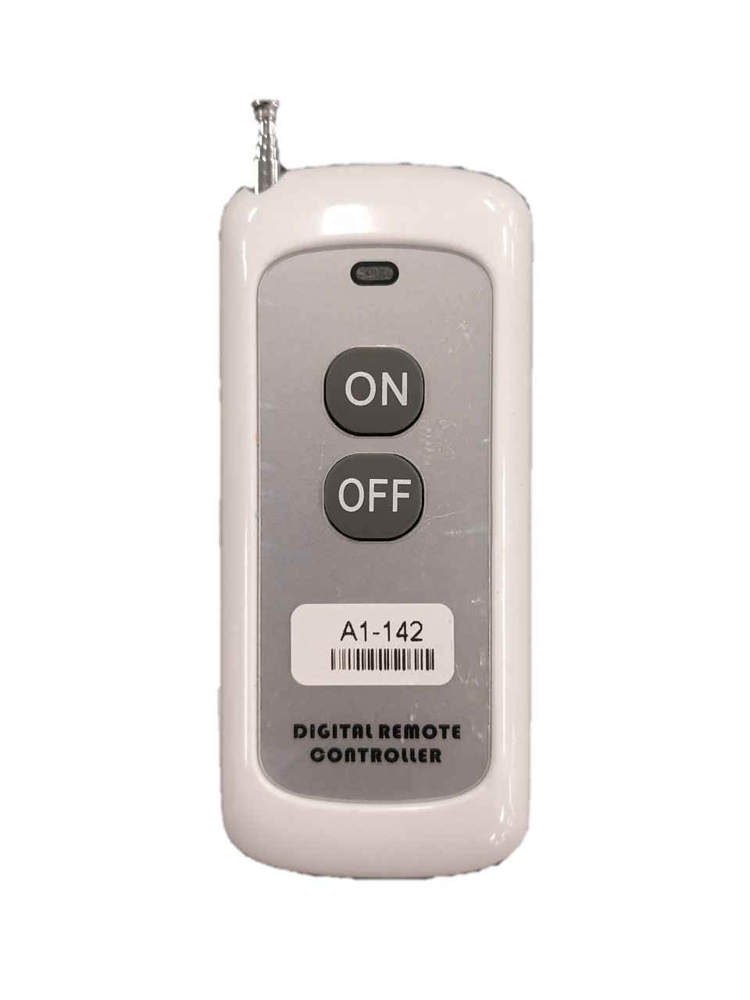
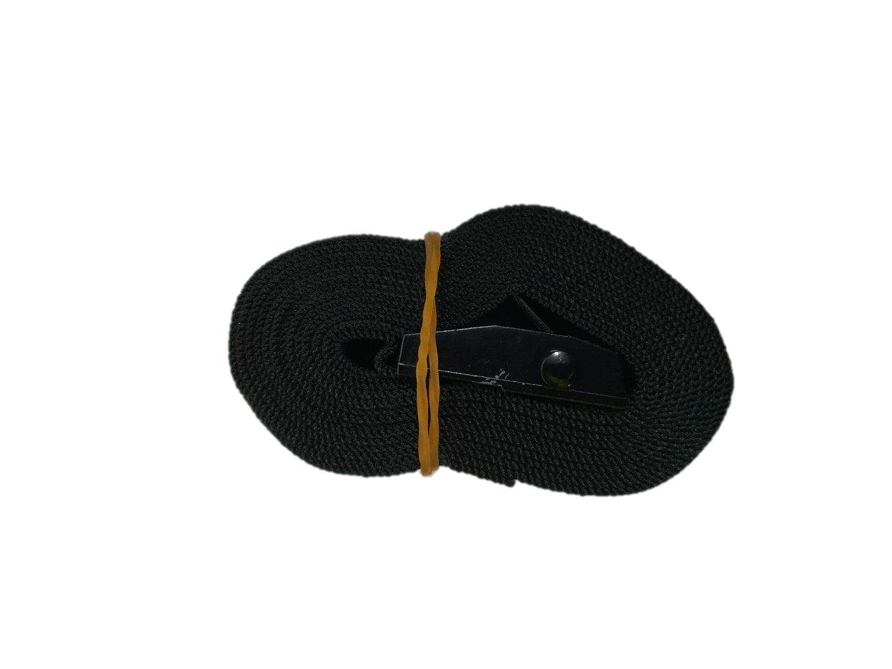

************
A1 Robot Dog
************

Revision History
================

+----------+-------------------+----------+------------------------+
| Revision | Date (DD/MM/YYYY) | Author   | Changes                |
+==========+===================+==========+========================+
| 1        | 14/11/2022        | Kee Jin  | Initial release        |
+----------+-------------------+----------+------------------------+

1. Overview
===========
The A1 robot dog is a 12 DOF, quadruped robot.

2. Specifications
=================

.. list-table:: Technical Specifications
   :widths: 25 25

   * - Dimensions
     - 500mm x 300mm x 400mm
   * - Maximum traversal tilt
     - 22 degrees
   * - Maximum stair-climbing height
     - 12cm
   * - Maximum Speed
     - 3.3m/s	
   * - Charging Time
     - 45min
   * - Weight
     - 12kg
   * - Rated Load
     - 5kg
   * - Motor
     - 12 x Servo Geared motors (9.1 : 1 reduction ratio)

3. Summary of Modes
===================
The following table summarises the 3 possible modes available in the A1 robot dog. For more details and complete state diagrams, please refer to our user guide: :download:`Getting Started with A1 <https://tangrobot.sharepoint.com/:b:/s/Public-Outgoing/EWldLuLPrqxPjYHd6UM5pgsBTVi_D0cK11hqG4RYbkdaGA?e=kNOz91>`.

4. General Notes
================
* When conducting experiments with the A1 that may impact its stability, the emergency stop and leash provided should be used where necessary.

* The A1 should be powered off and its battery should be replaced whenever there is only 1/4 of the battery LED indicators left lit and blinking. This indicates that the battery level is low (0-25%).
* Before powering off the A1, be sure to bring it down to the damped proning state first to prevent the robot from dropping down from a height. To do so, get the A1 to the "proning state" with "L2+A" and finally press "L2+B". 

5. Resources
============

* User guide: `Getting Started with A1 <https://tangrobot.sharepoint.com/:b:/s/Public-Outgoing/EWldLuLPrqxPjYHd6UM5pgsBTVi_D0cK11hqG4RYbkdaGA?e=kNOz91>`_
* SDK: `unitree_legged_sdk <https://github.com/westonrobot/unitree_legged_sdk>`_
* ROS simulation package: `unitree_ros <https://github.com/westonrobot/unitree_ros>`_
* ROS controller package: `unitree_ros_to_real <https://github.com/westonrobot/unitree_ros_to_real>`_
* CAD File: `A1 STEP file <https://tangrobot.sharepoint.com/:f:/s/Public-Outgoing/ElQRG3RQ_c9AgNYCMkutAmABLD7A14Lb1seaXNhzNVFgww?e=dKDxeq>`_