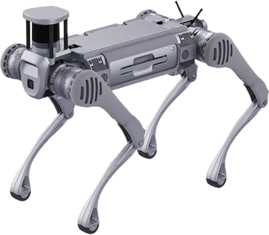
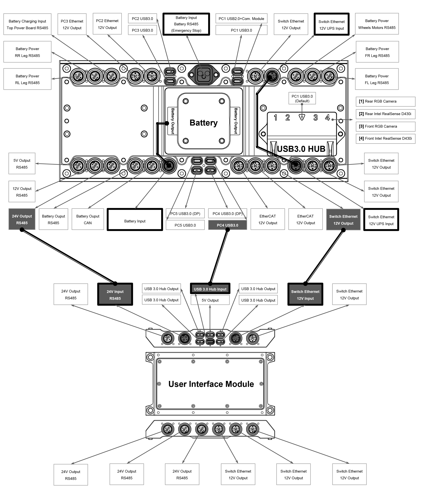
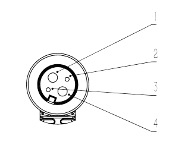
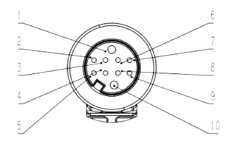

************
B2 Robot Dog
************

Revision History
================

+----------+-------------------+----------+------------------------------------------------------+
| Revision | Date (DD/MM/YYYY) | Author   | Changes                                              |
+==========+===================+==========+======================================================+
| 1        | 31/1/2024         | Kang Wei | Initial release                                      |
+----------+-------------------+----------+------------------------------------------------------+

1. Overview
===========

2. Specifications
=================
.. list-table:: Dimensions
   :widths: 25 25

   * - Standing State
     - 1098mm x 450mm x 645mm
   * - Proning State
     - 880mm x 460mm x 330mm
   * - Net Weight (Incl. battery)
     - Approx. 60kg
   * - Degrees of Freedom
     - 12
   * - Maximum Speed
     - > 6m/s (Limited for safety purposes)

.. list-table:: Environment
   :widths: 25 25

   * - Operating Temperature
     - -20℃ ~ 55℃, under good weather conditions
   * - Slope Walking Ability
     - > 45°
   * - Maximum Step Height
     - 20 ~ 25cm
   * - Jumping Ditch Width
     - 0.5 ~ 1.2m
   * - Maximum Jumping Distance
     - > 1.6m
   * - Protection Level
     - IP67 

.. list-table:: Battery Information
   :widths: 25 25

   * - Model
     - BT2-10
   * - Weight
     - 12.2kg
   * - Capacity
     - 45Ah (2268Wh)
   * - Standard Voltage
     - 50.4V
   * - Charging Voltage
     - 58.8V
   * - Charging Current
     - 15A
   * - Operating Time
     - 4 - 6h
   * - Charging Time
     - 3h 20m

.. list-table:: Internal PC Information
   :widths: 25 25

   * - Intel Core i5-1235U
     - | OS: Ubuntu 20.04
       | RAM: 8GB
       | Hard Drive: 512GB
   * - Intel Core i7-1255U / i7-1265U
     - | OS: Ubuntu 20.04
       | RAM: 32GB
       | Hard Drive: 512GB
   * - Nvidia Jetson Orin NX
     - | OS: Ubuntu 20.04
       | RAM: 32GB
       | Hard Drive: 512GB

.. list-table:: Internal Components
   :widths: 25 25

   * - Control and Perception Computing Power
     - | PC1 [1]: Intel Core i5
       | PC2 [2]: Intel Core i7
       | PC3 [3]: Intel Core i7 / Nvidia Jetson Orin NX
       | PC4 [3]: Intel Core i7 / Nvidia Jetson Orin NX
       | PC5 [3]: Intel Core i7 / Nvidia Jetson Orin NX
   * - Perception Sensor Configuration [4]
     - | 3D LiDAR ×1
       | Depth Camera ×2
       | Optical Camera ×2
   * - External Interfaces
     - | 1000M-Base-Ethernet ×4
       | USB3.0 ×4
       | 12V ×4
       | 5V ×1
       | 24V ×4
       | BAT ×1

[1] Standard configuration

[2] User development

[3] Optional configuration

[4] Varies with different configurations

3. Electrical Interfaces
========================

.. list-table:: Interface Description
   :widths: 25 25

   * - | - Battery Charging Input [1]
       | - Top Power Board RS485 [1]
     - | Reserved 4-pin connector for wireless charging plate and 
       | RS485 pins for communication with the power board.
   * - | - PC3 Ethernet
       | - 12V Output
     - | 10-pin connector with direct ethernet connection to PC3 and 
       | 12V power supply
   * - | - PC2 Ethernet
       | - 12V Output
     - | 10-pin connector with direct ethernet connection to PC2 and 
       | 12V power supply
   * - PC2 USB3.0
     - USB-C connector with direct connection to PC2
   * - PC3 USB3.0
     - USB-C connector with direct connection to PC3
   * - PC1 USB2.0
     - USB-C connector with direct connection to PC1
   * - PC1 USB3.0
     - USB-C connector with direct connection to PC1
   * - | - Switch Ethernet
       | - 12V Output
     - | Connection to ethernet switch for communication between PCs and 
       | 12V power supply
   * - | - Switch Ethernet
       | - 12V UPS Input [2]
     - | Connection to ethernet switch for communication between PCs and 
       | 12V UPS power input
   * - | - Battery Power [1]
       | - Wheels Motors RS485 [1]
     - Reserved port for wheeled configuration
   * - | - Battery Power [1]
       | - FR Leg RS485 [1]
     - Reserved port for front right leg
   * - | - Battery Power [1]
       | - FL Leg RS485 [1]
     - Reserved port for front left leg
   * - | - EtherCAT
       | - 12V Output
     - EtherCAT communication protocol and 12V power supply
   * - PC4 USB3.0 (DP)
     - Direct USB-C DisplayPort connection to PC4
   * - PC4 USB3.0
     - USB-C connector with direct connection to PC4
   * - PC5 USB3.0 (DP)
     - Direct USB-C DisplayPort connection to PC5
   * - PC5 USB3.0
     - USB-C connector with direct connection to PC5
   * - Battery Input [1]
     - Reserved port for internal electrical circuit
   * - | - Battery Output
       | - CAN
     - 58V power supply and CAN communication protocol
   * - | - Battery Output
       | - RS485
     - 58V power supply and RS485 communication protocol
   * - | - 24V Output
       | - RS485
     - 24V power supply and RS485 communication protocol
   * - | - 12V Output
       | - RS485
     - 12V power supply and RS485 communication protocol
   * - | - 5V Output
       | - RS485
     - 5V power supply and RS485 communication protocol
   * - | - Battery Power [1]
       | - RR Leg RS485 [1]
     - Reserved port for rear right leg
   * - | - Battery Power [1]
       | - RL Leg RS485 [1]
     - Reserved port for rear left leg

[1] Reserved ports are designated solely for internal electrical circuit use only, not open for public acccess

[2] The standard B2 robot dog does not come equipped with an Uninterruptible Power Supply (UPS). However, it is available as a customizable add-on feature.

User Interface Module
----------------------
The user interface module expands the interfaces available on the B2 body, allowing users to access the robot without needing to remove the panels.

(2+2) Power Line Interface
--------------------------

+-----+-----------------+-------------------+
| Pin |     Colour      | Interface         |
+=====+=================+===================+
| 1   | Black (14AWG)   | Power-            |
+-----+-----------------+-------------------+
| 2   | Red (24AWG)     | 485A              |
+-----+-----------------+-------------------+
| 3   | Black (24AWG)   | 485B              |
+-----+-----------------+-------------------+
| 4   | White (14AWG)   | Power+            |
+-----+-----------------+-------------------+

(8+2) Signal Line Interface
---------------------------

+----+--------+------------------+-----------------------------+
| Pin| Colour | Interface Meaning| T568 Standard Ethernet Cable|
+====+========+==================+=============================+
| 1  | Black  | Power-           |                             |
+----+--------+------------------+-----------------------------+
| 2  | Orange | 4N               | Brown                       |
+----+--------+------------------+-----------------------------+
| 3  | Purple | 4P               | White Brown                 |
+----+--------+------------------+-----------------------------+
| 4  | Brown  | 1P               | White Orange                |
+----+--------+------------------+-----------------------------+
| 5  | Blue   | 1N               | Orange                      |
+----+--------+------------------+-----------------------------+
| 6  | White  | 3N               | Blue                        |
+----+--------+------------------+-----------------------------+
| 7  | Green  | 3P               | White Blue                  |
+----+--------+------------------+-----------------------------+
| 8  | Pink   | 2N               | Green                       |
+----+--------+------------------+-----------------------------+
| 9  | Grey   | 2P               | White Green                 |
+----+--------+------------------+-----------------------------+
| 10 | Red    | Power+(12V)      |                             |
+----+--------+------------------+-----------------------------+

4. Resources
============

Manual
------

* B2 Manual: `Unitree <https://support.unitree.com/home/en/B2_developer/About%20B2>`_

.. Development
.. -----------