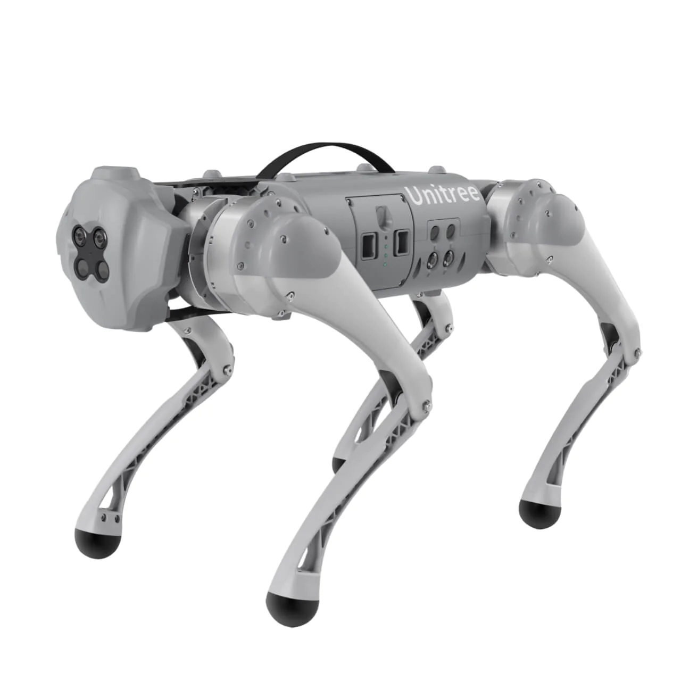
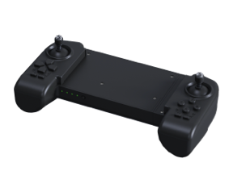

*************
Go1 Robot Dog
*************

Revision History
================

+----------+-------------------+----------+------------------------------------------------------+
| Revision | Date (DD/MM/YYYY) | Author   | Changes                                              |
+==========+===================+==========+======================================================+
| 1        | 14/11/2022        | Kee Jin  | Initial release                                      |
+----------+-------------------+----------+------------------------------------------------------+
| 2        | 22/09/2023        | Karthee  | Updates to safety precautions, FAQ and General notes |
+----------+-------------------+----------+------------------------------------------------------+

1. Overview
===========

The Go1 robot dog is a quadruped robot with force control technology, used for compound control of the force and position of each joint.
The Go1 is equippred with 12 servo motors (3 per limb) giving it a total of 12 degrees of freedom, making it suitable for use in uneven terrain. 

2. Safety Precautions
=================
* **Do not carry** the Go1 when in static mode or sports mode.
* When battery level indicator is **1 blinking LED light (0-25%)**, turn off the Go1 and charge the battery to prevent it from falling to the ground due to battery depletion.
* If you have additional hardware installed atop the Go1, **do not** use the roll function as it risks damaging the hardware or robot.
* Please make sure that the Go1 is placed on its abdominal support pad on **level ground** before starting the machine.
* Bring Go1 to **damped prone position** before switching off the robot. To do so, get the Go1 to the "proning state" with "L2+A" and finally press "L2+B". 

3. Specifications
=================

.. list-table:: Technical Specifications
   :widths: 25 25

   * - Dimensions (Proning State)
     - 550mm x 300mm x 130mm
   * - Dimensions (Standing State)
     - 650mm x 300mm x 400mm
   * - Maximum traversal tilt
     - 25 degrees
   * - Maximum Speed
     - Pro\: 3.5m/s Edu: 3.7m/s	
   * - Charging Time
     - ~50min
   * - Average Running Time
     - ~1h
   * - Weight
     - 12kg
   * - Rated Load
     - | Pro\: 3kg
       | Edu\: 5kg
   * - Power Output
     - 22.2V
   * - Motor
     - 12 x Servo geared motors
   * - Remote Controller Range
     - 100m
   * - Camera
     - | 4 x Stereo cameras
       | FOV\: 150 degrees x 170 degrees
   * - Sensor
     - 3 x Ultrasonic sensors
   * - Lidar (Purchased Separately)
     - | Working range\: 0.15m-12m 
       | Angular range\: 360 degrees
       | Resolution\: \< 1 degree

4. General Notes
================

Emergency Stop
----------------

* When conducting experiments with the Go1 that may impact its stability, the emergency stop provided should be used where necessary.

.. image:: figures/A1_estop.png
    :width: 180 px
    :align: center

* Press and hold the **OFF button** for 1 second to trigger the emergency stop. Do note that once the emergency stop is triggered, the power to the motors on board 
  the Go1 will be cut causing it to drop to the ground.
* To reset the emergency stop, power cycle the Go1.

Remote Controller Calibration
-----------------------------

* When the Go1 drift is significant during remote controller operation, calibration of the remote controller may fix this.

* Press the remote control buttons "F1" and "F3" and release them at the same time. At this time, the remote control will emit 2 continuous beep sounds
  to indicate that it has entered the calibration mode. 
* After entering the calibration mode, move the left and right joysticks to full rudder and rotate it several times until the beep sound stops.
  Press F3 once to make the calibration take effect and that completes the calibration process.
* **Note** : Please do not touch the joystick before calibrating, only move the joystick after entering the calibration mode.

5. Resources
============

* User guide: `Getting Started with Go1 <https://tangrobot.sharepoint.com/:b:/s/Public-Outgoing/EWkPsjYni41MjcukW1VNwhMBhOqCz3DxIxBa5dtJ3XV6PQ?e=e7LNl6>`_
* Official User manual: `Go1 User Manual V1.4 <https://tangrobot.sharepoint.com/:b:/s/Public-Outgoing/EfN-kw3WillLoPDFdPTMjZQBNyfvgurdt0KMnO36B4pHIA?e=3ei6Es>`_
* Software guide: `Go1 Software Manual <https://tangrobot.sharepoint.com/:b:/s/Public-Outgoing/EengpX_Tv-NBiYwO-6PInTsBbsRL6N1EqfOVFiCnB1Gbwg?e=QQ9dwH>`_
* Official SDK guide: `Unitree Legged SDK Manual <https://tangrobot.sharepoint.com/:b:/s/Public-Outgoing/Edh2OJLDqe9LtzRZQDgmpcsBJAHLhkejnlN_4znJp-oIiw?e=5ggCrE>`_
* SDK: `unitree_legged_sdk <https://github.com/westonrobot/unitree_legged_sdk>`_
* ROS simulation package: `unitree_ros <https://github.com/westonrobot/unitree_ros>`_
* ROS controller package: `unitree_ros_to_real <https://github.com/westonrobot/unitree_ros_to_real>`_
* CAD File: `Go1 STEP file <https://tangrobot.sharepoint.com/:f:/s/Public-Outgoing/Epo7xFk4MVNGgrDL9sgeVmcBM7-5QvVGvsCztrksVI7Iwg?e=PTiy74>`_

6. FAQ
============

* Can the Go1 navigate autonomously?
   - The Go1 has a basic navigation stack setup in ROS Melodic. To use it, the Go1 will need a lidar to be installed and a map of the area that the robot is going to be navigating in.
* How to switch between static mode and move mode?
   - When the Go1 is in static mode (locked joints), press "START" to switch to move mode. From move mode, press "L2+A" to switch to static mode.
* How to switch from move mode to running mode?
   - When the Go1 is in move mode, press "L2 + START" to switch to running mode.
* How to switch from move mode and climbing mode?
   - When the Go1 is in move mode, press "A" to switch to climbing mode. To switch back to move mode, press "B".
* What is the maximum stairs height Go1 can ascend in climbing mode?
   -  The Go1 can ascend stairs of height 10cm.
* Can the Go1 connect to wifi?
   - No, the Go1 has a local network within its on-board system but it cannot connect to the internet.
* What is self-discharge protection?
   - When the power of battery is higher than 65%, after 10 days without any operation, the battery will self-discharge to 65% to protect the battery.
* Does the Go1 have an IP rating for water and dust resistance?
   -  No, the Go1 does not have an IP rating for water and dust resistance.  
* Can the Go1 start on a slope instead of level ground?
   -  No, the Go1 needs to start on a level ground for the IMU sensor to calibrate correctly.
