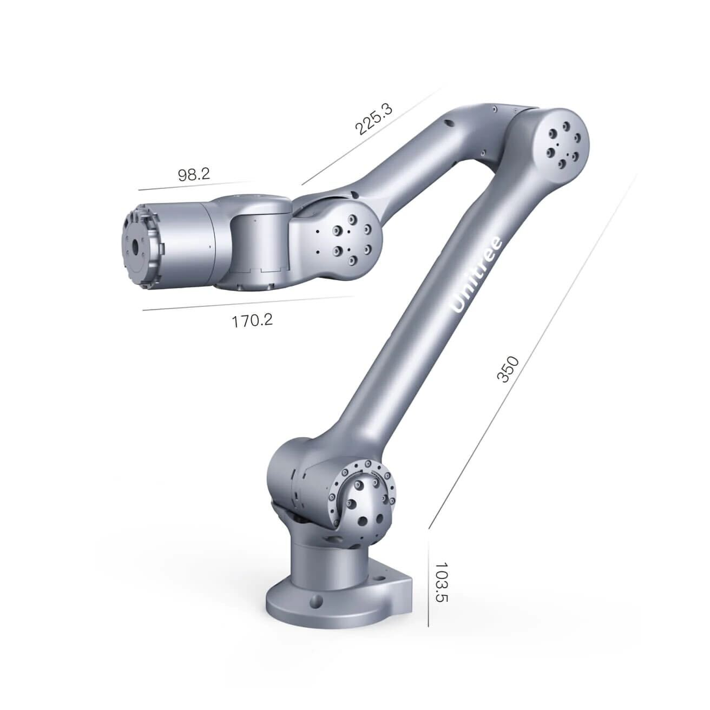
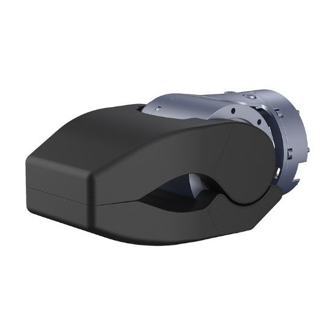

************
Z1 Robot Arm
************

Revision History
================

+----------+-------------------+----------+------------------------+
| Revision | Date (DD/MM/YYYY) | Author   | Changes                |
+==========+===================+==========+========================+
| 1        | 17/01/2024        | Kang Wei | Initial release        |
+----------+-------------------+----------+------------------------+

1. Overview
===========

The Z1 robot arm is a compact and lightweight 6-DOF manipulator that can cooperate with the Aliengo or B1 robot and other mobile robots for diversified application scenarios.

2. Specifications
=================

.. list-table:: Common Technical Specifications
   :widths: 25 25

   * - Degree of Freedom
     - 6
   * - Reach
     - 740mm
   * - Repeatability [1]
     - ~0.1mm
   * - Power Supply
     - Voltage 24V, Current > 20A
   * - Interface
     - Ethernet
   * - User Operating System
     - Ubuntu
   * - Power
     - MAX 500W
   * - Force Feedback and Collision Detection
     - Provided
   * - Control Interface [2]
     - Position + Force Control

[1] It depends on the actual test according to the use requirements (the test standards of manipulator vary greatly, and the accuracy varies greatly under different test conditions)

[2] Since the reduction ratio used by each joint is relatively low, the position control stiffness of the whole machine is low. If the control mode is not optimized, there will be large position control error and shaking when the manipulator moves.

.. table:: Specific Technical Specifications

   +--------------------------+---------------+----------------+
   |                          |     Z1 Air    |     Z1 Pro     |
   +==========================+===============+================+
   | Weight                   |4.3kg          |4.5kg           |
   +--------------------------+---------------+----------------+
   | Payload                  |2.0kg          |≥3.0kg          |
   +--------------------------+---------------+----------------+

.. table:: Joint Motion Range

   +-------------+---------------+---------------+
   |    Joint    |     Range     |   Max Speed   |
   +=============+===============+===============+
   | J1          |±150°          |180°/s         |
   +-------------+---------------+---------------+
   | J2          |0-180°         |180°/s         |
   +-------------+---------------+---------------+
   | J3          |-165-0°        |180°/s         |
   +-------------+---------------+---------------+
   | J4          |±80°           |180°/s         |
   +-------------+---------------+---------------+
   | J5          |±85°           |180°/s         |
   +-------------+---------------+---------------+
   | J6          |±160°          |180°/s         |
   +-------------+---------------+---------------+

3. End Effectors
================

Gripper
-------

.. list-table:: Specifications
   :widths: 25 25

   * - Dimensions
     - 139mm x 80mm x 68mm
   * - Weight
     - 700g - 750g
   * - Peak Grasp Force
     - 200N
   * - Peak Clamp Force (at tip of opening)
     - 150N
   * - Rated Load
     - 2kg 
   * - Max Opening
     - 90°
   * - Opening/Closing Time
     - 0.5s
   * - Voltage
     - 24V 
   * - Peak Power
     - 70W
   * - Communication Mode
     - RS485

4. Resources
============

Manual
------

* Z1 Manual: `Unitree <https://dev-z1.unitree.com/>`_

Development
-----------

* Z1 Controller: `z1_controller <https://github.com/westonrobot/z1_controller.git>`_
* Z1 SDK: `z1_sdk <https://github.com/westonrobot/z1_sdk.git>`_
* ROS Package: `unitree_ros <https://github.com/westonrobot/unitree_ros.git>`_